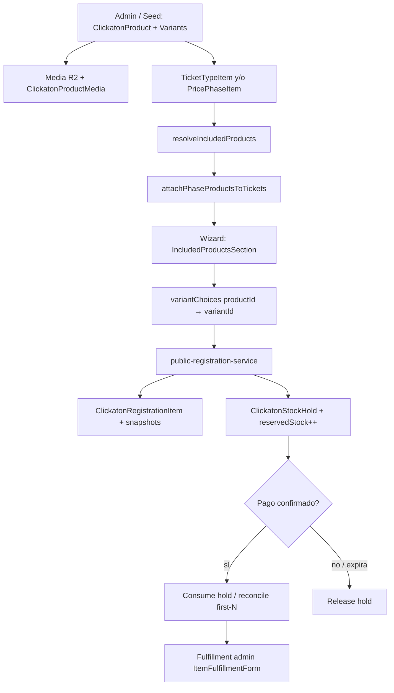

# TIENDA — ETAPA 01 — Auditoría del catálogo existente

**Fecha:** 2026-08-01  
**Alcance:** solo lectura / documentación  
**App:** Clickatón (`apps/clickaton`)  
**Restricciones respetadas:** sin commits, sin push, sin deploy, sin migraciones, sin tablas nuevas, sin cambios en DNX Payments / Mercado Pago / inscripción / checkout / UI.

---

## Resumen ejecutivo

Clickatón ya tiene un **catálogo de merchandising completo orientado a inscripción**: productos, variantes (talles), SKU, stock, holds, media (R2), composición en tickets y fases de precio, beneficio first-N, y fulfillment post-pago.

La **tienda pública aún no existe** como storefront, pero el dominio ya está **pre-modelado** en Prisma y parcialmente en el admin (`isStoreEnabled`, `storeStatus`, `storeSlug`, `storePrice`, movimientos `STORE_*`, `sourceType: STORE_PURCHASE`).

**Recomendación:** la futura **TIENDA** puede y debe construirse **reutilizando el mismo catálogo** (`ClickatonProduct` / `Variant` / `Media` / inventario). No hace falta un segundo catálogo de productos.

---

## 1. Estado actual

### 1.1 Qué existe

| Área | Estado | Notas |
|------|--------|-------|
| Modelos Prisma de producto | ✅ | `ClickatonProduct`, `ClickatonProductVariant`, `ClickatonProductMedia` |
| Stock + reserved + holds | ✅ | `stock`, `reservedStock`, `ClickatonStockHold` |
| Ledger de inventario | ✅ parcial | Modelo + helpers; admin adjust **no** escribe `ADMIN_ADJUSTMENT` |
| CRUD admin productos | ✅ | Create / update / soft deactivate (`isActive`) |
| Variantes (talles) | ✅ | CRUD + stock adjust + activate |
| Media (primary, gallery, size chart) | ✅ | Upload server actions → R2 / local |
| Composición ticket (kit) | ✅ | `ClickatonTicketTypeItem` |
| Productos por fase de precio | ✅ | `ClickatonPricePhaseItem` (first-N, deadline) |
| Remera en inscripción | ✅ | Selección de talle en wizard |
| Marketing ficha maratón | ✅ | `MarathonShirtOffer` + `loadShirtOfferMedia` |
| Campos comerciales tienda | ✅ schema + admin form | Storefront público OFF |
| Enums / source tienda | ✅ | `STORE_PURCHASE`, `STORE_HOLD` / `STORE_SALE` / `STORE_RELEASED` |
| Fulfillment de ítems | ✅ | `ItemFulfillmentForm` en admin inscripciones |
| Seed / config canónica | ✅ | `ARGENTINA_2026_MERCH`, talles XS–5XL |

### 1.2 Qué falta (para TIENDA)

| Área | Estado |
|------|--------|
| Storefront público (`/tienda` o similar) | ❌ |
| Listado / detalle / carrito de compra | ❌ |
| Checkout de tienda (distinto de inscripción) | ❌ |
| Consumo real de movimientos `STORE_*` | ❌ (helpers listos, flujo no cableado) |
| Componentes storefront genéricos (`ProductCard`, etc.) | ❌ |
| REST API pública de productos | ❌ |
| Hard delete de productos | ❌ (intencional: solo soft deactivate) |
| Permisos granulares (create vs stock vs hide) | ❌ (un solo rol admin MVP) |
| Pipeline de resize / variantes de tamaño de imagen | ❌ |
| Categorías de producto en Clickatón | ❌ |
| Impuestos / descuentos por SKU | ❌ (solo `taxCategory` string opcional; promos son de inscripción) |
| Addon pago opcional en inscripción | ❌ diferido (`optional_paid_addon`) |

---

## 2. Modelos existentes

**Fuente:** `packages/db/prisma/schema.prisma`

### 2.1 Enums

| Enum | Valores relevantes |
|------|-------------------|
| `ClickatonProductMediaType` | `PRIMARY`, `GALLERY`, `SIZE_CHART`, `DETAIL`, `PACKAGING`, `IN_USE` |
| `ClickatonProductStoreStatus` | `DRAFT`, `ACTIVE`, `OUT_OF_STOCK`, `HIDDEN`, `ARCHIVED` |
| `ClickatonInventoryMovementType` | `INITIAL_STOCK`, `ADMIN_ADJUSTMENT`, `REGISTRATION_*`, `STORE_*`, `RETURN`, `DAMAGED`, `GIFT` |
| `ClickatonRegistrationItemSourceType` | `TICKET_BASE`, `PRICE_PHASE`, `STORE_PURCHASE` |
| `ClickatonItemFulfillmentStatus` | `PENDING`, `READY`, `DELIVERED`, `CANCELLED`, `RETURNED` |
| `ClickatonHoldStatus` | `ACTIVE`, `CONSUMED`, `EXPIRED`, `RELEASED` |
| `DnxMediaAssetKind` | incluye `PRODUCT_IMAGE`, `PRODUCT_SIZE_CHART` |

### 2.2 Núcleo de catálogo

#### `ClickatonProduct`
- Identidad: `id`, `editionId`, `name`, `description`, `code`, `isActive`
- Media soft-refs: `primaryImageAssetId`, `sizeChartAssetId`, `sizeChartDescription`, `sizeChartInstructions`
- **Prep tienda:** `isStoreEnabled`, `storeStatus`, `storeSlug`, `storeTitle`, `storeDescription`, `storePrice`, `compareAtPrice`, `storeCurrency`, `taxCategory`, `requiresShipping`, `allowPickup`, `weightGrams`, `storeSortOrder`, `publishedAt`, `archivedAt`
- Relaciones: `variants`, `ticketItems`, `pricePhaseItems`, `media`, `inventoryMovements`
- Uniques: `[editionId, code]`, `[editionId, storeSlug]`

#### `ClickatonProductVariant`
- `code`, `name`, `sku` (**unique global**), `stock`, `reservedStock`
- `priceAmount?`, `currency?` (override opcional; null = incluido / sin precio propio)
- `sortOrder`, `isActive`
- Unique: `[productId, code]`

#### `ClickatonProductMedia`
- Soft ref `assetId` → `DnxMediaAsset`
- `mediaType`, `sortOrder`, `altText`, `caption`, `status` (`ACTIVE` \| `HIDDEN`)
- Unique: `[productId, assetId, mediaType]`

#### `ClickatonInventoryMovement`
- Ledger auditable: `movementType`, `quantity` (delta), `sourceType` / `sourceId`, `reason`, `createdByUserId`, `metadata`, `idempotencyKey?`

### 2.3 Composición e inscripción

| Modelo | Rol |
|--------|-----|
| `ClickatonTicketType` | Entrada / kit (precio, cupo, ventana de venta) |
| `ClickatonTicketTypeItem` | Producto incluido en ticket; variante fija o `requiresVariantChoice` |
| `ClickatonRegistrationPricePhase` | Fase comercial de inscripción |
| `ClickatonPricePhaseItem` | Beneficio merch por fase (`stockLimit` first-N, `benefitDeadlineAt`) |
| `ClickatonRegistrationItem` | Ítem en inscripción con **snapshots** (nombre, talle, SKU, imagen, size chart) |
| `ClickatonStockHold` | Reserva de stock de variante por inscripción |
| `ClickatonCapacityHold` | Hold de cupo de ticket (no merch) |
| `DnxMediaAsset` | Blob metadata (`storageBackend`, `storageKey`, `publicUrl`, `mimeType`, `bytes`, `kind`, `ownerType=PRODUCT`) |

### 2.4 Modelos que NO aplican a Clickatón

No reutilizar para TIENDA Clickatón:

- `CatalogProduct` / categorías de ComprameLaFoto o FotoRank
- `LabProduct`, `PhotographerProduct`, `AlbumProduct`

Son otros dominios del monorepo.

---

## 3. Dónde viven las remeras hoy

| Aspecto | Detalle |
|---------|---------|
| Producto canónico | Código `REMERA-CLICKATON` (`ARGENTINA_2026_MERCH` en `config/editions/argentina-2026.ts`) |
| Creación | Seed (`scripts/seed-argentina-2026-edition.ts`) + CRUD admin `/admin/catalogo/productos` |
| Talles | `ARGENTINA_2026_SHIRT_SIZES`: XS, S, M, L, XL, XXL, 3XL (`XXXL` code legado), 4XL, 5XL |
| Inclusión comercial | Preferentemente vía `ClickatonPricePhaseItem` (fases 25k/30k, first-N = 100, deadline 2026-08-30) |
| Marketing público | `MarathonShirtOffer` en ficha de maratón; media vía `loadShirtOfferMedia` (lookup `code contains "REMERA"`) |
| Prep tienda en config | `storeSlug: "remera-clickaton"`, `storePricePesos: 18_000`, descripción “disponible próximamente” |

---

## 4. Mapa de arquitectura real

```
apps/clickaton/
├── app/admin/(panel)/catalogo/
│   ├── page.tsx                              # Hub "Productos y kits"
│   ├── actions.ts
│   ├── productos/
│   │   ├── page.tsx                          # Listado
│   │   ├── nuevo/page.tsx                    # Alta
│   │   └── [productId]/page.tsx              # Detalle = edición in-place
│   └── entradas/
│       ├── page.tsx
│       ├── nueva/page.tsx
│       └── [ticketTypeId]/page.tsx           # + composición
├── app/admin/(panel)/ediciones/[editionId]/precios/
│   └── page.tsx                              # Fases + productos incluidos
├── app/api/
│   ├── media/[...key]/route.ts               # Proxy GET R2 (products/editions)
│   └── cron/product-media-bootstrap/route.ts # Bootstrap media (CRON_SECRET)
├── components/admin/catalog/
│   ├── ProductForm.tsx
│   ├── ProductVariantsPanel.tsx
│   ├── VariantForm.tsx
│   ├── StockAdjustForm.tsx
│   ├── ProductMediaUploadFields.tsx
│   ├── ProductActiveToggle.tsx
│   ├── ProductListActiveButton.tsx
│   ├── TicketTypeForm.tsx
│   ├── TicketCompositionPanel.tsx
│   └── TicketActiveToggle.tsx
├── components/admin/pricing/PricePhaseItemsPanel.tsx
├── components/admin/registrations/ItemFulfillmentForm.tsx
├── components/public-registration/
│   ├── IncludedProductsSection.tsx           # Talle + guía en wizard
│   └── PublicRegistrationWizard.tsx
├── components/marathon/MarathonShirtOffer.tsx
├── components/founding-allies/AlliesMerch.tsx # Marketing estático (no DB)
├── lib/admin-catalog/                        # Domain + service + actions admin
│   ├── application/catalog-service.ts
│   ├── actions/{products,tickets,product-forms,ticket-forms,runtime}.ts
│   ├── auth/admin-catalog-auth.ts
│   ├── design/{contracts,permissions,routes,validation-rules}.ts
│   ├── domain/{types,repository,errors,codes,money,availability}.ts
│   ├── infrastructure/{prisma,in-memory}-catalog-repository.ts
│   └── validation/schemas.ts
├── lib/admin/catalog/product-media-actions.ts
├── lib/admin/pricing/phase-items.ts
├── lib/catalog/
│   ├── application/attach-phase-products.ts
│   └── domain/{resolve-included-items,first-n-benefit,reconcile-first-n-on-confirm,types}.ts
├── lib/inventory/domain/record-movement.ts
├── lib/public-marathons/load-shirt-offer-media.ts
├── lib/public-registration/                  # Reserva + variantChoices
├── lib/registration/                         # Domain holds / variants
├── config/editions/argentina-2026.ts
└── scripts/
    ├── seed-argentina-2026-edition.ts
    ├── upload-remera-media-10d3.ts
    ├── wire-remera-public-media.ts
    └── *admin-catalog* / *included-merch* selfchecks
```

**No existe** una carpeta pública `products/` ni `tienda/` con componentes de storefront.

---

## 5. Componentes reutilizables

### 5.1 Nombres pedidos (storefront genérico)

| Componente | ¿Existe? | Notas |
|------------|----------|-------|
| `ProductCard` | ❌ | — |
| `ProductGrid` | ❌ | — |
| `ProductGallery` | ❌ | Hay upload de galería admin; no galería pública reutilizable |
| `ProductDetail` | ❌ | Solo página admin `AdminProductDetailPage` |
| `ProductVariantSelector` | ❌ | Select inline en `IncludedProductsSection` |
| `ProductPrice` | ❌ | — |
| `ProductBadge` | ❌ | — |
| `ProductImage` | ❌ | `` directo en secciones públicas |
| `ProductCarousel` | ❌ | — |

### 5.2 Componentes reales reutilizables / adaptables

| Componente | Path | Reutilización TIENDA |
|------------|------|----------------------|
| `ProductForm` | `components/admin/catalog/ProductForm.tsx` | Admin (ya incluye campos tienda) |
| `ProductVariantsPanel` | idem | Admin variantes/stock |
| `VariantForm` | idem | Admin |
| `StockAdjustForm` | idem | Admin stock |
| `ProductMediaUploadFields` | idem | Admin media |
| `ProductActiveToggle` / `ProductListActiveButton` | idem | Soft hide producto |
| `TicketCompositionPanel` | idem | Kits de inscripción (no tienda) |
| `PricePhaseItemsPanel` | `components/admin/pricing/` | Beneficios por fase |
| `IncludedProductsSection` | `components/public-registration/` | Patrón de talle/size-chart; **no** es card de tienda |
| `MarathonShirtOffer` | `components/marathon/` | Galería marketing; referencia visual |
| `ItemFulfillmentForm` | `components/admin/registrations/` | Entrega post-venta / kit |
| `AlliesMerch` | `components/founding-allies/` | Estático; **no** acoplar al catálogo DB |

**Conclusión UI:** el **dominio y admin** se reutilizan; los componentes de **vitrina pública** (`ProductCard`, grid, detalle, carousel, price) hay que **crearlos** en etapas siguientes, consumiendo el mismo modelo.

---

## 6. APIs existentes

### 6.1 REST HTTP real

| Ruta | Método | Existe | Rol |
|------|--------|--------|-----|
| `GET /products` | GET | ❌ | — |
| `GET /products/:id` | GET | ❌ | — |
| `POST /products` | POST | ❌ | — |
| `PATCH /products` | PATCH | ❌ | — |
| `DELETE /products` | DELETE | ❌ | — |
| `GET /api/media/[...key]` | GET | ✅ | Proxy público de keys `clickaton/(editions\|products)/…` |
| `POST /api/cron/product-media-bootstrap` | POST | ✅ | Bootstrap media (Bearer `CRON_SECRET`) |

**No hay REST CRUD de productos.** Las mutaciones viven en **Server Actions**.

### 6.2 Server Actions (API efectiva)

**Productos / variantes** (`lib/admin-catalog/actions/products.ts` + `product-forms.ts`):

- `listProductsAction`
- `getProductAction`
- `createProductAction`
- `updateProductAction`
- `setProductActiveAction`
- `createVariantAction`
- `updateVariantAction`
- `setVariantActiveAction`
- `adjustVariantStockAction`

**Tickets / composición** (`actions/tickets.ts` + `ticket-forms.ts`):

- `listTicketTypesAction`, `getTicketTypeAction`
- `createTicketTypeAction`, `updateTicketTypeAction`, `setTicketTypeActiveAction`
- `addTicketProductAction`, `updateTicketProductAction`, `removeTicketProductAction`
- `getCatalogAvailabilityAction`

**Media** (`lib/admin/catalog/product-media-actions.ts`):

- `uploadProductPrimaryImageAction`
- `uploadProductSizeChartAction`
- `uploadProductGalleryImageAction`
- `deleteProductMediaAction`

**Fase de precio** (`lib/admin/pricing/phase-items.ts`):

- list / add / update / remove price phase items
- `duplicatePhaseItemsFromPhaseAction`

---

## 7. Panel administrativo

### 7.1 Rutas UI

| Path | Feature |
|------|---------|
| `/admin/catalogo` | Hub KPIs + nav Productos / Entradas |
| `/admin/catalogo/productos` | Listado filtrable por edición |
| `/admin/catalogo/productos/nuevo` | Alta producto |
| `/admin/catalogo/productos/[productId]` | Editar producto + variantes + stock + media + prep tienda |
| `/admin/catalogo/entradas` | Listado tickets/kits |
| `/admin/catalogo/entradas/nueva` | Alta ticket |
| `/admin/catalogo/entradas/[ticketTypeId]` | Edit + composición |
| `/admin/ediciones/[editionId]/precios` | Fases + ítems merch |

Nav: `config/admin/navigation.ts` → “Catálogo” → `/admin/catalogo`.

### 7.2 Checklist admin pedido

| Capacidad | ¿Existe? |
|-----------|----------|
| Productos (listado) | ✅ |
| Nuevo | ✅ |
| Editar | ✅ (en detalle; no hay página `/editar`) |
| Eliminar (hard) | ❌ (solo `isActive=false`) |
| Stock | ✅ (`StockAdjustForm` / `adjustVariantStock`) |
| Variantes | ✅ |
| Imágenes | ✅ (primary, gallery, size chart) |
| Prep campos tienda | ✅ (checkbox “storefront OFF”) |

### 7.3 Rutas de diseño huérfanas

En `lib/admin-catalog/design/routes.ts` existen:

- `productEdit` → `…/editar`
- `ticketEdit` → `…/editar`

**No hay páginas** bajo esas rutas; la edición ocurre en el detalle.

---

## 8. Permisos

| Pregunta | Respuesta actual |
|----------|------------------|
| ¿Quién crea productos? | Admin Clickatón: `SUPER_ADMIN` **o** email en allowlist (`hasClickatonAdminAccess`) |
| ¿Quién edita? | Mismo gate |
| ¿Quién elimina? | Nadie hard-delete; soft via `setProductActive(false)` / variante |
| ¿Quién oculta? | `isActive=false`; tienda: `storeStatus` / `isStoreEnabled` (storefront aún OFF) |
| ¿Quién cambia stock? | Mismo admin (`catalog.variant.mutate`) |

**Capabilities** (`CatalogAdminCapability`):

- `catalog.read`
- `catalog.ticket.mutate`
- `catalog.product.mutate`
- `catalog.variant.mutate`
- `catalog.composition.mutate`
- `catalog.activate`
- `catalog.availability.read`

MVP: rol efectivo `ADMIN_GENERAL` con **todas** las caps.  
`VENUE_ADMIN_FUTURE` (solo lectura) está definido pero **no** implementado en UI.

Media uploads usan `requireClickatonAdmin()` directo (capa paralela a capabilities).

---

## 9. Flujo actual: producto → inscripción



### Pasos detallados

1. **Alta de producto**  
   Admin (`createProductAction`) o seed Argentina 2026 (`REMERA-CLICKATON` + talles + stock placeholder).

2. **Variantes**  
   Una por talle; `sku` único; `stock` / `reservedStock`.

3. **Media**  
   Primary + gallery + size chart → `DnxMediaAsset` + `ClickatonProductMedia`.

4. **Composición comercial**  
   - Ticket: `ClickatonTicketTypeItem` (`requiresVariantChoice`)  
   - Fase: `ClickatonPricePhaseItem` (`stockLimit`, `benefitDeadlineAt`)  
   - Política: no duplicar mismo `productId` entre ticket y fase (`resolve-included-items`).

5. **UI pública de inscripción**  
   `PublicRegistrationWizard` → `IncludedProductsSection`:  
   - muestra productos incluidos  
   - select de talles con `availableStock > 0`  
   - modal/guía de talles  

6. **Persistencia**  
   `variantChoices` del form → `ClickatonRegistrationItem` (`productVariantId` + snapshots) + `ClickatonStockHold`.  
   Errores de dominio: `VARIANT_REQUIRED`, `PRODUCT_OUT_OF_STOCK`.

7. **Confirmación**  
   `reconcile-first-n-on-confirm`: si el cupo first-N se agotó, puede revocar el beneficio.  
   Movimientos `REGISTRATION_*` vía inventario en flujo público.

8. **Post-pago**  
   Snapshots en cuenta/resumen; entrega operativa con `fulfillmentStatus` / `ItemFulfillmentForm`.

**No hay carrito de merch aparte** en inscripción: el talle viaja dentro del flujo de registro.

---

## 10. Imágenes

| Aspecto | Detalle |
|---------|---------|
| Storage | `getWelcomeCardStorage()` → R2 si hay env; sino Local / KeyOnly |
| Namespace | `"products"` → keys tipo `clickaton/products/YYYY-MM-DD/{uuid}.ext` |
| Registro DB | `DnxMediaAsset` + `ClickatonProductMedia` |
| URLs públicas | `publicUrl` del asset (`R2_PUBLIC_URL/...`) o proxy `/api/media/{key}` |
| Upload | Server actions admin (`product-media-actions.ts`) |
| Límite tamaño | **8 MB** |
| Formatos | `image/*`; extensiones jpg / png / webp |
| Compresión / resize | **No** hay pipeline de variantes de tamaño |
| Tipos usados | `PRIMARY`, `GALLERY`, `SIZE_CHART` (enum también `DETAIL`, `PACKAGING`, `IN_USE`) |
| Bootstrap ops | Cron `product-media-bootstrap` + scripts `upload-remera-media-10d3.ts`, `wire-remera-public-media.ts` |
| Soft refs | Sin FK Prisma a `DnxMediaAsset` — integridad a cargo de la app |

---

## 11. Precios, impuestos, descuentos, promociones

| Concepto | Estado en catálogo Clickatón |
|----------|------------------------------|
| Precio de inscripción | En `ClickatonTicketType.priceAmount` + fases |
| Precio por variante | Campo `priceAmount?` existe; en MVP merch incluido suele ser 0 |
| Precio tienda | `ClickatonProduct.storePrice` / `compareAtPrice` (prep) |
| Impuestos | Solo `taxCategory` string opcional; sin motor fiscal |
| Descuentos / promos | Módulo `/admin/promociones` orientado a **inscripción**, no acoplado a SKU |
| First-N merch | Cupo + deadline en `PricePhaseItem` (beneficio, no descuento de precio de producto) |

---

## 12. Inventario y stock

| Pieza | Existe |
|-------|--------|
| Stock físico por variante | ✅ `stock` |
| Stock reservado | ✅ `reservedStock` |
| Disponibilidad | ✅ `stock - reservedStock` (domain helpers) |
| Holds por inscripción | ✅ `ClickatonStockHold` |
| Ledger | ✅ modelo + `recordInventoryMovement` + keys `reg:` / `store:` |
| Ajuste admin → ledger | ⚠️ **Gap:** `adjustVariantStock` actualiza stock pero **no** llama `recordInventoryMovement` (`ADMIN_ADJUSTMENT`) |
| Movimientos tienda | Enums + helpers listos; flujo de venta **no** implementado |

---

## 13. Deuda técnica (sin corregir)

1. **Storefront OFF con schema/UI prep** — riesgo de confusión operativa si se marca `isStoreEnabled` sin páginas públicas.  
2. **Rutas `/editar` fantasma** en `catalogAdminRoutes`.  
3. **Dos capas de auth** — capabilities (`admin-catalog`) vs `requireClickatonAdmin` en media/phase-items.  
4. **`AlliesMerch` desacoplado** del catálogo DB.  
5. **Lookup remera frágil** — `code contains "REMERA"` en `loadShirtOfferMedia`.  
6. **Ledger incompleto en adjust admin** — no escribe `ADMIN_ADJUSTMENT`.  
7. **Sin hard delete** — códigos/SKUs “zombies” si se desactiva mal (intencional, pero operativo).  
8. **Promociones sin acoplamiento a productos**.  
9. **Features diferidas** — `optional_paid_addon`, `multi_venue_ticket`, `standalone_kit_entity`.  
10. **Componentes storefront ausentes** — hay que crear UI; datos ya están.  
11. **Soft refs media** sin integridad referencial en DB.  
12. **Copy first-N** repetida en domain, marketing y legal además de config de edición.

---

## 14. Recomendación TIENDA

### ¿Se puede construir la TIENDA reutilizando el sistema existente sin un segundo catálogo?

**Sí. Confirmado.**

El diseño actual ya unifica inscripción + tienda futura sobre las mismas entidades:

- Mismo `ClickatonProduct` / `ClickatonProductVariant` / `ClickatonProductMedia` / `ClickatonInventoryMovement`
- `ClickatonRegistrationItemSourceType.STORE_PURCHASE` (o un order store futuro que reutilice el mismo stock)
- Movimientos `STORE_HOLD` / `STORE_SALE` / `STORE_RELEASED`
- Campos comerciales ya en producto + form admin
- Helpers `storeHoldIdempotencyKey` en `lib/inventory`

### Qué implica (próximas etapas — no esta)

1. Storefront público (listado / detalle / selector de variante / precio).  
2. Carrito + checkout de tienda (**sin** reutilizar ciegamente el checkout de inscripción; y **sin** tocar DNX Payments / MP en esta etapa de auditoría).  
3. Wire-up de holds/movimientos `STORE_*` sobre el mismo stock.  
4. Gating real: `isStoreEnabled && storeStatus === ACTIVE` (+ stock).  
5. Crear componentes de vitrina (`ProductCard`, etc.) consumiendo el dominio existente.  
6. Opcional: addons pagos en inscripción (`optional_paid_addon`).

### Qué no hacer

- No crear un segundo modelo tipo `StoreProduct`.  
- No importar `CatalogProduct` de CLF/FotoRank.  
- No duplicar stock en otra tabla.  
- No alterar inscripción/checkout existentes en esta etapa.

---

## 15. Checklist rápido de cobertura de auditoría

| Tema buscado | Hallazgo |
|--------------|----------|
| Modelos Prisma | ✅ ClickatonProduct* + inventory + registration items |
| Entidades / domain types | ✅ `lib/admin-catalog`, `lib/catalog`, `lib/registration` |
| Servicios | ✅ `catalog-service`, resolve/attach phase, inventory helpers |
| APIs REST | Solo media proxy + cron bootstrap |
| Server Actions | CRUD completo admin |
| Componentes React | Admin + inscripción; **sin** storefront genérico |
| Hooks dedicados | No hay hooks `useProduct*` |
| Validaciones / schemas | ✅ `lib/admin-catalog/validation/schemas.ts` |
| Imágenes / storage / uploads | ✅ R2 + DnxMediaAsset |
| Stock / variantes / talles / SKU | ✅ |
| Categorías de producto | ❌ |
| Precio / impuestos / descuentos | Parcial (storePrice; taxCategory; promos aparte) |
| Inventario ledger | Parcial |
| Panel admin | ✅ |
| Listado / detalle público de tienda | ❌ |
| Integración inscripción | ✅ documentada |

---

## Fin — TIENDA — ETAPA 01

Documento de auditoría únicamente. Ningún comportamiento de producción fue modificado.
