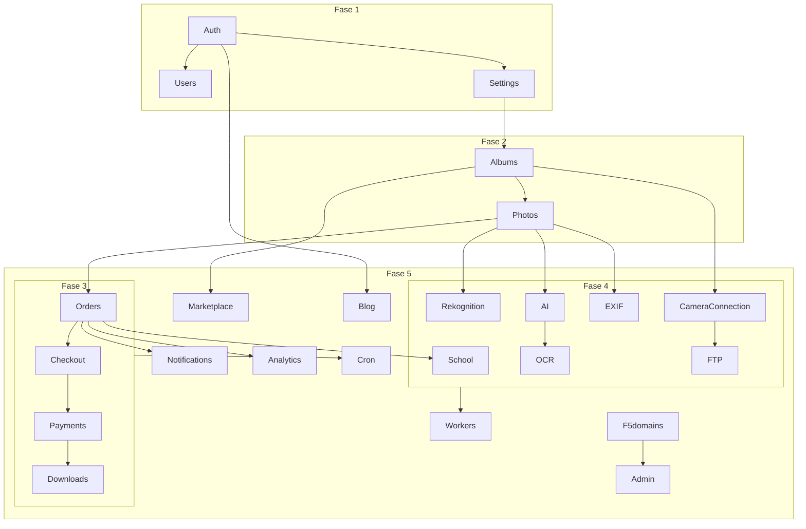

# 04 — Plan de importación por dominios funcionales

**Fecha:** 2026-07-04  
**Fuente:** `/Users/danielcuart/Desktop/compramelafoto`  
**Destino:** `apps/compramelafoto` (reemplazo de copia stale tras archivar)  
**Alcance:** solo planificación — **no** se copian, mueven ni modifican archivos

**Prerequisitos documentados (no son dominios de import):**

- [`01-current-state.md`](./01-current-state.md) — congelar WIP monorepo
- [`03-prisma-diff.md`](./03-prisma-diff.md) + [`prisma-migration-plan.md`](./prisma-migration-plan.md)
- [`../decisions/0001-prisma-unificado-clf-legacy.md`](../decisions/0001-prisma-unificado-clf-legacy.md) — ADR merge Prisma **antes** de import funcional con datos reales

**Metodología de conteo:** APIs (`app/api/**/route.ts`), páginas, `lib/`, `components/`, workers y scripts asignados al dominio **primario** por responsabilidad de negocio. Los totales son **aproximados** (~±15 %); hay solapamiento en bordes (p. ej. `Event` entre Albums y Marketplace).

**Escala total legacy (referencia):** ~2 571 archivos TS/TSX/JS en app+lib+components; ~564 API routes; 3 workers desplegables.

---

## Leyenda

| Campo | Valores |
|-------|---------|
| **Prioridad** | P0 bloqueante · P1 core revenue · P2 importante · P3 diferible |
| **Riesgo** | Bajo · Medio · Alto · Crítico |
| **Complejidad** | S · M · L · XL |

---

## Auth

| Campo | Detalle |
|-------|---------|
| **Prioridad** | P0 |
| **Archivos aprox.** | **~45** (18 API, 17 páginas auth/registro, 7 lib sesión, middleware parcial) |
| **Dependencias** | Ninguna (raíz del grafo); bloquea todos los paneles |
| **Modelos Prisma** | `User`, `EmailVerificationToken`, `PasswordResetToken`, `UserLoginDevice`, `TermsAcceptance`, `TermsDocument`, `MercadoPagoOAuthState` (parcial) |
| **Servicios externos** | Google OAuth (`GOOGLE_CLIENT_*`) |
| **Variables ENV** | `AUTH_SECRET`, `GOOGLE_CLIENT_ID`, `GOOGLE_CLIENT_SECRET`, `NEXTAUTH_URL`, `NEXT_PUBLIC_APP_URL` |
| **Packages compartidos** | `@repo/db`, `@repo/auth` (reemplazo cookie `auth-token` → `dnx_session`), `@repo/auth-guards` |
| **Riesgo** | **Crítico** — auth legacy incompatible con suite (ADR no aplica aquí código, sí cutover) |
| **Complejidad** | **L** |
| **Orden** | **1** (primero) |

**Alcance funcional:** login/registro multi-rol (fotógrafo, lab, cliente, organizador), OAuth Google, reset password, verify email, session clients por panel, `middleware.ts` (referral/blog — coordinar con Analytics/Blog).

---

## Users

| Campo | Detalle |
|-------|---------|
| **Prioridad** | P0 |
| **Archivos aprox.** | **~15** |
| **Dependencias** | Auth |
| **Modelos Prisma** | `User` (perfil, flags), `EmailPreferences`, `PrivacyRequest`, `PrivacyEvent`, `AccountRestriction` |
| **Servicios externos** | — |
| **Variables ENV** | `PRIVACY_CONTACT_EMAIL`, `BIOMETRIC_DELETION_SECRET` |
| **Packages compartidos** | `@repo/db`, `@repo/auth-guards` |
| **Riesgo** | Medio |
| **Complejidad** | **S** |
| **Orden** | **1** (junto con Auth) |

**Alcance:** cuenta usuario, consentimiento facial, marketing opt-in, privacidad, revocación biométrica.

---

## Settings

| Campo | Detalle |
|-------|---------|
| **Prioridad** | P0 |
| **Archivos aprox.** | **~25** (config global, sales-settings, system-settings API) |
| **Dependencias** | Auth |
| **Modelos Prisma** | `AppConfig`, `SystemSettings`, `PhotographerSalesSettings` |
| **Servicios externos** | — |
| **Variables ENV** | `DIGITAL_DOWNLOAD_CENTER_ROLLOUT_HOURS`, feature flags globales (`PREVENTA_*`, `GLOBAL_PRODUCTS_*`, `ENABLE_VIDEO_MVP`) |
| **Packages compartidos** | `@repo/db` |
| **Riesgo** | Medio — defaults distintos mono vs legacy (`downloadLinkDays` ADR D6) |
| **Complejidad** | **M** |
| **Orden** | **1** |

---

## Albums

| Campo | Detalle |
|-------|---------|
| **Prioridad** | P0 |
| **Archivos aprox.** | **~410** (189 API, 146 lib, 57 components, 18 páginas) |
| **Dependencias** | Auth, Users, Settings; Prisma gap (82 modelos + campos `Album` ADR D6) |
| **Modelos Prisma** | `Album`, `AlbumAccess`, `AlbumCollaborator`, `AlbumExtension`, `AlbumInvitation`, `AlbumInterest`, `AlbumNotification`, `AlbumPack*`, `AlbumProduct`, `AlbumSalesSettings`, `AlbumSlugAlias`, `AlbumUpsell*`, `AlbumFolder`, `AlbumCatalogProduct`, `DesignProject*`, `Template`, `TemplateSlot`, `TemplateV2*`, `PackDefinition`, `BenefitDefinition`, `PhotobookDocument`, `VideoAsset`, `Event` (parcial), `UpsellStrategy`, `UserUpsellConfig` |
| **Servicios externos** | Cloudflare R2 (portadas, mockups) |
| **Variables ENV** | `R2_*`, `NEXT_PUBLIC_R2_*`, `ALBUM_*`, `PREVENTA_*`, `GLOBAL_PRODUCTS_*` |
| **Packages compartidos** | `@repo/db`, `@repo/design-system` (dashboard, wizard álbumes) |
| **Riesgo** | **Alto** — mayor superficie; 37 campos `Album` faltantes en mono |
| **Complejidad** | **XL** |
| **Orden** | **2** |

**Alcance:** CRUD álbumes, packs, preventa/precompra config, diseño (template v2), carpetas, videos MVP, wizard, APIs dashboard y públicas `a/[id]`, `album/[slug]`.

---

## Photos

| Campo | Detalle |
|-------|---------|
| **Prioridad** | P0 |
| **Archivos aprox.** | **~55** (13 API upload/view, 15 lib procesamiento, 15 components galería) |
| **Dependencias** | Albums, Settings; R2 configurado |
| **Modelos Prisma** | `Photo`, `PhotoFace`, `PhotoClaim`, `PhotoAnalysisJob`, `Selection`, `SelectionPhoto` |
| **Servicios externos** | **Cloudflare R2**, `sharp` |
| **Variables ENV** | `R2_*`, `MAX_FILE_SIZE`, `NEXT_PUBLIC_MAX_UPLOAD_MB`, `PHOTO_VARIANT_*`, `PHOTO_WATERMARK_*`, `PROTECTED_PREVIEW_WATERMARK*`, `ASYNC_ALBUM_PHOTO_INGEST` |
| **Packages compartidos** | `@repo/db` |
| **Riesgo** | **Alto** — 21 campos `Photo` faltantes en mono; variantes/watermarks en prod |
| **Complejidad** | **L** |
| **Orden** | **2** (inmediatamente después / paralelo estrecho con Albums) |

---

## Orders

| Campo | Detalle |
|-------|---------|
| **Prioridad** | P1 |
| **Archivos aprox.** | **~80** |
| **Dependencias** | Albums, Photos, Auth |
| **Modelos Prisma** | `Order`, `OrderItem`, `OrderFulfillmentGroup`, `OrderAuditLog`, `PrintOrder*`, `PreCompraOrder*`, `Subject`, `SubjectSelfie`, `AbandonedOrderReminder`, `AlbumProduct` |
| **Servicios externos** | R2 (assets impresión), email (confirmación) |
| **Variables ENV** | `WATERMARK_BOUGHT_ENABLED`, flags checkout |
| **Packages compartidos** | `@repo/db` |
| **Riesgo** | **Alto** — campos `Order`/`OrderItem` legacy (preventa, organizer) |
| **Complejidad** | **L** |
| **Orden** | **3** |

---

## Checkout

| Campo | Detalle |
|-------|---------|
| **Prioridad** | P1 |
| **Archivos aprox.** | **~95** |
| **Dependencias** | Albums, Photos, Orders, Payments (preferencia MP) |
| **Modelos Prisma** | `AlbumPackOrderDraft`, `AlbumPackSelection*`, `PackPurchaseEntitlement`, `RedemptionSession`, `UpsellStrategy`, `UserUpsellConfig` + órdenes |
| **Servicios externos** | MercadoPago (preferencia) |
| **Variables ENV** | `PREVENTA_PACKS_V1`, `CHECKOUT_FEE_SHADOW_MODE`, `CHECKOUT_DEBUG_LOGS`, `ALBUM_PACK_PUBLIC_PAY_ENABLED` |
| **Packages compartidos** | `@repo/db`, `@repo/design-system` (checkout UI) |
| **Riesgo** | **Alto** — pricing engine, preventa canjeable, fees |
| **Complejidad** | **XL** |
| **Orden** | **3** |

---

## Payments

| Campo | Detalle |
|-------|---------|
| **Prioridad** | P1 |
| **Archivos aprox.** | **~40** |
| **Dependencias** | Checkout, Orders |
| **Modelos Prisma** | `PaymentSplit`, `WebhookEvent`, `FraudAlert`, `UncollectedPlatformFee`, `MercadoPagoOAuthState`, `ReferralEarning` (parcial), `OrganizerCommission*` |
| **Servicios externos** | **MercadoPago** (OAuth, webhooks, preferences) |
| **Variables ENV** | `MP_*`, `MP_ACCESS_TOKEN`, `MP_ENV`, `MP_STATEMENT_DESCRIPTOR` |
| **Packages compartidos** | `@repo/db` |
| **Riesgo** | **Crítico** — dinero real; webhooks URL cambia en deploy mono |
| **Complejidad** | **L** |
| **Orden** | **3** (con Checkout/Orders) |

---

## Downloads

| Campo | Detalle |
|-------|---------|
| **Prioridad** | P1 |
| **Archivos aprox.** | **~35** (API zip, descargas token, lib digital delivery, crons asociados) |
| **Dependencias** | Orders, Payments (estado PAID), Photos/R2 |
| **Modelos Prisma** | `OrderDownloadToken`, `ZipGenerationJob`, `PackAccessToken`, `DownloadTokenType` enums |
| **Servicios externos** | R2, Resend (email con link) |
| **Variables ENV** | `ZIP_JOB_PROCESS_SECRET`, `ZIP_JOB_PROCESS_TIMEOUT_MS`, `ENABLE_ZIP_READY_EMAIL`, `DIGITAL_DOWNLOAD_CENTER_ROLLOUT_HOURS` |
| **Packages compartidos** | `@repo/db` |
| **Riesgo** | Alto — jobs ZIP async, crons |
| **Complejidad** | **L** |
| **Orden** | **3** (cierre del flujo compra) |

---

## School

| Campo | Detalle |
|-------|---------|
| **Prioridad** | P1 |
| **Archivos aprox.** | **~75** |
| **Dependencias** | Albums, Orders, PreCompra; **ADR D1** (`SchoolStudent`) |
| **Modelos Prisma** | `School`, `SchoolLead`, `SchoolOrganizer*`, `SchoolCourse`, `AcademicYear`, **`SchoolStudent`** (ex `Student`), `StudentEnrollment`, `AlbumStudentRosterEntry`, `StudentRosterImport*`, `PreCompraOrder` (campos escolares) |
| **Servicios externos** | — (PDF/XLSX local) |
| **Variables ENV** | `ALLOW_SCHOOL_DEMO_SEED`, flags roster |
| **Packages compartidos** | `@repo/db` |
| **Riesgo** | **Crítico** — colisión `Student` con FotoOffice; estados `PreCompraOrderItemStatus` (ADR D4) |
| **Complejidad** | **XL** |
| **Orden** | **4** |

---

## Search

| Campo | Detalle |
|-------|---------|
| **Prioridad** | P2 |
| **Archivos aprox.** | **~15** |
| **Dependencias** | Photos, Albums; Rekognition (búsqueda facial) |
| **Modelos Prisma** | `Photo`, `FaceMatch`, `AlbumStudentRosterEntry` (roster search) — sin modelos propios |
| **Servicios externos** | AWS Rekognition (face), texto en DB |
| **Variables ENV** | `AWS_*`, `REKOGNITION_COLLECTION_ID` |
| **Packages compartidos** | `@repo/db` |
| **Riesgo** | Medio |
| **Complejidad** | **M** |
| **Orden** | **4** |

---

## AI

| Campo | Detalle |
|-------|---------|
| **Prioridad** | P2 |
| **Archivos aprox.** | **~55** (analysis runner, admin AI, internal APIs) |
| **Dependencias** | Photos, Cron |
| **Modelos Prisma** | `PhotoAnalysisJob`, `Photo` (estados análisis) |
| **Servicios externos** | Google Vision (OCR path compartido), pipeline interno |
| **Variables ENV** | `ANALYSIS_BATCH_SIZE`, `ANALYSIS_CONCURRENCY`, `GOOGLE_APPLICATION_CREDENTIALS_JSON` |
| **Packages compartidos** | `@repo/db` |
| **Riesgo** | Medio |
| **Complejidad** | **L** |
| **Orden** | **4** |

---

## Rekognition

| Campo | Detalle |
|-------|---------|
| **Prioridad** | P2 |
| **Archivos aprox.** | **~25** |
| **Dependencias** | Photos, Search, School (selfies precompra), Privacy/Users |
| **Modelos Prisma** | `FaceDetection`, `FaceMatch`, `FaceMatchEvent`, `PhotoFace`, `HiddenAlbum*`, `SubjectSelfie`, `AlbumInterest` |
| **Servicios externos** | **AWS Rekognition** |
| **Variables ENV** | `AWS_ACCESS_KEY_ID`, `AWS_SECRET_ACCESS_KEY`, `AWS_REGION`, `REKOGNITION_COLLECTION_ID`, `HIDDEN_ALBUM_*`, `BIOMETRIC_DELETION_SECRET` |
| **Packages compartidos** | `@repo/db` |
| **Riesgo** | **Alto** — datos biométricos, compliance |
| **Complejidad** | **L** |
| **Orden** | **4** |

---

## OCR

| Campo | Detalle |
|-------|---------|
| **Prioridad** | P3 |
| **Archivos aprox.** | **~15** |
| **Dependencias** | AI (pipeline compartido), Photos |
| **Modelos Prisma** | `OcrToken` |
| **Servicios externos** | **Google Cloud Vision** |
| **Variables ENV** | `GOOGLE_APPLICATION_CREDENTIALS_JSON` |
| **Packages compartidos** | `@repo/db` |
| **Riesgo** | Bajo |
| **Complejidad** | **S** |
| **Orden** | **4** |

---

## EXIF

| Campo | Detalle |
|-------|---------|
| **Prioridad** | P2 |
| **Archivos aprox.** | **~40** |
| **Dependencias** | Photos, Camera Connection (metadata), Cron |
| **Modelos Prisma** | `PhotoExifMetadata`, `PhotographerDevice`, `PhotographicCameraBody`, `PhotographicLens`, `PhotographicGearCombination`, `PhotographicGearObservation`, `ExifDeviceScanLease`, `ExifDeviceScanState` |
| **Servicios externos** | — (`exifr` local) |
| **Variables ENV** | `EXIF_DEVICE_SCAN_*` |
| **Packages compartidos** | `@repo/db` |
| **Riesgo** | Medio |
| **Complejidad** | **M** |
| **Orden** | **4** |

---

## Camera Connection

| Campo | Detalle |
|-------|---------|
| **Prioridad** | P2 |
| **Archivos aprox.** | **~45** (dashboard API, lib, scripts) |
| **Dependencias** | Albums, Photos, Workers, FTP gateway |
| **Modelos Prisma** | `CameraConnectionSettings`, `CameraIngestJob`, `CameraUploadLog` |
| **Servicios externos** | R2 (raw uploads) |
| **Variables ENV** | `CAMERA_CONNECTION_FTP_*`, `CAMERA_INGEST_*`, `GATEWAY_BASE_URL`, `ASYNC_ALBUM_PHOTO_INGEST` |
| **Packages compartidos** | `@repo/db` |
| **Riesgo** | Alto — deploy infra separada |
| **Complejidad** | **L** |
| **Orden** | **4** |

---

## FTP

| Campo | Detalle |
|-------|---------|
| **Prioridad** | P2 |
| **Archivos aprox.** | **~12** (`camera-ftp-gateway/src`) |
| **Dependencias** | Camera Connection, Photos, Workers |
| **Modelos Prisma** | `CameraUploadLog`, `CameraIngestJob` (vía gateway) |
| **Servicios externos** | FTP (`ftp-srv`), S3/R2 |
| **Variables ENV** | `CAMERA_CONNECTION_FTP_HOST`, `CAMERA_CONNECTION_FTP_PORT`, `CAMERA_CONNECTION_FTP_SERVER_LIVE`, credenciales R2 |
| **Packages compartidos** | `@repo/db` (worker) |
| **Riesgo** | Alto — proceso always-on, Docker |
| **Complejidad** | **M** |
| **Orden** | **4** (con Camera Connection) |

---

## Marketplace

| Campo | Detalle |
|-------|---------|
| **Prioridad** | P2 |
| **Archivos aprox.** | **~570** (paneles fotógrafo/lab, catálogo, directorio, cuánto cobro, imprimir, polaroids, organizador) |
| **Dependencias** | Auth, Albums (parcial), Orders (lab), Payments (MP connect fotógrafo) |
| **Modelos Prisma** | `Lab*`, `CatalogProduct*`, `PhotographerProduct`, `Community*`, `CuantoCobro*`, `OrganizerPublicProfile`, `OrganizerOfficialPhotographer`, `OrganizerFeaturedGallery`, `OrganizerLandingSponsor`, `Event*`, `PrintOrder` (overlap), `FotoOfficeInterest` |
| **Servicios externos** | MercadoPago OAuth, R2 (logos), Resend |
| **Variables ENV** | `MP_*` (connect), `GLOBAL_PRODUCTS_*`, subset CuantoCobro |
| **Packages compartidos** | `@repo/db`, `@repo/design-system` (paneles, directorio público) |
| **Riesgo** | **Alto** — dominio más grande; mezcla varios productos |
| **Complejidad** | **XL** |
| **Orden** | **5** |

**Nota:** considerar sub-oleadas internas: (5a) lab/fotógrafo/organizador, (5b) cuánto cobro, (5c) directorio/comunidad.

---

## Blog

| Campo | Detalle |
|-------|---------|
| **Prioridad** | P3 |
| **Archivos aprox.** | **~125** (CMS admin, público, `data/blog` seeds) |
| **Dependencias** | Auth (admin), Notifications (opcional) |
| **Modelos Prisma** | `BlogAuthor`, `BlogCategory`, `BlogTag`, `BlogPost*`, `BlogMedia`, `BlogSubscriber`, `BlogPostView` |
| **Servicios externos** | R2 (imágenes), YouTube embed (`YOUTUBE_API_KEY`) |
| **Variables ENV** | `YOUTUBE_API_KEY` |
| **Packages compartidos** | `@repo/db`, `@repo/design-system` |
| **Riesgo** | Bajo — aislable |
| **Complejidad** | **L** |
| **Orden** | **5** |

---

## Analytics

| Campo | Detalle |
|-------|---------|
| **Prioridad** | P3 |
| **Archivos aprox.** | **~20** |
| **Dependencias** | Orders, Checkout, Auth |
| **Modelos Prisma** | `FunnelVisit`, `PlatformMetrics`, `ReferralAttribution`, `ReferralEarning`, `ReferralCode` |
| **Servicios externos** | — |
| **Variables ENV** | `CHECKOUT_FEE_SHADOW_MODE`, flags funnels |
| **Packages compartidos** | `@repo/db` |
| **Riesgo** | Bajo |
| **Complejidad** | **M** |
| **Orden** | **5** |

---

## Notifications

| Campo | Detalle |
|-------|---------|
| **Prioridad** | P1 |
| **Archivos aprox.** | **~50** (email, WhatsApp, soporte, campañas) |
| **Dependencias** | Auth, Orders, Albums; Cron (colas) |
| **Modelos Prisma** | `EmailQueue`, `EmailTemplate`, `EmailCampaign`, `EmailSend`, `SentEmailLog`, `WhatsAppDeliveryLog`, `DashboardNotification`, `AlbumNotification`, `SupportTicket`, `SupportMessage`, `AdminSystemMessage` |
| **Servicios externos** | **Resend**, **WhatsApp** Meta API |
| **Variables ENV** | `RESEND_API_KEY`, `EMAIL_*`, `SEND_EMAIL*`, `WHATSAPP_*`, `APP_BASE_URL` |
| **Packages compartidos** | `@repo/db` |
| **Riesgo** | Medio — deliverability prod |
| **Complejidad** | **L** |
| **Orden** | **5** (servicios transversales; stubs mínimos en Fase 3 para confirmación pedido) |

---

## Cron

| Campo | Detalle |
|-------|---------|
| **Prioridad** | P1 |
| **Archivos aprox.** | **~45** (24 rutas API + lib + scripts + `vercel.json`) |
| **Dependencias** | Casi todos los dominios (último mile de integración) |
| **Modelos Prisma** | Transversal (órdenes, ZIP, email, cleanup, MP reconcile, EXIF, camera ingest…) |
| **Servicios externos** | Vercel Cron, MP, R2, Resend, Rekognition (cleanup) |
| **Variables ENV** | `CRON_SECRET`, dominio-específicos |
| **Packages compartidos** | `@repo/db` |
| **Riesgo** | **Alto** — 15 jobs en `vercel.json`; omitir uno = deuda técnica prod |
| **Complejidad** | **L** |
| **Orden** | **5** |

---

## Workers

| Campo | Detalle |
|-------|---------|
| **Prioridad** | P2 |
| **Archivos aprox.** | **~40** (3 paquetes: ingest, video, FTP) |
| **Dependencias** | Camera Connection, Photos, Albums; Prisma `@repo/db` |
| **Modelos Prisma** | `CameraIngestJob`, `VideoProcessingJob`, `VideoAsset` |
| **Servicios externos** | R2/S3, `sharp`, `ffmpeg` (video-worker) |
| **Variables ENV** | `CAMERA_INGEST_*`, `VIDEO_WORKER_*`, `R2_*` |
| **Packages compartidos** | `@repo/db` |
| **Riesgo** | Alto — deploy Docker/Railway separado de Vercel |
| **Complejidad** | **L** |
| **Orden** | **5** |

---

## Admin

| Campo | Detalle |
|-------|---------|
| **Prioridad** | P2 |
| **Archivos aprox.** | **~285** (159 API admin, 72 páginas, 28 components) |
| **Dependencias** | Todos los dominios (superficie de soporte) |
| **Modelos Prisma** | `AdminLog`, `AdminMessage*`, `ContactMessage`, `Testimonial`, `FraudAlert`, `PrivacyRequest`, `PlatformMetrics`, + lectura transversal |
| **Servicios externos** | R2 admin, Resend, MP admin |
| **Variables ENV** | `ADMIN_EMAIL`, `ADMIN_PASSWORD` (seed), flags QA |
| **Packages compartidos** | `@repo/db`, `@repo/auth-guards` (`isSuperAdmin`), `@repo/design-system` |
| **Riesgo** | Medio — import incremental por sub-panel |
| **Complejidad** | **XL** |
| **Orden** | **5** (último; o paralelo por subdominio admin tras core estable) |

---

## Grafo de dependencias (resumen)

---

## Estrategia de importación (sin copiar aún)

1. **Archivar** `apps/compramelafoto` stale → `apps/_archive/...` (paso previo documentado en 01).
2. **Placeholder** mínimo Next.js en `apps/compramelafoto` con `@repo/db`, `@repo/auth`, `@repo/auth-guards`.
3. Por dominio y fase: copiar **solo** archivos del dominio (en ejecución futura), adaptar imports `@/lib/prisma` → `@repo/db`, auth → `@repo/auth`.
4. **Feature flags** por dominio en env hasta cutover completo.
5. **No** importar `apps/compramelafoto` monorepo stale como base.

---

## Fases de migración — dominios por fase

| Fase | Objetivo | Dominios incluidos | Archivos aprox. acum. | Prerequisito Prisma |
|------|----------|-------------------|----------------------:|---------------------|
| **Fase 1** | Fundación identidad y config | **Auth**, **Users**, **Settings** | ~85 | `User`, tokens, `AppConfig` alineados; `Role` enum (ADR D2) |
| **Fase 2** | Core producto fotográfico | **Albums**, **Photos** | ~550 | Gap modelos álbum/pack/template; campos `Album`/`Photo` (ADR D6) |
| **Fase 3** | Monetización y entrega | **Orders**, **Checkout**, **Payments**, **Downloads** | ~260 | `Order*`, `WebhookEvent`, ZIP; `ExportJobStatus` (ADR D3) |
| **Fase 4** | Escolar, búsqueda e inteligencia media | **School**, **Search**, **AI**, **Rekognition**, **OCR**, **EXIF**, **Camera Connection**, **FTP** | ~320 | `SchoolStudent` rename (ADR D1); EXIF/camera tables; `PreCompraOrderItemStatus` (ADR D4) |
| **Fase 5** | Plataforma, ops y superficie amplia | **Marketplace**, **Blog**, **Analytics**, **Notifications**, **Cron**, **Workers**, **Admin** | ~1 100+ | Tablas restantes gap; crons activos; workers en CI/CD |

### Detalle por fase

#### Fase 1 — Fundación
- **Auth**, **Users**, **Settings**
- Entregable: login fotógrafo/cliente, sesión suite, `AppConfig` leído desde `@repo/db`
- Bloquea: todo lo demás

#### Fase 2 — Core álbum
- **Albums**, **Photos**
- Entregable: dashboard álbum, upload, galería pública mínima
- Bloquea: checkout, school, camera ingest

#### Fase 3 — Comercio
- **Orders**, **Checkout**, **Payments**, **Downloads**
- Entregable: compra álbum test en staging, webhook MP, ZIP digital
- Bloquea: revenue prod

#### Fase 4 — Escolar e inteligencia
- **School**, **Search**, **AI**, **Rekognition**, **OCR**, **EXIF**, **Camera Connection**, **FTP**
- Entregable: roster import, búsqueda facial, tethering FTP staging
- Nota: **Workers** (ingest) pueden habilitarse al final de Fase 4 o inicio Fase 5

#### Fase 5 — Plataforma completa
- **Marketplace**, **Blog**, **Analytics**, **Notifications**, **Cron**, **Workers**, **Admin**
- Entregable: paridad funcional con legacy prod; crons `vercel.json` replicados
- **Admin** puede importarse por sub-paneles en paralelo al final

---

## Tabla resumen final

| Fase | Dominios |
|------|----------|
| **Fase 1** | Auth · Users · Settings |
| **Fase 2** | Albums · Photos |
| **Fase 3** | Orders · Checkout · Payments · Downloads |
| **Fase 4** | School · Search · AI · Rekognition · OCR · EXIF · Camera Connection · FTP |
| **Fase 5** | Marketplace · Blog · Analytics · Notifications · Cron · Workers · Admin |

---

## Referencias

- [`02-legacy-inventory.md`](./02-legacy-inventory.md)
- [`03-prisma-diff.md`](./03-prisma-diff.md)
- [`prisma-migration-plan.md`](./prisma-migration-plan.md)
- [`../decisions/0001-prisma-unificado-clf-legacy.md`](../decisions/0001-prisma-unificado-clf-legacy.md)

---

*Solo planificación. Sin copia, movimiento ni modificación de código, `package.json` o Prisma.*
