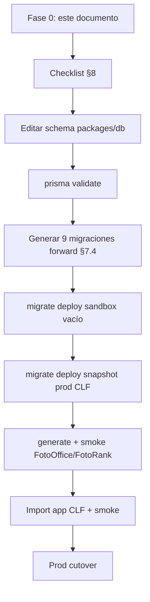

# 06 — Plan de ejecución: fusión Prisma legacy CLF → `packages/db`

**Fecha:** 2026-07-04  
**Fase:** 0 — preparación operativa (sin cambios en código ni DB)  
**Estado:** documento de trabajo — **no implementado**

**Fuentes:**

| Recurso | Ruta |
|---------|------|
| Schema legacy (prod) | `/Users/danielcuart/Desktop/compramelafoto/prisma/schema.prisma` |
| Schema monorepo | `packages/db/prisma/schema.prisma` |
| ADR decisiones | [`../decisions/0001-prisma-unificado-clf-legacy.md`](../decisions/0001-prisma-unificado-clf-legacy.md) |
| Diff técnico | [`03-prisma-diff.md`](./03-prisma-diff.md) |
| Plan estratégico | [`prisma-migration-plan.md`](./prisma-migration-plan.md) |

**Restricciones de esta fase:**

- NO modificar `schema.prisma`
- NO crear migraciones
- NO ejecutar `prisma generate` ni `prisma migrate`
- NO tocar `apps/*`

**Métricas de referencia (2026-07-04):**

| Métrica | Legacy | `packages/db` |
|---------|-------:|--------------:|
| Modelos | 186 | 162 |
| Enums | 126 | 103 |
| Solo legacy | 82 modelos / 67 enums | — |
| Solo mono | — | 58 modelos / 44 enums |
| Compartidos (nombre) | 104 | 104 |
| Compartidos modificados | 30 (diff estructural) | 30 |
| Migraciones deploy activas | 169 | 19 |

**Tag git pre-import monorepo:** `clf/monorepo-pre-legacy-import`  
**Tag legacy prod referencia:** `6e6fd6d4`

---

## Principio rector

> Prod CLF es fuente de verdad para datos y columnas CLF. El monorepo es fuente de verdad para tablas suite (FotoOffice, FotoRank, auth). Colisiones → rename o unión explícita — nunca overwrite silencioso. ([ADR D1–D7](../decisions/0001-prisma-unificado-clf-legacy.md))

---

## 1. Orden exacto de dominios Prisma a migrar

Orden para **editar `packages/db/prisma/schema.prisma`** y para **generar migraciones forward** (D7). Cada dominio depende de los anteriores donde indica FK.

| Orden | Dominio | Objetivo en schema | Migración forward asociada | Bloquea |
|------:|---------|-------------------|---------------------------|---------|
| **0** | **Pre-requisitos / inventario** | Validar entorno, backups, sign-off ADR | — | Todo |
| **1** | **Colisiones CRITICAL (schema)** | Resolver nombres/enums/PK antes de añadir tablas | `20260704100000_clf_rename_student_to_school_student` (solo si DB CLF) | Dominios 2–16 |
| **2** | **Auth suite + Workspace** | Añadir `UserSession`, `GlobalRole`, `Workspace*` (mono) sin tocar CLF | Ya en `init_baseline` + migraciones mono 19 | FotoOffice |
| **3** | **Escuela / roster** | `SchoolStudent` + 9 modelos legacy + merge `School` | `20260704110000_clf_gap_core_school_roster` | Precompra, packs |
| **4** | **Album packs / preventa / upsell** | 12 modelos + merge `AlbumPack` | `20260704120000_clf_gap_album_packs_preventa` | Checkout packs |
| **5** | **Catálogo global + Template V2** | `CatalogProduct*` (6) + `SystemCatalogTemplate` + `TemplateV2*` (6) | Parte de `20260704130000_clf_gap_catalog_camera_media` | Diseño escolar |
| **6** | **Cámara / video / carpetas** | `Camera*` (3) + `Video*` (2) + `AlbumFolder` | `20260704130000_clf_gap_catalog_camera_media` | Ingest workers |
| **7** | **Core commerce (merge)** | Union `Album`, `Photo`, `Order`, `OrderItem` | `20260704160000_clf_align_shared_models` (§1) | Toda la app CLF |
| **8** | **Precompra / diseño escolar (merge)** | Union `PreCompraOrder`, `PreCompraOrderItem`, `DesignProject`, jobs | `20260704160000` (§2) + PK Int D5 | Crons diseño |
| **9** | **Organizador / eventos / comisiones** | `Event*` gap + `Organizer*` (8) + merge `Event` | `20260704150000_clf_gap_organizer_exif_gear` (§1) | Landings org |
| **10** | **EXIF / equipamiento fotográfico** | `PhotoExifMetadata`, `Photographic*` (5), `ExifDevice*` (2) | `20260704150000` (§2) | Rekognition/EXIF |
| **11** | **Cuánto Cobro** | 9 modelos `CuantoCobro*` | `20260704140000_clf_gap_cuantocobro_blog_leads` (§1) | Módulo CC |
| **12** | **Blog / marketing / leads** | `Blog*` (8) + `Talk*` + leads + métricas | `20260704140000` (§2) | SEO / funnels |
| **13** | **FotoOffice — members / cards / courses** | 26 modelos mono (mantener) | Migraciones mono ya aplicadas | FotOffice |
| **14** | **FotoRank** | 25 modelos `Fotorank*` + `ContestOrganization*` | Migraciones mono ya aplicadas | FotoRank |
| **15** | **Evaluaciones** | `Evaluation*`, `Rubric*`, `Student` (mono cuid) | `20260428192455` ya aplicada | Post D1 |
| **16** | **Shared cleanup + enums + índices** | `User`, referrals, templates, webhooks, enums D2–D4 | `20260704170000_clf_align_enums` + `20260704180000_clf_verify_indexes_constraints` | Deploy |

### 1.1 Orden dentro del archivo `schema.prisma` (edición manual recomendada)

1. `generator` / `datasource` — alinear Prisma `^6.19.1` (legacy)
2. Enums **colisión** (`Role`, `ExportJobStatus`, `PreCompraOrderItemStatus`, `PreviewJobStatus`)
3. Enums **solo legacy** por dominio (orden 3→12)
4. Enums **solo mono** (suite)
5. Modelo `SchoolStudent` (ex-legacy `Student`) — **antes** de `Student` evaluaciones
6. Modelos solo legacy por dominio (3→12)
7. Modelos solo mono (13→15)
8. Modelos compartidos — merge campo a campo (legacy ∪ mono), empezando por `User`, `Album`, `Photo`, `Order`
9. Revisión relaciones circulares y `@@index` / `@@unique`

---

## 2. Modelos legacy por dominio (82 — añadir a `packages/db`)

### Dominio 3 — Escuela / roster (8)

| Modelo | FK principales |
|--------|----------------|
| `AcademicYear` | `School` |
| `AlbumStudentRosterEntry` | `Album`, `SchoolStudent` |
| `StudentEnrollment` | `School`, `SchoolStudent` |
| `StudentRosterImportBatch` | `Album`, `School` |
| `StudentRosterImportRow` | `StudentRosterImportBatch` |
| `SchoolLead` | — |
| `SchoolOrganizer` | `User`, `School` |
| `SchoolOrganizerInvitation` | `SchoolOrganizer` |

> `Student` legacy → renombrar a **`SchoolStudent`** (D1). No copiar como `Student`.

### Dominio 4 — Album packs / preventa / upsell (11)

`AlbumPackComponent`, `AlbumPackOrderDraft`, `AlbumPackSelectionPhoto`, `AlbumPackSelectionSession`, `AlbumUpsellConfig`, `AlbumUpsellPack`, `BenefitDefinition`, `PackDefinition`, `PackPurchaseEntitlement`, `PackAccessToken`, `RedemptionSession`

### Dominio 5 — Catálogo + Template V2 (12)

`CatalogProduct`, `CatalogProductCategory`, `CatalogProductComponent`, `CatalogProductImage`, `AlbumCatalogProduct`, `SystemCatalogTemplate`, `TemplateV2`, `TemplateV2Asset`, `TemplateV2Block`, `TemplateV2Publication`, `TemplateV2VariableBinding`, `TemplateV2Version`

### Dominio 6 — Cámara / video / carpetas (6)

`CameraConnectionSettings`, `CameraIngestJob`, `CameraUploadLog`, `AlbumFolder`, `VideoAsset`, `VideoProcessingJob`

### Dominio 9 — Organizador / eventos (11)

`EventFolder`, `EventInterest`, `EventNearbyPhotographerNotification`, `EventOrganizerCommission`, `OrganizerCommission`, `OrganizerCommissionWithdrawalRequest`, `OrganizerEventDownload`, `OrganizerFeaturedGallery`, `OrganizerLandingSponsor`, `OrganizerOfficialPhotographer`, `OrganizerPublicProfile`

### Dominio 10 — EXIF / gear (8)

`PhotoExifMetadata`, `PhotographerDevice`, `PhotographicCameraBody`, `PhotographicGearCombination`, `PhotographicGearObservation`, `PhotographicLens`, `ExifDeviceScanLease`, `ExifDeviceScanState`

### Dominio 11 — Cuánto Cobro (9)

`CuantoCobroConsulta`, `CuantoCobroConsultaActivity`, `CuantoCobroConsultaFile`, `CuantoCobroConsultaNote`, `CuantoCobroConsultaSequence`, `CuantoCobroFinancialProfile`, `CuantoCobroQuote`, `CuantoCobroQuoteSequence`, `CuantoCobroQuoteVersion`

### Dominio 12 — Blog / marketing / leads (17)

`BlogAuthor`, `BlogCategory`, `BlogMedia`, `BlogPost`, `BlogPostTag`, `BlogPostView`, `BlogSubscriber`, `BlogTag`, `CharlaFotoEscolarLead`, `DnxCourseEnrollment`, `DnxCourseLead`, `FotoOfficeInterest`, `FunnelVisit`, `Talk`, `TalkLead`, `PlatformMetrics`, `SimulatorCapture`

**Total:** 8 + 11 + 12 + 6 + 11 + 8 + 9 + 17 = **82**

---

## 3. Enums legacy por dominio (67 — añadir a `packages/db`)

### Dominio 3 — Escuela / roster (7)

`StudentEnrollmentStatus`, `StudentIdentificationMode`, `StudentSourceType`, `RosterImportRowStatus`, `RosterImportStatus`, `SchoolLeadStatus`, `SchoolOrganizerInvitationStatus`, `SchoolOrganizerStatus`

### Dominio 4 — Album packs / preventa (9)

`AlbumPackComponentKind`, `AlbumPackOrderDraftStatus`, `AlbumPackSelectionStatus`, `BenefitSelectionMode`, `BenefitTemplatePolicy`, `PackAvailabilityPhase`, `PackBenefitKind`, `PackPurchaseEntitlementStatus`, `RedemptionSessionStatus`

### Dominio 5 — Catálogo + Template V2 (9)

`CatalogDeliveryType`, `CatalogProductImageRole`, `CatalogProductType`, `TemplateV2AssetKind`, `TemplateV2BlockType`, `TemplateV2ReviewStatus`, `TemplateV2Status`, `TemplateV2Visibility`

### Dominio 6 — Cámara / video / carpetas (6)

`AlbumCleanupStatus`, `AlbumPhotoIngestSource`, `CameraConnectionAssignmentMode`, `CameraIngestJobStatus`, `VideoCategory`, `VideoProcessingJobStatus`, `VideoProcessingStatus`

### Dominio 7–8 — Commerce / diseño (5)

`CheckoutPaymentSource`, `OrderOrigin`, `OrderItemLineOrigin`, `PreviewJobStatus`, `SelectionPhotoRole`, `TemplateSlotRole`

### Dominio 9 — Organizador / eventos (7)

`EventFolderScope`, `EventOrganizerCommissionPayoutMode`, `EventOrganizerCommissionStatus`, `EventPhotoPricingMode`, `EventStatus`, `OrganizerCommissionAppliesTo`, `OrganizerCommissionStatus`, `OrganizerCommissionWithdrawalStatus`

### Dominio 10 — EXIF / gear (6)

`PhotoExifMetadataStatus`, `PhotoStorageCleanupStatus`, `PhotoVariantsStatus`, `PhotographerDeviceConfidence`, `PhotographerDeviceType`, `PhotographicGearConfidence`, `PhotographicGearEntityStatus`, `ExifDeviceScanMode`, `ShutterCountConfidence`

### Dominio 11 — Cuánto Cobro (6)

`CuantoCobroConsultaActivityKind`, `CuantoCobroConsultaPipelineStage`, `CuantoCobroConsultaPriority`, `CuantoCobroConsultaSourceChannel`, `CuantoCobroConsultaStatus`, `CuantoCobroQuoteStatus`

### Dominio 12 — Blog / marketing (5)

`BlogPostStatus`, `BlogPostType`, `DnxCourseEnrollmentStatus`, `TalkModality`, `TalkStatus`, `ReferralProgram`

---

## 4. Modelos que requieren rename

| Origen (legacy / mono) | Nombre unificado | ADR | Acción schema | Acción SQL forward |
|------------------------|------------------|-----|---------------|-------------------|
| **`Student`** (legacy CLF, `Int` PK, `schoolId`) | **`SchoolStudent`** | D1 | Renombrar modelo; actualizar relaciones y FKs en schema | `ALTER TABLE "Student" RENAME TO "SchoolStudent"` + rename columnas FK |
| **`Student`** (mono evaluaciones, `String` cuid) | **`Student`** | D1 | **Mantener** sin cambios | N/A en DB que solo tiene escolar |
| `PreviewJobStatus` (legacy) vs `DesignPreviewJobStatus` (mono) | **`PreviewJobStatus`** | D5 | Unificar enum en schema; eliminar `DesignPreviewJobStatus` | `UPDATE` valores mono → legacy + drop enum mono |
| Columnas FK `studentId` → tablas escolares | `schoolStudentId` (recomendado) | D1 | Renombrar en schema para claridad | `RENAME COLUMN` en tablas afectadas |

### Tablas con FK a `SchoolStudent` (inventario para migración D1)

Revisar en legacy schema antes de SQL:

- `StudentEnrollment`
- `AlbumStudentRosterEntry`
- `PreCompraOrder` (snapshot / `studentId`)
- `StudentRosterImportRow`
- Cualquier otra relación `@relation` hacia legacy `Student`

**Comando de inventario (no ejecutar en prod sin revisión):**

```bash
grep -n 'Student' /Users/danielcuart/Desktop/compramelafoto/prisma/schema.prisma | grep -i 'studentId\|@relation'
```

---

## 5. Modelos compartidos que requieren merge (30)

Política: **legacy ∪ mono**; en conflicto de tipo/default → **gana legacy** para caminos CLF (D6).

### CRITICAL — merge obligatorio antes de deploy CLF

| Modelo | Gap principal (legacy → mono) | Resolución ADR |
|--------|------------------------------|----------------|
| **`Album`** | +37 campos/relaciones solo legacy | D6 — union completa |
| **`Photo`** | +21 campos (folders, variants, EXIF, ingest, cleanup) | D6 |
| **`Order`** | +15 campos (`origin`, checkout, organizer, preventa) | D6 |
| **`OrderItem`** | +5 campos (`lineOrigin`, pack slots, entitlement) | D6 |
| **`PreCompraOrder`** | +14 campos escolares | D6 |
| **`PreCompraOrderItem`** | `albumProductId` optional legacy; +`packDefinitionId`, `fulfillmentQrToken` | D6 — optional gana |
| **`DesignExportJob`** | PK `Int` vs `String`; campos `attempts`/`lastError` vs `completedAt` | D5 — PK Int + columnas union |
| **`DesignPreviewJob`** | Igual export + enum status | D5 |
| **`WebhookEvent`** | `paymentId` `@unique` mono; `status` optional mono | Revisar duplicados; mantener unique si safe |
| **`SelectionPhoto`** | `role`: enum → `String` en mono | Restaurar `SelectionPhotoRole` enum |
| **`TemplateSlot`** | `role`: enum → `String` en mono | Restaurar `TemplateSlotRole` enum |

### REVIEW — merge con revisión manual

| Modelo | Acción |
|--------|--------|
| **`User`** | Union +25 relaciones legacy + +18 mono (`globalRole`, `userSessions`, `fotorank*`, members) |
| **`AlbumPack`** | Añadir `coverImageUrl`, `templateV2Id`, relaciones hijas; default `price` según legacy |
| **`AlbumProduct`** | Revisar diff campo a campo |
| **`DesignProject`** | Campos inline mono vs jobs legacy — no eliminar jobs |
| **`DesignRevision`** | Añadir `projectApprovedForExport` (mono) |
| **`Event`** | +19 campos legacy (pricing, folders, comisiones) |
| **`School`** | +10 relaciones (roster, organizers, academic years) |
| **`EventMember`** | `termsAcceptedAt`, `termsAcceptedText` |
| **`PhotographerProduct`** | `albumPackComponents`, `benefitDefinitions` |
| **`ReferralAttribution`** | `sourceType`, `sourceEntityId`, `referralProgram` |
| **`ReferralEarning`** | `referralProgram` |
| **`Template`** | `version`, `benefitDefinitions` |
| **`AppConfig`** | `downloadLinkDays` default **15** (legacy prod) |
| **`CommunityProfile`** | Diff menor — union |
| **`Lab`**, **`LabSizeDiscount`** | Diff menor — union |
| **`PrintOrder`** | Diff menor — union |
| **`Subject`**, **`SupportTicket`** | Diff menor — union |

### SAFE — compartidos idénticos o diff cosmético

~74 modelos compartidos sin diff estructural (ver [`03-prisma-diff.md`](./03-prisma-diff.md) § nota 80 idénticos). Los 30 listados arriba requieren edición explícita.

---

## 6. Conflictos críticos y resolución (ADR 0001)

| ID | Conflicto | Severidad | Resolución canónica | Verificación post-merge |
|----|-----------|-----------|---------------------|-------------------------|
| **C1** | Dos `Student` distintos | CRITICAL | D1: `SchoolStudent` + `Student` evaluaciones | `SchoolStudent` Int; `Student` cuid |
| **C2** | `Role` sin `SCHOOL_ORGANIZER` en mono | CRITICAL | D2: union todos los valores | `SCHOOL_ORGANIZER` en enum |
| **C3** | `ExportJobStatus`: `SUCCEEDED` vs `COMPLETED` | CRITICAL | D3: canónico `SUCCEEDED` | 0 filas `COMPLETED` |
| **C4** | `PreCompraOrderItemStatus` sin estados escolares | CRITICAL | D4: añadir 3 valores | `PHYSICAL_IN_PROGRESS`, `AT_SCHOOL`, `DELIVERED` |
| **C5** | PK `DesignExportJob` / `DesignPreviewJob` Int → cuid | CRITICAL | D5: mantener `Int` | `id` integer en DB |
| **C6** | `Album`/`Photo`/`Order`/`PreCompraOrder` incompletos en mono | CRITICAL | D6: legacy ∪ mono | Script diff columnas |
| **C7** | 169 + 19 migraciones incompatibles | CRITICAL | D7: gap forward, no replay | `_archive/legacy` poblado |
| **C8** | `ContestOrganization*` overlap CLF/FotoRank | CRITICAL | Validar uso en legacy antes merge | Grep código legacy |
| **R1** | `WebhookEvent.paymentId` unique | REVIEW | Mantener unique si no hay duplicados prod | `SELECT paymentId, COUNT(*) ... HAVING COUNT(*) > 1` |
| **R2** | `DesignProject` campos inline mono | REVIEW | Union; no borrar jobs | Code review diseño |
| **R3** | 3 migraciones mono album_pack subset | REVIEW | D7.5: absorbidas por gap legacy | Tablas existen post-gap |
| **R4** | Prisma version `6.9` mono vs `6.19` legacy | REVIEW | Alinear `^6.19.1` en `packages/db` | `package.json` packages/db |

---

## 7. Lista de migraciones forward a crear

### 7.1 Mantener sin replay (ya aplicadas en DBs mono/suite)

```
20260422085720_init_baseline
20260422185334_service_leads_subtypes_meta
20260424022429_add_service_lead_forms
20260424033104_add_service_lead_form_mode
20260424162000_add_presential_courses_mvp
20260428192455_add_evaluaciones_engine
20260501110000_add_teacher_applications
20260501114500_add_workspace_branding_colors
20260501130000_add_members_registry
20260501141000_add_membership_fees
20260501143000_add_member_charges_payments
20260501152000_add_member_cards
20260501170500_add_card_template_v2
20260501181000_add_card_requests
20260501184500_add_member_card_validity
20260502090000_card_templates_by_category
```

### 7.2 Descartar como forward (contenido absorbido por gap legacy — D7.5)

| Migración mono | Sustituida por |
|----------------|----------------|
| `20260502170000_add_album_pack_entity` | Gap legacy album packs |
| `20260502173500_album_pack_enums_and_constraints` | Gap legacy enums packs |
| `20260502201000_add_album_mode` | Legacy `20260502124600_add_album_mode` (verificar SQL diff) |

> En DBs que **solo** aplicaron estas 3: migraciones forward deben ser **idempotentes** (`IF NOT EXISTS`).

### 7.3 Archivar (referencia, no deploy)

| Origen | Destino propuesto |
|--------|-------------------|
| 169 carpetas legacy | `packages/db/prisma/migrations/_archive/legacy-00000000-20260702/` |
| 19 mono (copia referencia opcional) | `packages/db/prisma/migrations/_archive/mono-20260422-20260502/` |

### 7.4 Migraciones forward nuevas (crear tras editar schema)

| Orden | Nombre carpeta | Contenido SQL | Dominio schema §1 |
|------:|----------------|---------------|-------------------|
| 1 | `20260704100000_clf_rename_student_to_school_student` | `ALTER TABLE "Student" RENAME TO "SchoolStudent"`; rename FKs; **solo** en DB CLF prod sin tabla evaluaciones | Dominio 1 |
| 2 | `20260704110000_clf_gap_core_school_roster` | CREATE tables dominio 3 + enums roster | Dominio 3 |
| 3 | `20260704120000_clf_gap_album_packs_preventa` | CREATE tables dominio 4 + enums packs | Dominio 4 |
| 4 | `20260704130000_clf_gap_catalog_camera_media` | CREATE dominio 5 + 6 | Dominios 5–6 |
| 5 | `20260704140000_clf_gap_cuantocobro_blog_leads` | CREATE dominio 11 + 12 | Dominios 11–12 |
| 6 | `20260704150000_clf_gap_organizer_exif_gear` | CREATE dominio 9 + 10 | Dominios 9–10 |
| 7 | `20260704160000_clf_align_shared_models` | `ALTER TABLE` para 30 modelos compartidos (D6) | Dominios 7–8, 16 |
| 8 | `20260704170000_clf_align_enums` | `ALTER TYPE` Role, ExportJobStatus, PreCompraOrderItemStatus; datos D3 | Dominio 16 |
| 9 | `20260704180000_clf_verify_indexes_constraints` | Índices, FKs, `@@unique` faltantes | Dominio 16 |

**Alternativa aceptada (ADR D7):** fusionar 2–6 en una sola `20260704110000_clf_gap_all_tables.sql`.

**Generación SQL (cuando se autorice Fase 1):**

```bash
# Ejemplo — NO ejecutar en esta fase
cd packages/db
npx prisma migrate diff \
  --from-migrations prisma/migrations \
  --to-schema-datamodel prisma/schema.prisma \
  --script > /tmp/clf_gap_preview.sql
```

---

## 8. Checklist antes de editar `packages/db/prisma/schema.prisma`

### Gobernanza

- [ ] ADR [`0001`](../decisions/0001-prisma-unificado-clf-legacy.md) revisado y sign-off **CLF + FotoOffice**
- [ ] Commit archivado: `799ac240` (`chore(compramelafoto): archive stale monorepo app...`)
- [ ] Tag `clf/monorepo-pre-legacy-import` existe y apunta al pre-import
- [ ] Branch de trabajo acordado (ej. `migration/clf-prisma-unify`)

### Inventario DB (prod / sandbox)

- [ ] `pg_dump --schema-only` de prod CLF guardado
- [ ] `pg_dump` datos críticos (muestra álbumes/órdenes) — rollback
- [ ] Branch Neon `migration/clf-unify` creado
- [ ] Query: ¿prod CLF tiene tabla `Student` escolar (`schoolId`)? → define orden D1
- [ ] Query: ¿staging mono tiene `DesignExportJob.status = 'COMPLETED'`? → script D3
- [ ] Query: ¿duplicados en `WebhookEvent.paymentId`? → decide unique

### Inventario schema

- [ ] Lista **82 modelos** solo-legacy impresa (§2)
- [ ] Lista **67 enums** solo-legacy impresa (§3)
- [ ] Lista **30 modelos** compartidos modificados asignada a reviewer (§5)
- [ ] Lista **58 modelos** solo-mono confirmada — no eliminar (FotoOffice/FotoRank)
- [ ] Diff SQL album_mode / album_pack mono vs legacy ejecutado **offline** (ver §7.2)

### Tooling

- [ ] Versión Prisma acordada: `^6.19.1` en `packages/db/package.json`
- [ ] Plan ventana mantenimiento prod comunicado
- [ ] Rollback documentado: **restore `pg_dump`** — prohibido `migrate reset` en prod
- [ ] Equipo sabe: **no** editar `apps/_archive/.../prisma/schema.prisma` como fuente

---

## 9. Checklist después de editar schema y crear migraciones

### Validación schema (sin deploy prod)

- [ ] `prisma validate` pasa en `packages/db`
- [ ] Conteo modelos schema ≥ 240 (estimado 186 + 58 − duplicados + merges)
- [ ] `SchoolStudent` existe; `Student` es evaluaciones (cuid)
- [ ] `DesignExportJob.id` es `Int` en schema
- [ ] Enum `Role` incluye `SCHOOL_ORGANIZER` + roles suite
- [ ] Enum `ExportJobStatus` usa `SUCCEEDED` (sin `COMPLETED`)
- [ ] `PreCompraOrderItemStatus` incluye 3 estados escolares
- [ ] `SelectionPhotoRole` / `TemplateSlotRole` restaurados (no `String`)

### Validación migraciones (sandbox)

- [ ] `_archive/legacy` y `_archive/mono` poblados; 169 legacy **no** en carpeta deploy activa
- [ ] `migrate deploy` OK en Neon **vacío** (desde cero con 19 mono + 9 forward)
- [ ] `migrate deploy` OK en **restore snapshot prod CLF** + forward
- [ ] Migraciones idempotentes en DB parcial (solo 3 album_pack mono)
- [ ] Conteo tablas DB ≥ prod CLF + tablas suite

### Validación client (post `generate` — cuando se autorice)

- [ ] `prisma generate` en `packages/db` sin error
- [ ] `pnpm --filter @repo/db run check-types` (si existe)
- [ ] FotoOffice smoke: login, members, evaluaciones
- [ ] FotoRank smoke: concurso, jurados
- [ ] CLF smoke (post-import app): login, álbum, checkout test

### Documentación

- [ ] Actualizar [`03-prisma-diff.md`](./03-prisma-diff.md) con enlace a ADR 0001 como resolución CRITICAL
- [ ] Registrar hash commit schema unificado

---

## 10. Comandos de validación

> **NO ejecutar** hasta autorización explícita de Fase 1. Documentados para copy-paste controlado.

### 10.1 Inventario schema (read-only)

```bash
LEGACY="/Users/danielcuart/Desktop/compramelafoto/prisma/schema.prisma"
MONO="packages/db/prisma/schema.prisma"

# Conteos
grep -c '^model ' "$LEGACY" "$MONO"
grep -c '^enum ' "$LEGACY" "$MONO"

# Solo en legacy
comm -23 \
  <(grep '^model ' "$LEGACY" | awk '{print $2}' | sort) \
  <(grep '^model ' "$MONO" | awk '{print $2}' | sort)

# Modelos compartidos con diff
comm -12 \
  <(grep '^model ' "$LEGACY" | awk '{print $2}' | sort) \
  <(grep '^model ' "$MONO" | awk '{print $2}' | sort) \
| while read m; do
    diff -q <(sed -n "/^model $m /,/^}/p" "$LEGACY") \
            <(sed -n "/^model $m /,/^}/p" "$MONO") >/dev/null || echo "MODIFIED: $m"
  done
```

### 10.2 Validación Prisma (post-edición schema)

```bash
cd packages/db
pnpm exec prisma validate --schema prisma/schema.prisma
```

### 10.3 Generate (post-validación)

```bash
cd packages/db
pnpm run db:generate
# o: pnpm exec prisma generate --schema prisma/schema.prisma
```

### 10.4 Preview diff migración (sandbox)

```bash
cd packages/db
pnpm exec prisma migrate diff \
  --from-url "$DATABASE_URL" \
  --to-schema-datamodel prisma/schema.prisma \
  --script
```

### 10.5 Estado migraciones

```bash
cd packages/db
pnpm exec prisma migrate status --schema prisma/schema.prisma
```

### 10.6 Checks DB pre-D1 (prod CLF — solo lectura)

```sql
-- ¿Tabla Student escolar?
SELECT column_name, data_type
FROM information_schema.columns
WHERE table_name = 'Student'
ORDER BY ordinal_position;

-- ¿Filas COMPLETED en jobs diseño (staging mono)?
SELECT status, COUNT(*) FROM "DesignExportJob" GROUP BY status;
SELECT status, COUNT(*) FROM "DesignPreviewJob" GROUP BY status;

-- ¿Duplicados WebhookEvent?
SELECT "paymentId", COUNT(*) FROM "WebhookEvent"
WHERE "paymentId" IS NOT NULL
GROUP BY "paymentId" HAVING COUNT(*) > 1;
```

### 10.7 Verificación post-deploy columnas críticas

```bash
# Tras migrate deploy en sandbox — comparar columnas Album legacy vs DB
psql "$DATABASE_URL" -c "\d \"Album\"" | head -80
```

### 10.8 Comparación SQL migraciones equivalentes (offline)

```bash
diff packages/db/prisma/migrations/20260502201000_add_album_mode/migration.sql \
     /Users/danielcuart/Desktop/compramelafoto/prisma/migrations/20260502124600_add_album_mode/migration.sql

diff packages/db/prisma/migrations/20260502170000_add_album_pack_entity/migration.sql \
     /Users/danielcuart/Desktop/compramelafoto/prisma/migrations/20260502104700_add_album_pack_model/migration.sql
```

---

## 11. Modelos solo monorepo (58) — preservar sin modificar

Añadir al schema unificado **tal cual** desde `packages/db` (dominios 13–15). No eliminar.

`CardRequest`, `CardTemplate`, `ContestOrganization`, `ContestOrganizationMember`, `Course`, `CourseEnrollment`, `CourseInstance`, `CourseSalesCourse`, `CourseSalesLead`, `CourseSalesLesson`, `CourseSalesSection`, `CourseSalesTeacher`, `CourseSalesWorkspaceSettings`, `EvaluationActivity`, `EvaluationContext`, `EvaluationContextStudent`, `EvaluationResult`, `EvaluationResultItem`, `FotofficeWorkspaceBranding`, `FotorankAdminSession`, `FotorankContest`, `FotorankContestCategory`, `FotorankContestCategoryGlobalCategory`, `FotorankContestEntry`, `FotorankDiplomaIssued`, `FotorankDiplomaTemplate`, `FotorankGlobalCategory`, `FotorankGlobalCategoryAlias`, `FotorankJudgeAccount`, `FotorankJudgeAssignment`, `FotorankJudgeAuditEvent`, `FotorankJudgeDirectoryInvitation`, `FotorankJudgeInvitation`, `FotorankJudgeOrganizationMembership`, `FotorankJudgeProfile`, `FotorankJudgeSession`, `FotorankJudgeVote`, `FotorankJudgeVoteHistory`, `FotorankProfile`, `Member`, `MemberCard`, `MemberCardTemplateSettings`, `MemberCategory`, `MemberCharge`, `MemberPayment`, `Membership`, `MembershipFee`, `Rubric`, `RubricCriteria`, `RubricLevel`, `ServiceLeadForm`, `ServiceSalesLead`, `TeacherApplication`, `UserSession`, `Workspace`, `WorkspaceAppAccess`, `WorkspaceFeatureModule`, `WorkspaceMembership`

---

## 12. Enums compartidos — acción por enum

| Enum | Acción | ADR |
|------|--------|-----|
| `Role` | Union completa; añadir `SCHOOL_ORGANIZER` + roles suite | D2 |
| `ExportJobStatus` | Canónico `SUCCEEDED`; migrar `COMPLETED` → `SUCCEEDED` | D3 |
| `PreCompraOrderItemStatus` | Añadir 3 valores escolares | D4 |
| `OrderStatus` | Mantener union; orden irrelevante | SAFE |
| `EventType` | Mantener union; orden irrelevante | SAFE |
| Resto ~54 enums compartidos | Verificar valores idénticos; union si diff | REVIEW |

---

## 13. Flujo de ejecución (mermaid)



---

## 14. Referencias cruzadas

| Documento | Uso en Fase 0 |
|-----------|---------------|
| [`05-import-map.md`](./05-import-map.md) | Prisma → `packages/db`; no copiar `prisma/` al app |
| [`04-domain-import-plan.md`](./04-domain-import-plan.md) | Orden import código **después** de Prisma |
| [`01-current-state.md`](./01-current-state.md) | WIP archivado en `apps/_archive/` |

---

## Historial

| Fecha | Cambio |
|-------|--------|
| 2026-07-04 | Creación Fase 0 — plan operativo de fusión Prisma |

---

*Documento de planificación. Ningún schema, migración ni comando Prisma fue ejecutado al generarlo.*
