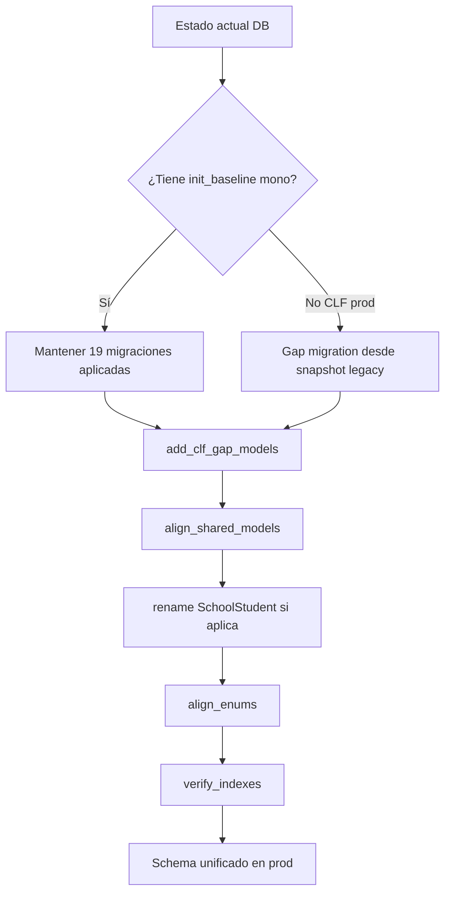

# Plan de unificación Prisma — CLF legacy → `packages/db`

**Fecha:** 2026-07-04  
**Estado:** propuesta (no ejecutada)  
**Prerequisitos:** [`03-prisma-diff.md`](./03-prisma-diff.md), [`02-legacy-inventory.md`](./02-legacy-inventory.md)

> **Restricción respetada:** este documento no ejecuta `migrate`, `db push`, `db pull` ni modifica archivos Prisma. Es el plan operativo para cuando el equipo decida aplicarlo.

---

## 1. Objetivo

Unificar en **`packages/db`** un único `schema.prisma` y un historial de migraciones que:

1. Refleje **producción CLF** como fuente de verdad de datos y tablas.
2. Preserve tablas **FotoOffice** y **FotoRank** ya introducidas en el monorepo.
3. Resuelva **colisiones de nombre** antes de cualquier deploy compartido.
4. Permita que `apps/compramelafoto` (post-import legacy) use exclusivamente `@repo/db`.

---

## 2. Principios de decisión

| # | Principio |
|---|-----------|
| P1 | **Legacy schema gana** en todo lo exclusivo CLF (82 modelos, 67 enums). |
| P2 | **Monorepo schema gana** en todo lo exclusivo suite (FotoOffice, FotoRank, `UserSession`). |
| P3 | **Colisiones CRITICAL** se resuelven con **rename** o **merge explícito**, nunca overwrite silencioso. |
| P4 | **No replay** de 169 migraciones legacy sobre DB que ya aplicó las 19 del mono — historiales divergentes. |
| P5 | **Una migración baseline** nueva para el gap legacy + migraciones forward documentadas. |
| P6 | Validar en **branch Neon** aislado antes de tocar producción CLF. |

---

## 3. Colisiones CRITICAL — resolución obligatoria

### 3.1 `Student` — colisión FotoOffice vs CLF escolar

**Problema:** mismo nombre, PK distinta, dominio distinto.

| | Legacy CLF | Monorepo (evaluaciones) |
|---|-----------|-------------------------|
| PK | `Int` autoincrement | `String` cuid |
| Scope | `schoolId` → `School` | `workspaceId` → `Workspace` |
| Uso | Roster, precompra, importación | `EvaluationContextStudent`, `EvaluationResult` |

**Propuesta (recomendada):**

```
Student          →  SchoolStudent     (legacy CLF — rename en schema unificado)
Student          →  Student           (mono evaluaciones — mantener)
```

**Pasos:**

1. En schema unificado: renombrar modelo legacy a `SchoolStudent` (o `ClfStudent`).
2. Migración SQL: `ALTER TABLE "Student" RENAME TO "SchoolStudent"` en DB **solo CLF** antes de introducir tabla evaluaciones, **o** crear evaluaciones con tabla nueva si CLF prod aún no tiene filas mono.
3. Actualizar código legacy importado (FK `studentId`, relaciones `PreCompraOrder`, etc.).
4. **Severidad si no se hace:** CRITICAL — imposible merge de schemas.

**Alternativa descartada:** unificar ambos en un solo `Student` polimórfico — complejidad extrema, no recomendado.

---

### 3.2 `Role` enum

**Problema:** legacy tiene `SCHOOL_ORGANIZER`; mono tiene roles workspace suite.

**Propuesta:**

```prisma
enum Role {
  // Legacy CLF
  ADMIN
  PHOTOGRAPHER
  LAB
  CUSTOMER
  LAB_PHOTOGRAPHER
  ORGANIZER
  SCHOOL_ORGANIZER
  // Suite
  SUPER_ADMIN
  WORKSPACE_ADMIN
  STAFF
  TEACHER_MANAGER
  COURSE_MANAGER
}
```

Migración: `ALTER TYPE "Role" ADD VALUE ...` por cada valor faltante en cada entorno. **Nunca** eliminar `SCHOOL_ORGANIZER` en prod CLF.

**Clasificación:** CRITICAL si se despliega mono sin añadir valores legacy.

---

### 3.3 `ExportJobStatus` — `SUCCEEDED` vs `COMPLETED`

**Problema:** legacy y código usan `SUCCEEDED`; mono usa `COMPLETED`.

**Propuesta:**

1. Enum unificado con **ambos** valores durante transición, **o**
2. Migración datos: `UPDATE ... SET status = 'COMPLETED' WHERE status = 'SUCCEEDED'` + alias en código.

**Preferencia:** mantener `SUCCEEDED` en CLF paths y mapear en `@repo/db` helpers; alinear mono a legacy para jobs de diseño CLF.

**Clasificación:** CRITICAL para `DesignExportJob` / `DesignPreviewJob` en producción.

---

### 3.4 `PreCompraOrderItemStatus` — fulfillment escolar

**Propuesta:** añadir a mono los valores legacy faltantes:

```
PHYSICAL_IN_PROGRESS
AT_SCHOOL
DELIVERED
```

Migración: `ALTER TYPE "PreCompraOrderItemStatus" ADD VALUE ...`

**Clasificación:** CRITICAL para pedidos escolares en prod.

---

### 3.5 `DesignExportJob` / `DesignPreviewJob` — PK Int → String

**Problema:** mono cambió PK a `cuid()`; legacy tiene filas `Int` y FKs.

**Propuesta:**

1. **Mantener PK `Int` autoincrement** en schema unificado para estas tablas (legacy gana).
2. Revertir en mono la migración conceptual de cuid para jobs CLF, **o**
3. Tabla nueva `DesignExportJobV2` solo si se quiere greenfield (no recomendado con datos prod).

**Clasificación:** CRITICAL — bloquea merge sin decisión.

---

### 3.6 `WebhookEvent.paymentId` unique

**Propuesta:** conservar `@unique` de mono (idempotencia MP). Verificar que legacy prod no tenga duplicados antes de aplicar.

**Clasificación:** REVIEW → CRITICAL si hay duplicados.

---

## 4. Estrategia de merge de schemas (fases)

### Fase 0 — Preparación (sin tocar prod)

| Paso | Acción | Salida |
|------|--------|--------|
| 0.1 | Tag git legacy `6e6fd6d4` | Referencia schema prod |
| 0.2 | Export SQL schema-only legacy (`pg_dump --schema-only`) | Backup |
| 0.3 | Branch Neon `migration/clf-unify` | DB sandbox |
| 0.4 | Resolver colisiones §3 en documento de diseño | Sign-off equipo |

### Fase 1 — Schema unificado en archivo (sin migrate)

| Paso | Acción |
|------|--------|
| 1.1 | Copiar `legacy/schema.prisma` como base de trabajo |
| 1.2 | Añadir 58 modelos solo-mono desde `packages/db/schema.prisma` |
| 1.3 | Aplicar renames (`SchoolStudent`) |
| 1.4 | Fusionar enums (§3.2–3.4) |
| 1.5 | Para 24 modelos modificados: **union** de campos (legacy ∪ mono), preferir tipos legacy en conflictos CLF |
| 1.6 | Añadir `UserSession` y relaciones `User` del mono |
| 1.7 | Review manual `Album`, `Photo`, `Order`, `User` |

**Resultado esperado:** ~240 modelos, ~170 enums (estimado).

### Fase 2 — Migraciones (estrategia recomendada: forward gap)

No replay de 169 + 19. Propuesta:

```
packages/db/prisma/migrations/
├── _archive/
│   ├── mono-20260422-20260502/     # mover 19 actuales (referencia)
│   └── legacy-00000000-20260702/   # copiar 169 legacy (referencia, no deploy)
├── 20260704000000_unified_baseline_marker/   # vacía o comment-only — marca historial
├── 20260704100000_add_clf_gap_models/        # SQL: 82 tablas + enums legacy faltantes
├── 20260704110000_align_shared_models/       # ALTER TABLE campos faltantes en 24 modelos
├── 20260704120000_rename_student_to_school_student/  # si aplica
├── 20260704130000_align_enums/               # Role, ExportJobStatus, PreCompra...
└── 20260704140000_verify_indexes_constraints/
```

**Generación SQL:** usar `prisma migrate diff` **solo en sandbox** cuando el equipo autorice — no en este paso.

### Fase 3 — Validación sandbox

| Check | Comando / criterio |
|-------|-------------------|
| Migrate deploy limpio | En branch Neon vacío |
| Migrate deploy desde prod snapshot | Restore + deploy forward |
| Prisma generate | `@repo/db` client compila |
| Apps FotoOffice / FotoRank | Tests smoke |
| App CLF importada | Login, álbum, checkout test |

### Fase 4 — Producción CLF

| Paso | Acción |
|------|--------|
| 4.1 | Ventana mantenimiento |
| 4.2 | Backup DB |
| 4.3 | Aplicar migraciones forward §Fase 2 (no full reset) |
| 4.4 | Deploy app desde monorepo |
| 4.5 | Verificar crons, workers, webhooks MP |

---

## 5. Plan de migraciones — detalle

### 5.1 Migraciones legacy (169) — tratamiento

| Tratamiento | Cuándo |
|-------------|--------|
| **Archivar** en `_archive/legacy-*` | Siempre — referencia histórica |
| **No ejecutar en mono** | Historial incompatible con `init_baseline` |
| **Condensar en `add_clf_gap_models`** | SQL equivalente al estado final `20260702120000` |

**Dominios a incluir en gap migration (prioridad):**

1. Album packs + preventa (13 migraciones legacy)
2. Escuela / roster (10)
3. Cuánto Cobro (8)
4. Cámara (5)
5. EXIF / gear (5)
6. Template V2 (1 + tablas relacionadas)
7. Blog (2)
8. Organizer commissions (9)
9. Resto del tail `other` (112) — agrupar por revisión SQL

### 5.2 Migraciones monorepo (19) — tratamiento

| Migración | Acción | Clasificación |
|-----------|--------|---------------|
| `20260422085720_init_baseline` | **Mantener como ya aplicada** en DBs que la tienen; referencia para tablas suite | REVIEW |
| `20260422185334` … `20260424162000` | **Mantener** — FotoOffice service leads / courses | SAFE |
| `20260428192455_add_evaluaciones_engine` | **Mantener** tras rename `Student` | CRITICAL |
| `20260501110000` … `20260502090000` | **Mantener** — members, cards | SAFE (FotoOffice) |
| `20260502170000_add_album_pack_entity` | **Descartar como forward** — reemplazado por gap legacy más completo | SAFE |
| `20260502173500_album_pack_enums_and_constraints` | **Descartar** — idem | SAFE |
| `20260502201000_add_album_mode` | **Fusionar** — verificar si `20260502124600` legacy es idéntico; una sola migración | REVIEW |

### 5.3 Equivalencias a verificar manualmente (SQL diff)

```bash
# Album mode — comparar sin ejecutar
diff packages/db/prisma/migrations/20260502201000_add_album_mode/migration.sql \
     /Users/danielcuart/Desktop/compramelafoto/prisma/migrations/20260502124600_add_album_mode/migration.sql

# Album pack entity mínima mono vs legacy
diff packages/db/prisma/migrations/20260502170000_add_album_pack_entity/migration.sql \
     /Users/danielcuart/Desktop/compramelafoto/prisma/migrations/20260502104700_add_album_pack_model/migration.sql
```

### 5.4 Migraciones a fusionar en una sola

| Grupo | Migraciones legacy | Migración unificada propuesta |
|-------|-------------------|------------------------------|
| Album pack core | `20260502104700` … `20260610120000` (13) | `20260704100000_add_clf_gap_models` (sección packs) |
| Cuánto Cobro | `20260624120000` … `20260624190000` (8) | misma gap migration (sección cc) |
| Photographic gear | `20260701120000` … `20260702120000` (5) | misma gap migration (sección exif) |

### 5.5 Migraciones a descartar (post-merge)

| Item | Motivo |
|------|--------|
| 3 migraciones mono album_pack / album_mode | Subset del legacy |
| Replay de 169 legacy individuales | Sustituidas por gap squash |
| WIP mono `apps/compramelafoto/prisma` | Copia stale — no usar |

---

## 6. Modelos compartidos — plan de alineación (24)

Prioridad de merge de campos (legacy ∪ mono):

| Prioridad | Modelo | Acción |
|----------:|--------|--------|
| 1 | `Album` | Añadir 37 campos legacy a mono |
| 2 | `Photo` | Añadir 21 campos legacy |
| 3 | `Order` / `OrderItem` | Añadir campos checkout/preventa/organizer |
| 4 | `User` | Union relaciones; `globalRole` + `userSessions` del mono |
| 5 | `PreCompraOrder` / `PreCompraOrderItem` | Campos escolares + revisar optional `albumProductId` |
| 6 | `AlbumPack` | Campos `coverImageUrl`, `templateV2Id`, relaciones hijas |
| 7 | `DesignProject` | Decidir: campos inline mono vs jobs legacy — **REVIEW** arquitectura |
| 8 | `DesignExportJob` / `DesignPreviewJob` | PK Int legacy — §3.5 |
| 9 | `Event` / `School` | Campos organizer/pricing/roster |
| 10 | Resto | `AppConfig`, `Referral*`, `Template*`, `WebhookEvent` |

---

## 7. Integración con paquetes shared

### `@repo/db`

| Tarea | Detalle |
|-------|---------|
| Schema único | Resultado Fase 1 |
| `postinstall` / `db:migrate:deploy` | Sin cambio de contrato |
| Version Prisma | Alinear `^6.19.1` (legacy) vs `^6.9.0` (mono) antes de merge |
| Workers CLF | Dejar de copiar schema local; `import { prisma } from "@repo/db"` |

### `@repo/auth`

| Tarea | Detalle |
|-------|---------|
| `UserSession` | Tabla solo mono — necesaria para suite |
| Convivencia | Bridge cookie `auth-token` → `dnx_session` en cutover (app layer, no Prisma) |

### `@repo/auth-guards`

| Tarea | Detalle |
|-------|---------|
| `Role` enum | Debe incluir roles CLF post-merge |
| `compramelafoto_workspace_id` | Cookie ya prevista |

### `@repo/design-system` / `@repo/ui`

Sin impacto directo en Prisma. UI migration independiente.

---

## 8. Conflictos FotoOffice / FotoRank — matriz de convivencia

| Escenario DB | Riesgo | Recomendación |
|--------------|--------|---------------|
| **CLF prod aislada** | Bajo para FotoOffice | Aplicar gap CLF + mantener tablas mono vacías |
| **Neon branch compartido dev** | Medio | Rename `Student` antes de seed evaluaciones |
| **Prod única suite futura** | Alto | Completar §3 antes de unificar instancias |

### FotoOffice — tablas que conviven sin conflicto de nombre

`Workspace*`, `Member*`, `CardTemplate*`, `CourseSales*`, `TeacherApplication` — **SAFE** si se añaden sin tocar tablas CLF.

### FotoRank — tablas que conviven sin conflicto

Todos los `Fotorank*` — **SAFE** en nombres. Revisar tamaño y backups.

### Shared — atención

| Item | Producto | Severidad |
|------|----------|-----------|
| `ContestOrganization` / `ContestOrganizationMember` | FotoRank + posible uso CLF eventos | CRITICAL — validar uso en legacy |
| `User` | Todos | REVIEW — grafo de relaciones grande |
| `Event` | CLF + FotoRank contexts | REVIEW — campos legacy faltantes en mono |

---

## 9. Checklist de ejecución (cuando se autorice)

### Pre-merge

- [ ] Sign-off rename `SchoolStudent`
- [ ] Sign-off enum `Role` unificado
- [ ] Sign-off PK jobs diseño (Int vs cuid)
- [ ] Branch Neon creado
- [ ] `pg_dump` prod CLF

### Schema

- [ ] Archivo `schema.prisma` unificado en branch
- [ ] Review 82 modelos añadidos
- [ ] Review 24 modelos alineados
- [ ] `prisma validate` (solo validación)

### Migraciones

- [ ] Archivar historiales en `_archive/`
- [ ] Crear `add_clf_gap_models` SQL
- [ ] Crear `align_shared_models` SQL
- [ ] Crear `align_enums` SQL
- [ ] Probar `migrate deploy` en sandbox

### Apps

- [ ] FotoOffice smoke
- [ ] FotoRank smoke
- [ ] CLF import smoke (auth, álbum, MP webhook test)

### Prod

- [ ] Ventana mantenimiento
- [ ] Migrate deploy forward
- [ ] Rollback plan documentado

---

## 10. Rollback

| Nivel | Acción |
|-------|--------|
| **App** | Revert deploy Vercel a commit anterior |
| **DB forward migration** | Restaurar `pg_dump` pre-migración — **único rollback seguro** |
| **Schema git** | Revert PR — no afecta DB ya migrada |

No usar `prisma migrate reset` en producción.

---

## 11. Cronograma sugerido (estimación)

| Semana | Entregable |
|--------|------------|
| 1 | Decisiones §3 CRITICAL + schema unificado en branch |
| 2 | Gap migration SQL + sandbox deploy |
| 3 | Import app CLF + `@repo/db` + pruebas integración |
| 4 | Staging full + workers + crons |
| 5 | Prod cutover (si sandbox verde) |

---

## Anexo A — Modelos solo mono (58)

`CardRequest`, `CardTemplate`, `ContestOrganization`, `ContestOrganizationMember`, `Course`, `CourseEnrollment`, `CourseInstance`, `CourseSalesCourse`, `CourseSalesLead`, `CourseSalesLesson`, `CourseSalesSection`, `CourseSalesTeacher`, `CourseSalesWorkspaceSettings`, `EvaluationActivity`, `EvaluationContext`, `EvaluationContextStudent`, `EvaluationResult`, `EvaluationResultItem`, `FotofficeWorkspaceBranding`, `FotorankAdminSession`, `FotorankContest`, `FotorankContestCategory`, `FotorankContestCategoryGlobalCategory`, `FotorankContestEntry`, `FotorankDiplomaIssued`, `FotorankDiplomaTemplate`, `FotorankGlobalCategory`, `FotorankGlobalCategoryAlias`, `FotorankJudgeAccount`, `FotorankJudgeAssignment`, `FotorankJudgeAuditEvent`, `FotorankJudgeDirectoryInvitation`, `FotorankJudgeInvitation`, `FotorankJudgeOrganizationMembership`, `FotorankJudgeProfile`, `FotorankJudgeSession`, `FotorankJudgeVote`, `FotorankJudgeVoteHistory`, `FotorankProfile`, `Member`, `MemberCard`, `MemberCardTemplateSettings`, `MemberCategory`, `MemberCharge`, `MemberPayment`, `Membership`, `MembershipFee`, `Rubric`, `RubricCriteria`, `RubricLevel`, `ServiceLeadForm`, `ServiceSalesLead`, `TeacherApplication`, `UserSession`, `Workspace`, `WorkspaceAppAccess`, `WorkspaceFeatureModule`, `WorkspaceMembership`

## Anexo B — Orden de migración forward (resumen)



## Anexo C — Clasificación SAFE / REVIEW / CRITICAL (resumen)

| ID | Item | Clase |
|----|------|-------|
| C1 | Colisión `Student` | CRITICAL |
| C2 | `Role` sin `SCHOOL_ORGANIZER` | CRITICAL |
| C3 | `ExportJobStatus` SUCCEEDED vs COMPLETED | CRITICAL |
| C4 | `PreCompraOrderItemStatus` valores escolares | CRITICAL |
| C5 | PK `DesignExportJob` / `DesignPreviewJob` | CRITICAL |
| C6 | `ContestOrganization*` overlap | CRITICAL |
| R1 | 82 modelos gap legacy | REVIEW |
| R2 | 24 modelos shared field merge | REVIEW |
| R3 | 3 migraciones mono album_pack subset | REVIEW |
| R4 | `User` relaciones union | REVIEW |
| R5 | `DesignProject` inline vs jobs | REVIEW |
| S1 | 80 modelos shared idénticos | SAFE |
| S2 | 51 modelos mono FotoOffice/FotoRank | SAFE |
| S3 | 13 modelos legacy blog/simulator | SAFE |
| S4 | Enums `OrderStatus` / `EventType` orden | SAFE |

---

## Referencias

- [`03-prisma-diff.md`](./03-prisma-diff.md) — diff técnico completo
- [`02-legacy-inventory.md`](./02-legacy-inventory.md)
- [`01-current-state.md`](./01-current-state.md)

---

*Plan de unificación — documentación únicamente. Sin cambios en `schema.prisma` ni migraciones.*
