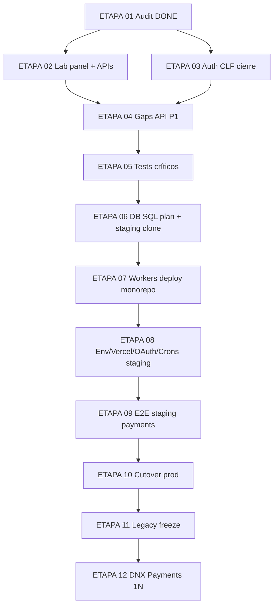

# 08 — Plan de ejecución de migración (post-auditoría)

**Fecha:** 2026-07-29  
**Orden** según dependencias reales encontradas (no el ejemplo genérico del brief).  
**DNX Payments 1:N:** última etapa de producto, post-freeze Legacy.

---

## Diagrama de dependencias

---

## ETAPA 02 — Panel Lab + APIs Lab → **DONE** (2026-07-29)

| | |
|--|--|
| **Objetivo** | Paridad panel laboratorio 1:1 |
| **Estado** | **DONE** — ver `10-stage-02-lab-migration-report.md`; P0-01 CLOSED |
| **Alcance cumplido** | `app/lab/**`, 11 APIs lab + `/api/terms/accept`, post-login `/lab/dashboard`, selfchecks |
| **Fuera de alcance (POST_LAB_PARITY)** | template-v2 fotógrafo, APIs escolar públicas (auth dual cerrado en ETAPA 03) |

---

## ETAPA 03 — Auth / Usuarios CLF (cierre) → **DONE** (2026-07-29)

| | |
|--|--|
| **Objetivo** | Una sola identidad runtime (`dnx_session`); eliminar dual-session |
| **Estado** | **DONE** — P0-06 CLOSED; ver `11-stage-03-auth-closure-report.md` |
| **Alcance cumplido** | SoT `getAuthUser`; sin fallback `auth-token`; login/OAuth fallan sin UserSession; logout purga Legacy; destinos + tests |
| **Cutover cookies Legacy** | `RELOGIN_REQUIRED` |
| **Trasladado a P0-07** | Google Console redirects + env Vercel |

---

## ETAPA 04 — Gaps API P1 (template-v2, consent, escolar, print, upsells)

| | |
|--|--|
| **Objetivo** | Cerrar las 43−lab APIs críticas de paridad |
| **Alcance** | Portar rutas listadas en `04-routes-parity.md` P1; omitir test/debug |
| **Dependencias** | ETAPA 02 si toca lab; ETAPA 03 para consent autenticado |
| **Riesgo** | Medio |
| **Archivos** | `app/api/template-v2/**`, `app/api/terms/accept`, `app/api/users/me/*`, `app/api/public/**`, `app/api/prints/upload-final`, `app/api/upsells/**` |
| **DONE** | `comm` Legacy−Mono APIs P0/P1 = 0 (excl. test/demo) |

---

## ETAPA 05 — Tests críticos + caracterización

| | |
|--|--|
| **Objetivo** | Restaurar red de seguridad pre-staging |
| **Alcance** | Portar tests Legacy álbumes/packs/pricing/download; smoke scripts diagnóstico |
| **Dependencias** | ETAPA 02–04 (código presente) |
| **Riesgo** | Bajo |
| **Archivos** | `lib/albums/**/*.test.ts`, `lib/album-packs/**`, `lib/pricing/**`, gateway rate-limit |
| **DONE** | Suite mínima CI verde; checklist E2E documentado |

---

## ETAPA 06 — Base de datos (plan SQL + staging)

| | |
|--|--|
| **Objetivo** | Schema físico compatible con prod CLF + mono |
| **Alcance** | Rename SchoolStudent; forward gaps; **no** apply a prod aún; validar en clon |
| **Dependencias** | Código ya usa `schoolStudent` (hoy) |
| **Riesgo** | **Crítico** |
| **Archivos** | `packages/db/prisma/migrations/*`, ADR-0001, scripts dry-run |
| **DONE** | Clon staging: health OK, roster/precompra/orders OK, backup documentado |

---

## ETAPA 07 — Workers monorepo

| | |
|--|--|
| **Objetivo** | FTP ingest + video operativos bajo layout mono |
| **Alcance** | Rewrite Docker o systemd pnpm; env R2/DB; healthchecks |
| **Dependencias** | DB staging estable (E06) |
| **Riesgo** | Alto ops |
| **Archivos** | `apps/compramelafoto-workers/**` |
| **DONE** | Ingest end-to-end + video job en staging |

---

## ETAPA 08 — Infra staging (env, Vercel, OAuth, crons)

| | |
|--|--|
| **Objetivo** | Stack Mono listo sin tráfico prod |
| **Alcance** | Env PRODUCTION_CRITICAL; redirects MP/Google; 17 crons; R2 CORS; FI `LEGACY_ONLY` |
| **Dependencias** | E06–E07 |
| **Riesgo** | Medio |
| **Archivos** | Vercel project, `vercel.json`, consolas OAuth |
| **DONE** | Staging URL sirve app; crons disparan; OAuth roundtrip |

---

## ETAPA 09 — E2E staging (pagos Legacy parity)

| | |
|--|--|
| **Objetivo** | Validar cobro idéntico a Legacy (Checkout Pro) |
| **Alcance** | Preference → pago sandbox → webhook → finalize → email → download; org collector 100%; reconcile cron |
| **Dependencias** | E08 |
| **Riesgo** | Alto negocio |
| **Archivos** | Flujos `06-payment-current-state.md` |
| **DONE** | Checklist pagos firmado; sin Orders 1:N |

---

## ETAPA 10 — Cutover producción

| | |
|--|--|
| **Objetivo** | DNS/tráfico → Mono; Legacy en standby |
| **Alcance** | Ventana; migrate SQL controlado; switch DNS; monitorear webhooks/emails |
| **Dependencias** | E09 GO |
| **Riesgo** | **Crítico** |
| **DONE** | Ventas + logins + uploads OK 24–48h; plan rollback DNS listo |

---

## ETAPA 11 — Legacy freeze

| | |
|--|--|
| **Objetivo** | Congelar Legacy como rollback temporal |
| **Alcance** | Read-only / disable deploys; documentar TTL rollback |
| **Dependencias** | E10 estable |
| **DONE** | Política freeze publicada; no writes nuevos a Legacy |

---

## ETAPA 12 — DNX Payments 1:N (POST_MIGRATION)

| | |
|--|--|
| **Objetivo** | Reemplazar cobro Checkout Pro ad-hoc por `@repo/payments` donde corresponda |
| **Alcance** | Split 1:N, vault FI, agreements — **fuera de paridad** |
| **Dependencias** | E11 |
| **Riesgo** | Alto financiero + legal distribución fondos |
| **DONE** | Criterios propios docs `docs/dnx-payments/` — no parte del GO cutover Legacy |

---

## Paralelismo permitido

- **E02 ∥ E03** (Lab vs Auth) si no comparten archivos conflictivos
- Revisión legal humana (términos fotógrafo / Info Spot) puede correr en paralelo desde E02
- **No** empezar E12 antes de E11

---

## Criterio global GO_TO_PRODUCTION (futuro)

No aplica a esta etapa. Requiere: P0-01…P0-08 cerrados + E09 firmado + legal P1-08 resuelto.
