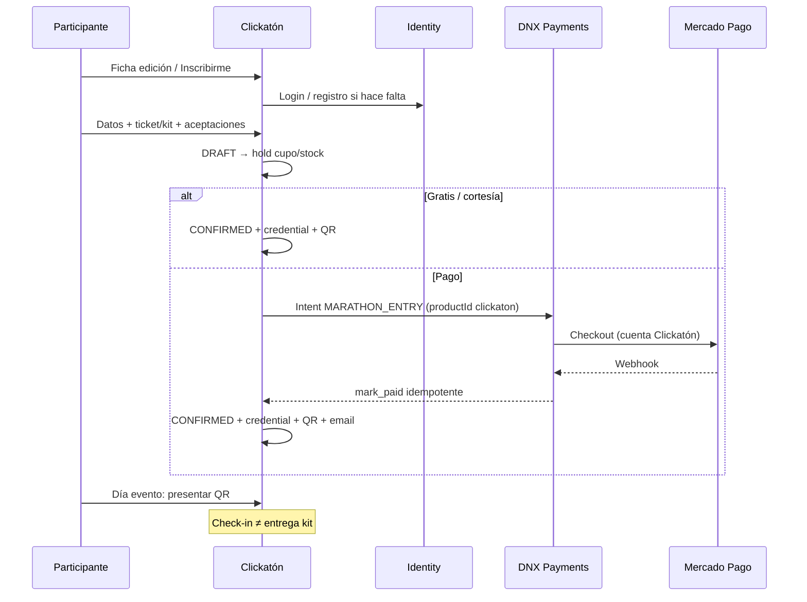

# Clickatón 10D1 — Auditoría inscripción, QR, check-in y kit

**Date:** 2026-07-18  
**Status:** **PLAN APROBABLE — LISTO PARA 10D2**  
**Scope:** diseño únicamente — sin migraciones, sin Neon writes, sin MP real  
**Depends on:** 10C4B GO (`29d30b2`) · ediciones/sedes (`ClickatonEdition` / `ClickatonVenue`)

Contratos TypeScript: `apps/clickaton/lib/registration/design/contracts.ts`  
Selfcheck: `pnpm --filter clickaton selfcheck:registration-design`

---

## 1. Estado actual (hallazgos)

### Git / DB

| Ítem | Valor |
|------|--------|
| HEAD auditado | `29d30b2` (10C4B docs) |
| 10C3B / 10C4B | `5dee5a4` · `222ed35` · `29d30b2` |
| Neon ClickatonEdition / Venue | Tablas presentes, **0 filas** |
| DnxPaymentIntent | Tabla presente |
| WIP Cuánto Cobro | Presente (ajeno; no tocado) |
| Orphan infospot | Reconciliado |

### Clickatón app

| Dominio | Estado |
|---------|--------|
| Ediciones / sedes admin CRUD | **Implementado** (Prisma) |
| Login unificado + Google + allowlist | **Implementado** |
| Catálogo público maratones | **Fixtures o HTTP FotoRank** — **no** lee Prisma ClickatonEdition |
| CTA “Inscribirme” | **Handoff** a FotoRank (`registrationUrl`); `checkoutUrl=null` |
| Inscripción / pago / QR / check-in / kit | **Ausentes** |
| Admin `/inscripciones` | Empty state stub |
| Integraciones admin | Cards informativas FR + Payments |

### Reutilizable en monorepo

- **DNX Identity** (`@repo/auth`): sesión `dnx_session`, Google OAuth, email Resend.
- **DNX Payments**: `productId: "clickaton"`, `MARATHON_ENTRY`, `DnxPayment*`, idempotencia, webhook inbox (sin endpoint prod).
- **FotoRank**: oferta pública MARATHON+CLICKATON, campos `registration*`, handoff documentado.
- **Allowlist admin** (Daniel / Rodrigo / Tamara) ya alineada a socios.

---

## 2. Principio de bounded contexts (decisión)

```text
Clickatón  → edición comercial, inscripción, pago orquestado, QR, check-in, kit, operadores
FotoRank   → concurso fotográfico (consignas, subida, jurado, ranking) vía fotorankContestId
DNX Payments → único dueño del PSP / cuenta MP Clickatón / webhooks / ledger
DNX Identity → User + sesión compartida
```

**Rompe el handoff 09B1 a medio plazo:** la inscripción pagada **no** vive en FotoRank. FR recibe (opcional, post-confirmación) un vínculo/sync de participantes para el canal fotográfico.

Clickatón **nunca** guarda access tokens de Mercado Pago ni procesa webhooks PSP.

---

## 3. Flujo participante (objetivo)



---

## 4. Entradas, productos y kits

| Concepto | Rol |
|----------|-----|
| `ClickatonTicketType` | Modalidad de participación (solo entrada, entrada+kit, …) por edición; precio snapshot |
| `ClickatonProduct` | SKU vendible (remera, botella, …) |
| `ClickatonProductVariant` | Talle/color; stock |
| `ClickatonKit` | Pack predefinido de ítems |
| `ClickatonKitItem` | Líneas del kit (product+variant+qty) |
| `ClickatonRegistrationItem` | Líneas compradas (precio pagado, qty) |

**MVP:** Opción A (solo inscripción) + Opción B (inscripción + remera con talles). Kits compuestos = evolución 10D3+.

Precio efectivo se **congela** en `RegistrationItem.unitAmountMinor` al confirmar checkout.

---

## 5. Datos del participante

| Campo | Clasificación |
|-------|----------------|
| userId (Identity) | Obligatorio (cuenta) |
| firstName, lastName | Obligatorio siempre |
| email | Obligatorio (de User + confirmación) |
| phone | Obligatorio por edición (default sí) |
| documentType + documentNumber | Obligatorio por edición (default sí); **sensible** |
| birthDate | Obligatorio si hay menores / categorías etarias |
| city, province, country | Opcional / por edición |
| venueId | Obligatorio si edición multi-sede |
| ticketTypeId | Obligatorio |
| shirtSize (variant) | Obligatorio si ítem lo requiere |
| emergencyContactName/Phone | Obligatorio por edición (recomendado sí) |
| medicalCoverage | Opcional; **no** historial clínico |
| acceptTermsAt, acceptImageAt | Obligatorio |
| parentalConsentAt + guardian* | Obligatorio si menor |
| accessibilityNotes | Opcional |
| internalNotes | Solo admin |

**Menores:** inscripción con tutor logueado o consentimiento firmado; QR del menor no expone documento.

**No almacenar:** datos de tarjeta, historia clínica detallada, DNI escaneado en MVP.

---

## 6. Estados (separados)

### Inscripción (`ClickatonRegistrationStatus`)

`DRAFT` → `PENDING_PAYMENT` / `WAITLISTED` → `PAYMENT_PROCESSING` → `CONFIRMED`  
Fallos: `PAYMENT_FAILED` | `PAYMENT_EXPIRED` | `CANCELLED` | `REFUNDED` | `TRANSFER_*` | `DISQUALIFIED`

### Check-in (`ClickatonCheckIn`)

Fila 0..1 por inscripción: `NOT_CHECKED_IN` | `CHECKED_IN` | `REVERTED`

### Kit (`ClickatonKitDelivery`)

`NOT_APPLICABLE` | `PENDING` | `PARTIAL` | `DELIVERED` | `REVERTED`

**No** usar `CHECKED_IN` como estado de inscripción: evita mezclar cobro y puerta.

Máquina de transiciones: ver `REGISTRATION_TRANSITIONS` en contratos. Confirmación **solo** por webhook/consulta Payments o acción admin auditada — **nunca** por return URL del browser.

---

## 7. Identificación visible

| Pieza | Decisión |
|-------|----------|
| PK | `cuid`/`uuid` interno |
| Visible | `{EDITION_PREFIX}-{SEQ:05}` ej. `COR26-00428` |
| Generación | Contador atómico por `editionId` (transacción) |
| No es secreto | OK mostrar en remesa / dorsal |
| Colisiones | Unique `(editionId, visibleCode)` |

---

## 8. QR (recomendación: Opción 2)

**Token opaco aleatorio** (≥128 bits) en `ClickatonQrToken`, unique, revocable, regenerable.

| Aspecto | Diseño |
|---------|--------|
| Contenido | Token o URL `https://maraton…/a/{token}` sin PII |
| Lookup | Server: token → credential → registration |
| Offline MVP | **Fuera de alcance** — requiere online |
| Revocación | `revokedAt` + regeneración invalida anterior |
| Screenshots | Aceptado; revocación + check-in único mitigan |
| Firma JWT (Opción 3) | Evolución si aparece modo offline |

---

## 9. Check-in

- Búsqueda: QR, visibleCode, nombre, documento, email.
- Muestra: identidad, sede, ticket, kit pendiente, estado pago.
- Idempotente: segundo scan → “ya acreditado” + timestamp/operador.
- Reversión: solo `ADMIN_GENERAL` o capability `checkin.revert` con motivo.
- Concurrencia: unique parcial / constraint “un check-in activo”.
- **MVP:** online only; cola offline = post-MVP.

---

## 10. Entrega de kit

Separada del check-in (puede acreditarse sin kit o viceversa según reglas de edición).

MVP:

- `ClickatonKitDelivery` 0..1 + ítems derivados de `RegistrationItem`.
- Stock: **reserva al pasar a PENDING_PAYMENT** (`ClickatonStockHold`); commit al CONFIRMED; release al expire/cancel.
- Cambio de talle: admin antes de entrega; post-entrega = reposición auditada.
- Retiro por tercero: flag + nombre + DNI receptor (opcional por edición).

---

## 11. Modelo de datos (propuesto — sin migración aún)

| Entidad | Responsabilidad | Claves / uniques |
|---------|-----------------|------------------|
| ClickatonTicketType | Oferta por edición | editionId+code |
| ClickatonProduct / Variant | Catálogo + stock | sku; variant unique |
| ClickatonKit / KitItem | Packs | kitId+productVariantId |
| ClickatonRegistration | Inscripción | userId+editionId (activo); visibleCode |
| ClickatonRegistrationItem | Líneas + precio pagado | registrationId |
| ClickatonRegistrationStatusHistory | Historial estados | append-only |
| ClickatonParticipantCredential | Credencial | registrationId 1:1 |
| ClickatonQrToken | Tokens opacos | token unique |
| ClickatonCheckIn | Acreditación | registrationId unique activo |
| ClickatonKitDelivery (+Item) | Entrega | registrationId |
| ClickatonRegistrationAudit | Auditoría acciones | append-only |
| ClickatonCapacityHold | Reserva cupo | registrationId / expiresAt |
| ClickatonStockHold | Reserva stock | variantId+qty+expiresAt |

**FKs:** `User`, `ClickatonEdition`, `ClickatonVenue?`  
**Payments:** `dnxPaymentOrderId` / `externalReference` opacos en Registration (no duplicar ledger).

Soft-delete: no borrar inscripciones CONFIRMED; anonimizar PII solo con proceso legal.

---

## 12. DNX Payments

| Tema | Diseño |
|------|--------|
| Orden | `productId=clickaton`, kind `MARATHON_ENTRY` (+ líneas merch) |
| Confirmación | Webhook → inbox → handler idempotente → `CONFIRMED` |
| Browser return | Solo UI “procesando / consultar estado” |
| Métodos futuros | MP, transferencia (review admin), free, cortesía, promo |
| Refund | Admin → Payments command → estado `REFUNDED` |

---

## 13. Cuenta de cobro Clickatón

- Cuenta **Mercado Pago distinta** de DNX Estudio.
- Socios: Daniel, Tamara, Rodrigo (mismos 3 admins allowlist).
- Credenciales: env/Vault **por producto** en Payments (`CLICKATON_MP_*`), nunca en Clickatón app ni OAuth CLF.
- Gap actual: Payments no tiene vault multi-cuenta; 10D5 debe añadir resolución de credentials por `productId`.

---

## 14. Roles

| Rol | Puede | No puede |
|-----|-------|----------|
| ADMIN_GENERAL | Todo operativo + finanzas + excepciones | — |
| ACCREDITATION_OPERATOR | Buscar, check-in, revert limitado | Precios, refunds, config |
| KIT_OPERATOR | Entregar / revert kit | Finanzas, config |
| AUDITOR_PARTNER | Reportes / exports (PII según política) | Mutar estados |

Evolución: `WorkspaceAppAccess` app `CLICKATON` + role; MVP puede extender allowlist + role table.

---

## 15. Panel admin (pantallas MVP)

Inscripciones (filtros edición/sede/estado/pago/check-in/kit/talle/código/nombre/doc/email) · detalle · check-in desk · kit desk · ticket types · productos · métricas básicas · CSV · audit log.

---

## 16. Experiencia pública

CTA en ficha (datos desde Prisma Edition publicada, no solo FR) · wizard inscripción · resumen · checkout · pending · confirmación + QR · mi inscripción (sesión) · link firmado email (sin PII en query).

---

## 17. Notificaciones

Eventos: pending, paid, failed, expired, confirmed+credential, reminder, cancel, refund, seat/kit change.  
Infra: patrón Resend `@repo/auth` / mailer compartido. **No enviar** en 10D1.

---

## 18. Cupos y stock

| Recurso | Regla MVP |
|---------|-----------|
| Cupo edición / sede / ticket | Hold TTL (ej. 15–30 min) al checkout |
| Stock variant | Hold al mismo tiempo |
| Expiración | Job/cron libera holds |
| Waitlist | Estado `WAITLISTED`; promoción manual en MVP |
| Sobreventa | Prohibida en MVP |

---

## 19. Seguridad

- Tokens QR opacos; rate-limit scan/lookup.
- Server-side transitions; sin mutación de estado desde cliente.
- Webhook firma + idempotency keys.
- Logs sin documento/teléfono completos.
- Exports PII solo ADMIN/AUDITOR con audit.
- Race: unique constraints + transacciones.

---

## 20. Auditoría

`ClickatonRegistrationAudit` + status history: acción, from/to, actorUserId, source, reason, correlationId, metadata mínima.

---

## 21. FotoRank

| Clickatón | FotoRank |
|-----------|----------|
| Edición comercial, sedes, inscripción, QR, puerta, kit | Concurso, consignas, fotos, jurado |
| `fotorankContestId` opcional | Canal MARATHON+CLICKATON para galería/consignas |
| Sync participantes CONFIRMED → FR (etapa posterior) | No cobro / no check-in |

Catálogo público debe **converger** a Prisma Edition (dejar fixtures/FR API como fallback hasta 10D3–4).

---

## 22. Etapas futuras

| Etapa | Alcance | Criterio GO |
|-------|---------|-------------|
| **10D2** | Migración Prisma entidades MVP | migrate deploy staging; empty-DB ok |
| **10D3** | Admin ticket types / products / kits / precios | CRUD + validaciones |
| **10D4** | Formulario DRAFT + holds | Draft persistido; hold liberable |
| **10D5** | Contrato Payments + credentials Clickatón | Intent sandbox; sin confirm browser |
| **10D6** | Webhook → CONFIRMED + credential + QR | Idempotencia; email dry-run |
| **10D7** | Panel participantes + CSV | Filtros; sin PII en URL |
| **10D8** | Check-in desk | Doble scan bloqueado |
| **10D9** | Kit delivery desk | Separado de check-in |
| **10D10** | Notificaciones, reportes, hardening | Rate limits; roles operadores |

---

## 23. Decisiones obligatorias

| # | Tema | Decisión |
|---|------|----------|
| 1 | Entidad principal | `ClickatonRegistration` |
| 2 | Pago vs inscripción | Estados de pago embebidos en registration **o** mirror de Payments; check-in/kit **separados** |
| 3 | Check-in vs kit | Entidades distintas |
| 4 | QR | Token opaco (Opción 2) |
| 5 | Número visible | Prefijo edición + secuencial; no PK |
| 6 | Cupo | Hold TTL al checkout |
| 7 | Stock | Hold TTL; commit on CONFIRMED |
| 8 | User | FK obligatoria a Identity `User` |
| 9 | FotoRank | Link opcional; no dueño del cobro |
| 10 | Payments | Único PSP; `productId=clickaton`; cuenta MP separada |
| 11 | MVP | Entrada ± remera; online check-in; kit desk; sin offline/split |
| 12 | Fuera MVP | Offline QR, envíos domicilio, split organizador, waitlist auto, Tiendanube |

---

## 24. Riesgos

- Drift catálogo público (FR fixtures) vs Prisma Edition.
- Falta credential resolution por producto en Payments.
- WIP Cuánto Cobro en árbol de migraciones (apartar en deploys).
- PII en exports/logs.
- Migración de expectativa “handoff FR” → UX Clickatón nativa (comunicación producto).

---

## 25. Próximo paso

**CLICKATÓN — ETAPA 10D2 — MODELO DE DATOS Y MIGRACIÓN DE INSCRIPCIONES**  
(solo tras aprobación explícita; no iniciar aquí).
