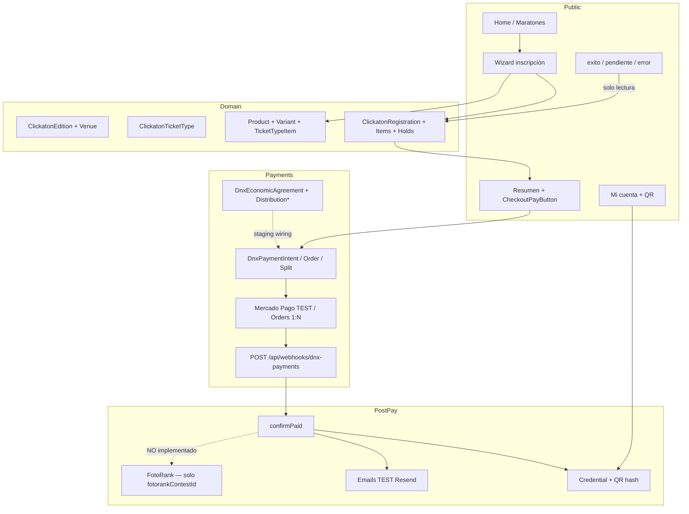

# Clickatón — Auditoría de estado actual para apertura de inscripciones

**Etapa:** 0 — Preflight y auditoría  
**Fecha:** 2026-07-28  
**Rama:** `migration-legacy-clf-to-monorepo`  
**HEAD:** `aa92de8e80ae2510db3255f694ad03c348bcd720`  
**Alcance:** solo auditoría (sin implementación, commit, push ni deploy)  
**Edición objetivo:** Clickatón Argentina 2026 — **19 de septiembre de 2026**  
**Veredicto operativo:** **NO GO comercial** · **GO condicional para QA staging/TEST**

---

## 1. Resumen ejecutivo

Clickatón ya tiene un dominio de inscripción **real en Prisma** (no stub): edición → sede → catálogo (entrada + productos/variantes) → reserva con holds → checkout vía **DNX Payments** → webhook → `CONFIRMED` + credencial/QR + emails TEST + Mi cuenta. Eso se cerró en gran parte en las etapas **10D\* / 11A / 11B**.

Lo que **falta** para el flujo comercial pedido (edición real 19/09/2026 → fases de precio → promociones → Tammy 100% → LIVE → sync FotoRank) es, en orden de bloqueo:

1. **Edición comercial configurable** (hoy existe `ClickatonEdition`, pero no hay seed/publicación de “Clickatón Argentina 2026” al 19/09; el piloto es `piloto-test-11b`).
2. **Fases de precio** (`RegistrationPricePhase` o equivalente) — **no existen**; hay un solo `priceAmount` por `ClickatonTicketType`.
3. **Promociones reutilizables** — **no existen** (`packages/promotions` ausente; `discountAmount` siempre 0 en el path de creación).
4. **Beneficiario Tammy 100%** — **conflicto I1 resuelto e implementado (Etapa 5, 2026-07-28):** ver §14.1 y `docs/clickaton/EDITION_FINANCIAL_DISTRIBUTION.md`. Queda cablear Orders 1:N + activación LIVE con conexión MP real.
5. **Sync post-pago a FotoRank** — **implementado (Etapa 7, 2026-07-28):** ver `docs/clickaton/CLICKATON_FOTORANK_SYNC.md`. **Etapa 8** agrega Instagram, foto y soft refs de placa; queda vincular concurso real + habilitar sync.
6. **Cobro LIVE** — flags OFF; OAuth owner **no ejecutado**; webhook productivo gated.
7. **Export CSV/XLS de inscriptos** — **no implementado** (diseño menciona capability `exports.pii`).

**No hay** referencias hardcodeadas a “20 de septiembre” ni a precio comercial fijo `$40.000` en el producto Clickatón. El fixture demo usa noviembre 2026; `$40.000` aparece solo como **ejemplo de UI** de pesos→centavos.

---

## 2. Preflight Git / working tree

| Ítem | Valor |
|---|---|
| Repo | `https://github.com/compramelafoto/dnx-suite.git` |
| Rama | `migration-legacy-clf-to-monorepo` |
| HEAD | `aa92de8` |
| Últimos commits Clickatón relevantes | `657562f` staging funnel · `57395f7` validate journey · `1b2de05` complete participant journey · `952cf4d` audit 11A |

### 2.1 Cambios locales Clickatón (WIP propio / marketing)

| Path | Tipo | Relación con inscripción |
|---|---|---|
| `app/(public)/organizar/page.tsx` | M | Marketing organizar sede |
| `components/formar-parte/*`, `content/formar-parte.ts` | M | Landing alianzas |
| `components/home/WhatIsClickaton.tsx`, `content/home.ts` | M | Home editorial |
| `components/organizar-sede/*`, `OrganizerAbout.tsx` | M/U | Marketing |
| `public/images/formar-parte/allies/*`, `public/images/home/` | M/U | Assets |
| `styles/utilities.css` | M | CSS |
| `scripts/dnx-payments-test-smoke.ts` | M | Smoke payments |
| `scripts/lib/run-mp-test-execute.ts` | U | Helper execute MP TEST |

**Riesgo:** bajo para el funnel si se aíslan; no tocar/revertir sin aviso.

### 2.2 Cambios ajenos en el mismo working tree (NO mezclar)

| Área | Paths | Riesgo |
|---|---|---|
| **InfoSpot** (feed geo, editorial intelligence, recommendations) | `apps/infospot/**` + docs 62–65 | Alto volumen; **ajeno** |
| **packages/editorial-intelligence**, **packages/recommendations** | nuevos | **Ajeno** |
| **packages/payments** (Checkout Pro adapter, HTTP client, request) | 4 archivos M | **Alto** — impacta smoke MP Clickatón |
| `apps/compramelafoto/next-env.d.ts` | M | Ruido |
| `apps/dnx-sales-assistant/.../dnxfotografia.local.json` | U | Ajeno |
| `turbo.json` | M | Posible impacto monorepo |

**Regla de trabajo:** no modificar paths ajenos sin informar. Cualquier cambio en `packages/payments` debe revalidar selfchecks/smoke Clickatón.

---

## 3. Inventario de archivos (Clickatón)

### 3.1 Aplicación `apps/clickaton`

| Área | Ubicación | Estado |
|---|---|---|
| App pública | `app/(public)/` — home, maratones, inscripción, pago, mi-cuenta, legal, login | Avanzado |
| Admin | `app/admin/(panel)/` — ediciones, sedes, catálogo, inscripciones, mensajes, config, integraciones, finanzas/cuenta-owner | MVP |
| API | `app/api/webhooks/dnx-payments`, `api/cron/expire-registration-holds`, OAuth Google, MP connect | Staging/TEST |
| Dominio inscripción | `lib/public-registration/`, `lib/registration/` | Prisma real |
| Checkout | `lib/checkout/` | DNX Payments cableado |
| Admin catálogo | `lib/admin-catalog/` | Prisma real |
| Admin ediciones/sedes | `lib/admin/editions`, `lib/admin/venues` | Prisma real |
| Admin inscripciones | `lib/admin-registration/` | Prisma real |
| Maratones públicos | `data/public-marathons/` (fixture / prisma / fotorank) | Dual |
| Content / fixtures | `content/`, `content/fixtures/demo-marathon.ts` | Editorial + demo |
| Scripts | selfchecks, seed piloto, smoke MP, expire holds | Amplio |
| E2E | `e2e/env-smoke.spec.ts` | Smoke entorno |
| Docs | `docs/clickaton/*` (52+ docs de etapas 10C–11B) | Extenso |

### 3.2 Paquetes compartidos

| Paquete | Rol para Clickatón |
|---|---|
| `@repo/db` | Schema Prisma único + migraciones Clickatón + DNX Payments |
| `@repo/payments` | Checkout Pro, Orders 1:N, webhooks, OAuth MP, acuerdos económicos |
| `@repo/auth` | Sesión / Google OAuth / emails |
| `packages/promotions` | **No existe** |

### 3.3 Documentación previa clave

| Doc | Veredicto histórico |
|---|---|
| `FUNCTIONAL_AUDIT_REGISTRATION_OPENING_11A.md` | NO GO · score 47/100 (2026-07-23) |
| `REGISTRATION_FUNNEL_COMPLETE_11B.md` | Funnel participante TEST cerrado |
| `REGISTRATION_FUNNEL_VALIDATION_11B2.md` | Validación journey |
| `DNX_PAYMENTS_*` / `ORDERS_1N_*` / `ECONOMIC_AGREEMENT_*` | Staging/TEST avanzado |
| `MERCADO_PAGO_OWNER_PRODUCTION_CONNECTION_10D3I_I1.md` | Código listo; OAuth real **no ejecutado** |
| `FOTORANK_*` | Contratos/adaptador lectura; sync post-pago ausente |
| `BACKLOG.md` | Desfasado vs código (aún lista 09B/09C como pendientes aunque el checkout TEST ya existe) |

---

## 4. Arquitectura actual

**Fuente de verdad cobro:** backend (precio desde ticket/registration; nunca monto del frontend).  
**Confirmación PAID:** solo webhook / S2S reconcile — **no** el redirect del browser.

---

## 5. Flujo actual (end-to-end)

1. Usuario autenticado (sesión DNX / Google).
2. Elige edición publicada (piloto `piloto-test-11b` o Prisma source).
3. Wizard: sede → tipo de entrada (+ variantes si `requiresVariantChoice`) → datos personales → review.
4. `createPublicRegistrationAction` → `PENDING_PAYMENT` + capacity/stock holds (o free → auto-confirm).
5. Resumen → elegibilidad checkout → `createRegistrationCheckout` → soft refs `paymentOrderId` / idempotency.
6. Redirect a checkout (fake / MP TEST / Orders TEST según flags).
7. Webhook DNX/MP → `applyPaymentEvent` → `confirmPaid` → `CONFIRMED` + `paymentStatus=APPROVED`.
8. Emisión credencial + QR (hash) + email confirmación TEST.
9. Páginas retorno muestran estado **solo si backend ya confirmó**.
10. Mi cuenta lista inscripciones y credencial.

**No ocurre hoy:** resolución de fase de precio, aplicación de promo, binding beneficiario Tammy LIVE, sync participante FotoRank.

---

## 6. Confirmación entidad por entidad

| Entidad pedida | Existe? | Nombre real | Estado |
|---|---|---|---|
| Clickatón / Marathon | Parcial | `ClickatonEdition` + tipo TS `PublicMarathon` (no Prisma Marathon) | Edición admin completa; público dual fixture/FR/Prisma |
| Edition / Event | Sí | `ClickatonEdition` + `ClickatonVenue` | MVP completo; faltan campos pedidos (ver §7) |
| Registration | Sí | `ClickatonRegistration` | Completo + history/audit/holds |
| Participant | Embebido | Snapshot en Registration + `User` FK | Sin modelo `Participant` aparte |
| Order | Sí (DNX) | `DnxPaymentOrder` (+ soft ref en Registration) | Core completo |
| Payment | Sí (DNX) | `DnxPaymentIntent` + provider orders | Core completo |
| PaymentSplit | Sí (DNX) | `DnxProviderSplit` | Completo |
| PaymentAllocation | No | — | Usar splits + `DnxOrderDistributionSnapshot` |
| MercadoPagoConnection | No (nombre) | `DnxPaymentAccount` + `DnxMercadoPagoOAuthState` | Infra OK; LIVE no conectado |
| DiscountCode / Promotion | No | — | Gap total |
| PromotionRedemption | No | — | Gap total |
| RegistrationItem | Sí | `ClickatonRegistrationItem` (snapshots + `sourceType` / fase) | Completo (Etapa 8B) |
| ProductVariant | Sí | `ClickatonProductVariant` | Completo (talles = variantes) |
| RegistrationPricePhase | Sí | `ClickatonRegistrationPricePhase` + `ClickatonPricePhaseItem` | Completo (Etapa 8B: merch por fase) |
| Product media / store prep | Sí | `ClickatonProductMedia` + campos store en Product | Prep tienda; storefront OFF |
| Inventory ledger | Sí | `ClickatonInventoryMovement` | Holds auditables; tienda futura |
| paymentBeneficiaryConfig | No (Clickatón) | `DnxEconomicAgreement` + rules bps | Schema OK; UI/edición incompleta |
| fotoRankContestId | Sí | `ClickatonEdition.fotorankContestId` | String opaco sin FK |
| syncStatus FotoRank | Sí (Etapa 7) | `ClickatonFotoRankSync` + soft refs en Registration | Listo; sync OFF en seed |
| Kit delivery | Sí | `ClickatonKitDelivery` (+ items) | Schema; UI ops incompleta |
| Export inscriptos | No | — | Gap |

### 6.1 Campos `ClickatonEdition` actuales vs pedido Etapa 1

| Pedido | Actual |
|---|---|
| id, slug, nombre, descripción | ✅ |
| fecha evento | ✅ `startAt`/`endAt` |
| inicio/cierre inscripciones | ✅ `registrationOpenAt`/`CloseAt` |
| timezone | ✅ opcional |
| estado | ✅ enum + `isPublished` |
| cupo opcional | ✅ `defaultCapacity` |
| ubicación / ciudad / provincia / país | ⚠️ en **Venue**, no en Edition |
| currency | ⚠️ en TicketType/Registration, no Edition |
| fotoRankContestId | ✅ |
| registrationEnabled | ⚠️ vía `status` + `isPublished` (no flag booleano) |
| paymentBeneficiaryConfig | ❌ (usar acuerdo DNX por scope) |
| createdAt / updatedAt | ✅ |

---

## 7. Partes completas

- Modelo Prisma inscripción/catálogo/credencial/QR/check-in/kit (schema + migraciones en repo).
- Panel admin: ediciones, sedes, productos, variantes, entradas/kits, listado/detalle inscripciones, notas, estados.
- Wizard público + holds + rate-limit (in-memory) + token HMAC `?t=`.
- Checkout DNX Payments (TEST/staging) con monto server-side.
- Webhook `/api/webhooks/dnx-payments` con firma e idempotencia.
- Páginas success / pending / failure que **no** marcan PAID por redirect.
- Cron expire holds (`vercel.json` `*/15`).
- Emails funnel TEST (reserva, pago, free, hold expired).
- Mi cuenta con credencial/QR regenerable.
- Allowlist admin: `dnxfotografia@gmail.com`, `rodrigorincon40@gmail.com`, `tammyytamer@gmail.com`.
- Selfchecks y smoke scripts amplios (`package.json`).
- Acuerdos económicos 1:N modelados en DNX (`DnxEconomicAgreement`…).

---

## 8. Partes incompletas

| Gap | Impacto |
|---|---|
| Edición comercial 19/09/2026 | No hay producto vendible real publicado |
| Fases de precio 25k / 30k / 35k | No modeladas ni UI |
| Promociones transversales | No paquete ni tablas |
| Beneficiarios por edición (Tammy 100%) | Sin UI; contradicción con I1 owner exclusivo |
| LIVE MP + flags prod | OFF; OAuth no ejecutado |
| Sync FotoRank post-PAID | Etapa 7 (durable + cron); OFF hasta validar concurso |
| Export CSV/XLS | Ausente |
| Panel beneficiarios / split por edición | Ausente en navegación admin |
| Rate-limit durable | In-memory |
| SEO / robots | Prelanzamiento (`disallow /` histórico 11A) |
| Sponsors admin | Stub |
| Operación kit entrega UI | Schema sí, ops limitada |
| BACKLOG.md desactualizado | Confunde estado real |

---

## 9. Mocks / stubs / in-memory

| Pieza | Runtime default | Alternativa |
|---|---|---|
| Public registration repo | Prisma | in-memory selfcheck |
| Checkout mutations | Prisma | in-memory |
| DNX client | `prisma` | `memory` / `durable-memory` / provider `manual` (fake URL) |
| Admin catalog / registrations | Prisma | in-memory selfcheck |
| Sponsors admin | Empty state stub | — |
| Public marathons source | `fixture` default; `prisma`/`fotorank` por env | Demo Nov 2026 |
| Rate limit | In-memory | — |
| Economic agreement staging | Fixtures `clickaton.staging.test` (no emails reales Tammy) | Doc 10D3I-E |

---

## 10. Migraciones

### Clickatón (nombre)

| Migración | Contenido |
|---|---|
| `20260718120000_clickaton_editions_and_venues` | Edition + Venue + enums |
| `20260718220000_clickaton_registrations_credentials_checkin_kits` | Catálogo, registration, holds, credential, QR, check-in, kit, audit |
| `20260722030000_clickaton_contact_messages` | Contacto |
| `20260723120000_dnx_clickaton_mp_oauth_state` | OAuth state MP Clickatón |

### DNX Payments / finance (usadas por el funnel)

| Migración | Contenido |
|---|---|
| `20260715170000_dnx_payments_core_persistence` | Intent/Order/Split/WebhookInbox… |
| `20260722220000_add_financial_identity_and_economic_agreements` | FI + agreements + distribution |
| `20260722230000_add_encrypted_credentials_and_legacy_mp_fields` | Vault credentials |

**Nota histórica:** docs 10C indicaban migraciones “preparadas, no aplicadas a Neon compartido”; staging posterior (10D3I / QA) reportó migraciones aplicadas en DB staging. **Validar estado real de cada entorno antes de Etapa 1** (`prisma migrate status`).

### Migraciones **necesarias** (propuestas, no creadas aún)

1. Fases de precio por edición (o evolución documentada de TicketType — ver plan).
2. Dominio promociones + redenciones (preferible paquete/tablas transversales).
3. Campos sync FotoRank — **hechos (Etapa 7)**; falta concurso real validado + sync ON.
4. Posible enlace Edition ↔ EconomicAgreement scope (`productKey=clickaton`, `scopeType=edition`, `scopeId=editionId`).
5. Campos Edition faltantes si se exige parity exacta (currency, registrationEnabled, location a nivel edición).

---

## 11. Integraciones conectadas

| Integración | Estado |
|---|---|
| DNX Identity / sesión | Conectada |
| Google OAuth admin/participante | Conectada (app compartida) |
| DNX Payments (Prisma durable) | Conectada; checkout flag default OFF |
| Mercado Pago TEST / smoke | Validado en etapas 10D3H\* |
| Mercado Pago LIVE owner | **No conectado** (I1 pendiente autorización manual) |
| Webhook DNX/MP | Ruta real; prod gated |
| FotoRank Public API V1 | Adaptador lectura opcional; default fixture |
| FotoRank write (participante) | **Sí (Etapa 7)** — `FotorankContestParticipant` vía Prisma compartido |
| Resend emails | TEST/sandbox |
| InfoSpot / CLF | Solo narrativa / no cobro Clickatón |

---

## 12. Autenticación y roles administrativos

- Allowlist en `apps/clickaton/config/admin/admins.ts` (SUPER_ADMIN implícito / acceso completo).
- Emails: `dnxfotografia@gmail.com`, `rodrigorincon40@gmail.com`, `tammyytamer@gmail.com`.
- Comparación case-insensitive.
- Deuda documentada: migrar a `WorkspaceAppAccess` / app `CLICKATON`.
- **No** hay roles por sede.
- Autorización financiera DNX: por `userId` + grants + ownership de Financial Identity — **no** por email solo.
- **Tammy productiva:** verificar en DB real si `tammyytamer@gmail.com` existe como `User` y si tiene `DnxFinancialIdentity` + `DnxPaymentAccount` ACTIVE. Staging usó fixtures `clickaton.staging.test`, **no** el email real.

---

## 13. Referencias buscadas

| Término | Resultado en Clickatón |
|---|---|
| 20 de septiembre / `2026-09-20` | **No** en `apps/clickaton` ni `docs/clickaton` |
| 19 de septiembre / `2026-09-19` | **No** como edición configurada aún |
| `$40.000` / `40000` | Solo ejemplos UI pesos→minor y selfchecks |
| Kit de inscripción | Modelo real TicketTypeItem + copy marketing |
| Primeros 100 inscriptos | **No** |
| Collector hardcodeado | **No** en producto; receivers TEST por env |
| MP directo sin DNX | **No** en path Clickatón (usa `@repo/payments`) |
| Fixture demo | `2026-11-14` (no septiembre) |

**Nota:** `2026-09-20` sí aparece en **otras apps** (`dnx-sales-assistant`, `cuanto-cobro-core` fixtures) — **ajeno** a esta tarea; no modificar.

---

## 14. Contradicciones y riesgos

### 14.1 Contradicciones de producto

1. **Beneficiario Tammy 100% vs I1 — RESUELTO e implementado (Etapa 5, 2026-07-28).**  
   - La regla I1 de “cuenta Mercado Pago exclusiva de Clickatón” **deja de ser invariante rígida** y pasa a ser **política/configuración por edición**.  
   - Para **Clickatón Argentina 2026 (19/09/2026)**: DNX Payments obligatorio; Tammy = única beneficiaria al **100%** del importe distribuible; cuenta MP resuelta desde la conexión del usuario Tammy (sin hardcodear email/collector/token); allocations 1:N; no habilitar cobros sin conexión validada; snapshot en Registration + auditoría.  
   - Reutiliza `DnxEconomicAgreement` / `DnxDistributionVersion` / `DnxFinanceGrant` (ver `docs/clickaton/EDITION_FINANCIAL_DISTRIBUTION.md`).  
   - Panel: `/admin/ediciones/[id]/finanzas`. Gate al habilitar `registrationEnabled`.  
   - **Gaps LIVE:** ledger Prisma inexistente; refunds productivos placeholder en `@repo/payments`; checkout default aún usa recipients stub 100% owner hasta cablear Orders 1:N con snapshot de edición (no se modificó WIP de `packages/payments`).

2. **Maratón público dual:** fixtures / FotoRank channel / `ClickatonEdition` Prisma pueden desalinearse (fecha, precio, CTA).

3. **BACKLOG.md** aún describe 09B/09C como pendientes aunque checkout TEST + catálogo existen.

4. **Estados Registration pedidos vs actuales:**  
   - Pedido: `DRAFT | PAYMENT_PENDING | PAID | …`  
   - Actual: `PENDING_PAYMENT` + `paymentStatus` separado (`APPROVED` ≈ PAID). Preferir **no duplicar** estados DNX; mapear en docs/UI.

### 14.2 Riesgos técnicos

| Riesgo | Severidad |
|---|---|
| Mezclar WIP InfoSpot/payments en mismo commit | Alta |
| Activar flags LIVE sin owner/webhook/acuerdo | Crítica |
| Confiar en redirect para PAID | Mitigado (código correcto) |
| Carreras en cupos/promos sin tx | Media (holds existen; promos no) |
| Rate-limit in-memory multi-instancia | Media |
| Soft refs sin FK a DNX Order | Baja/aceptada por diseño |
| Seed piloto usado como “edición real” | Alta si se publica por error |

### 14.3 Riesgos del working tree

- No revertir cambios marketing Clickatón ni Infospot.
- Informar antes de tocar `packages/payments` (ya hay diff local).
- No aplicar migraciones a producción en esta fase.

---

## 15. Deuda técnica

- Admin allowlist → WorkspaceAppAccess.
- `.env.example` incompleto vs vars usadas (checkout enabled, cron secret, email TEST, Orders 1:N, owner onboarding).
- Export PII diseñado pero no UI.
- Sync FotoRank modelado (Etapa 7); no activar comercialmente sin concurso validado.
- Promos: campo `discountAmount` sin origen.
- Tipos públicos `promotionalPrice` en `types/public/registration.ts` sin cableado.
- Legal funnel marcado pendiente validación jurídica.
- Documentación de etapas abundante; falta índice “estado canónico 2026-07-28”.

---

## 16. Variables de entorno

### Documentadas en `.env.example` (parcial)

`CLICKATON_PUBLIC_DATA_SOURCE`, FotoRank URLs, Google OAuth, `CLICKATON_PUBLIC_URL`, webhook DNX, mode/provider payments, MP TEST token/key, credentials source.

### Usadas / críticas y faltantes o incompletas en `.env.example`

| Variable | Uso |
|---|---|
| `DNX_CLICKATON_DNX_PAYMENTS_CHECKOUT_ENABLED` | Gate checkout |
| `DNX_MP_ORDERS_1N_STAGING_ENABLED` (+ observe) | Orders 1:N |
| `MERCADOPAGO_TEST_OWNER_USER_ID` / partner receivers / device / buyer | Smoke |
| `DNX_CONFIRM_STAGING` / `DNX_CONFIRM_ORDERS_TEST` | Confirmaciones controladas |
| `CRON_SECRET` / `CLICKATON_CRON_SECRET` | Cron holds |
| `CLICKATON_EMAIL_TEST_TO` / fallback / allow any | Emails |
| `DNX_CLICKATON_MP_OWNER_ONBOARDING_ENABLED` (+ gates OAuth) | LIVE owner |
| `CLICKATON_MP_CLIENT_ID/SECRET/REDIRECT/WEBHOOK_SECRET` | App MP dedicada |
| `DNX_FINANCIAL_CREDENTIAL_MASTER_KEY` | Vault |
| `CLICKATON_SEED_PILOT` | Seed piloto |
| `DATABASE_URL` | Prisma (monorepo) |

---

## 17. Endpoints y acciones relevantes

### API

- `POST /api/webhooks/dnx-payments`
- `GET /api/cron/expire-registration-holds`
- `GET/callback /api/auth/google`
- ` /api/clickaton/payments/mercadopago/{connect,callback,reconnect,revoke}` (flag OFF)

### Server actions (inscripción / checkout)

- Oferta/contexto/disponibilidad/crear/resumen/elegibilidad
- `createRegistrationCheckoutAction`, `startRegistrationCheckoutAction`, status/refresh/result

### Admin

- CRUD ediciones/sedes/catálogo
- Listado/detalle/estado/notas inscripciones
- Login/logout admin

### Rutas pago retorno

- `/maratones/[slug]/inscripcion/pago/{exito,pendiente,error}`

---

## 18. Plan recomendado (etapas siguientes)

Alineado al pedido del usuario, **reutilizando** lo existente y evitando reinventar:

| Etapa | Acción | Reutilizar |
|---|---|---|
| **1** | Completar Edition comercial (19/09/2026, DRAFT, ARS, no publicada) + gaps de campos mínimos | `ClickatonEdition` + Venue |
| **2** | Introducir `RegistrationPricePhase` (o TicketTypes por fase con validación de solape) + servicio “fase vigente” TZ AR | Admin precios nuevo |
| **3** | Crear `packages/promotions` + tablas Promotion/Redemption + preview/apply | `discountAmount` existente |
| **4** | Configurar Remera + talles XS–XXXL vía Product/Variant/TicketTypeItem | Catálogo actual |
| **5** | Acordo DNX 1:N scope=edition, Tammy 100% — **HECHO (2026-07-28)**; ver `EDITION_FINANCIAL_DISTRIBUTION.md` | EconomicAgreement + panel finanzas |
| **6** | Checkout desde snapshot + allocations durables + collector OAuth N=1 — **HECHO (código)**; LIVE bloqueado | `edition-checkout` + `DnxPaymentOrderAllocation` + doc `DNX_PAYMENTS_CHECKOUT_1N.md` |
| **7** | Integración mínima FotoRank post-PAID | **Hecho** — ver `CLICKATON_FOTORANK_SYNC.md` |
| **7** | Adapter sync FotoRank mínimo post-PAID + campos sync | **Hecho** (roster + outbox + cron) |
| **8** | Perfil social + placa automática de bienvenida | **Hecho** — `WELCOME_CARD_SYSTEM.md` + `@repo/media-composition` |
| **9** | Publicación automática Instagram | Pendiente |
| **8** | Admin: fases, promos, beneficiarios, columnas talle/sync/export | Paneles existentes |
| **9** | Hardening seguridad/concurrencia | Auth + payments |
| **10** | Tests unit/integration + E2E feliz TEST | Selfchecks + Playwright |
| **11** | `clickaton-registration-release-readiness.md` + checklist GO | — |

**Principio:** no borrar WIP ajeno; no activar `isPublished` / `REGISTRATION_OPEN` hasta readiness.

---

## 19. Archivos que se propone modificar (post-auditoría)

### Clickatón / DB / promotions (alcance propio)

- `packages/db/prisma/schema.prisma` + migraciones nuevas
- `apps/clickaton/lib/**` (editions, catalog, registration, checkout, admin)
- `apps/clickaton/app/admin/**`, `app/(public)/maratones/**`
- `apps/clickaton/content` solo si hay fecha hardcodeada a corregir
- `packages/promotions/**` (nuevo)
- `docs/clickaton/clickaton-registration-release-readiness.md` (Etapa 11)
- Tests/selfchecks/e2e bajo `apps/clickaton` y `packages/promotions`

### Posible impacto compartido (informar antes)

- `packages/payments/**` — solo si el wiring de beneficiarios/Orders lo exige; **hay diff local ajeno/WIP**
- FotoRank (`apps/fotorank`) — solo si hace falta endpoint interno de alta de participante; preferir paquete/API

### Fuera de alcance (no tocar sin aviso)

- `apps/infospot/**`, `packages/editorial-intelligence`, `packages/recommendations`
- `apps/compramelafoto/**` (salvo deuda inevitable documentada)
- `apps/dnx-sales-assistant/**`

---

## 20. Bloqueos externos

1. Decisión producto: **cuenta MP Tammy vs cuenta exclusiva Clickatón (I1)**.
2. Existencia en DB de User `tammyytamer@gmail.com` + PaymentAccount ACTIVE (prod/staging).
3. App Mercado Pago dedicada (Client ID/Secret, redirects, webhook secret) — checklist I1.
4. Concurso FotoRank real (`fotorankContestId`) para la edición 2026.
5. Validación jurídica de términos/privacidad.
6. Entorno staging con migraciones aplicadas y flags TEST.
7. Autorización manual OAuth owner / beneficiary.
8. Dinero real: **prohibido** en esta fase.

---

## 21. Checklist de readiness (vista previa; detalle en Etapa 11)

Inscripciones públicas **no** deben habilitarse sin:

- [ ] Edición válida 19/09/2026 (DRAFT→OPEN solo al final)
- [ ] Fase de precio vigente
- [ ] Beneficiarios = 100% con cuenta MP lista
- [ ] Webhook configurado y verificado
- [ ] DNX Payments operativo (no `manual` en prod)
- [ ] Artículo obligatorio (remera/talle) configurado
- [ ] Checkout E2E TEST pasado
- [ ] Variables de entorno disponibles
- [x] Sync FotoRank encolable / reintentable (Etapa 7; sync OFF en seed)
- [ ] Concurso FotoRank real validado + `fotoRankSyncEnabled=true` (manual admin)
- [x] Etapa 8: Instagram/foto + placa bienvenida (sin publicar)
- [x] Etapa 9: cola editorial Instagram, aprobación humana, cron y dry-run por defecto (sin habilitar LIVE)
- [ ] Aplicar migraciones Prisma Etapa 7/8 en Neon/shared
- [ ] Promos (si se anuncian) con límites y tests

---

## 22. Delta vs auditoría 11A (actualizado 2026-07-28)

| Tema | 11A | Ahora |
|---|---|---|
| Funnel reserva→pago TEST→QR/email/mi-cuenta | Roto/parcial | **Cerrado en 11B** |
| Score funnel TEST | ~47 global | ~75 técnico TEST (est.) |
| LIVE / owner MP | No | Sigue No |
| Fases precio / promos / Tammy 100% / sync FR | No pedido explícito | **Gaps del pedido actual** |
| Fecha edición comercial | N/A | **19/09/2026** por configurar |

**Veredicto Etapa 0:** base sólida para continuar implementación por etapas; **no** abrir venta pública todavía.

---

## 23. Próximo paso recomendado

**Etapa 1 — Edición Clickatón:**  
Completar/extender `ClickatonEdition` (+ Venue) para “Clickatón Argentina 2026”, fecha `2026-09-19`, timezone `America/Argentina/Buenos_Aires`, currency ARS, estado `DRAFT`, `isPublished=false`, sin activar inscripciones. Añadir seed/admin path. No tocar Infospot ni payments salvo necesidad explícita informada.

---

*Fin del informe Etapa 0. No se implementó código de producto en esta etapa (solo este documento).*

---

## Apéndice — Etapa 10 (2026-07-28)

Motor de cronograma versionable + consignas secretas + dashboard/confirmación. Ver `CLICKATON_TIMELINE_AND_PARTICIPANT_EXPERIENCE.md`.

- TZ edición: `America/Argentina/Cordoba`
- Timeline DRAFT seed (sin horarios inventados, no ACTIVE)
- Inscripciones comerciales siguen OFF
- Selfcheck: `pnpm --filter clickaton selfcheck:timeline`

## Apéndice — Etapa 11 (2026-07-28)

Carga de fotografías por consigna + EXIF/GPS + vínculo `FotorankContestEntry`. Ver `CLICKATON_PHOTO_UPLOAD_EXIF_GPS.md`.

- `uploadsEnabled=false` en seed
- Selfcheck: `pnpm --filter clickaton selfcheck:photo-upload`
- Sin activar consignas reales ni cargas productivas
