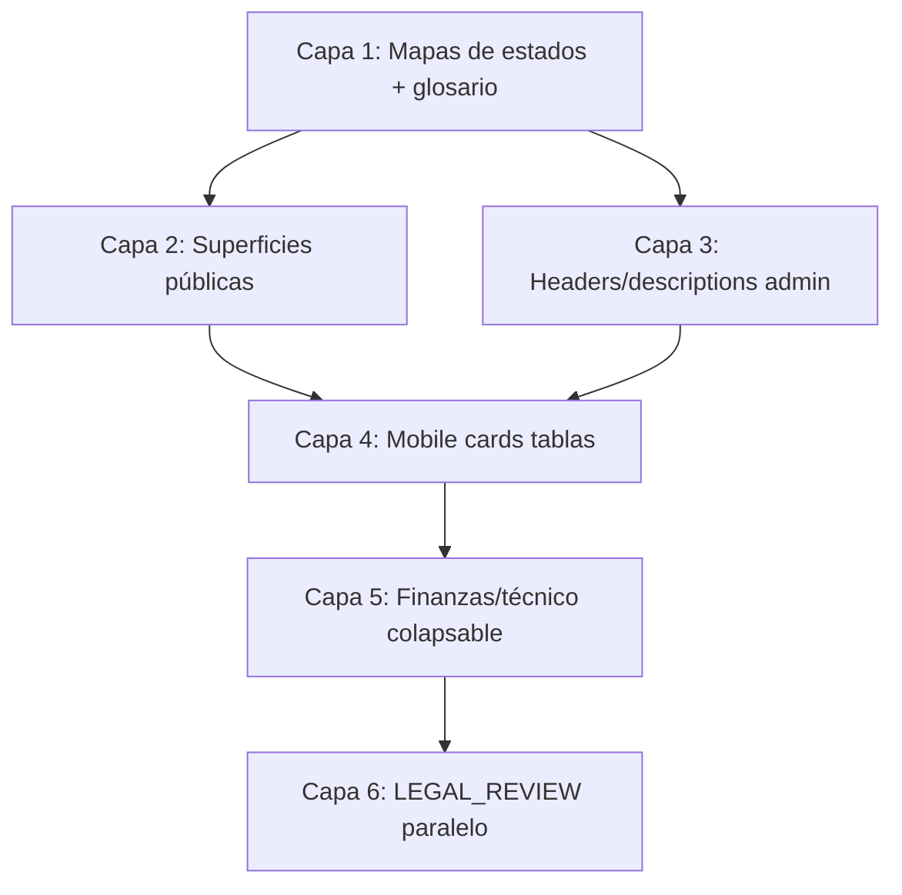

# Mapa de implementación — Clickatón UX

**Etapa:** 01 — Plan de cambios agrupados (sin implementar aún)  
**Fecha:** 2026-08-01  
**Objetivo:** evitar correcciones duplicadas; tocar primero componentes compartidos.

---

## 1. Informe final (métricas)

| Métrica | Valor |
|---|---|
| Pantallas auditadas | **66** |
| Textos / anglicismos visibles (hallazgos) | **~38** |
| Conceptos técnicos visibles | **~54** |
| Secciones sin explicación | **~18+** |
| Errores de experiencia móvil | **34** |
| Hallazgos copy documentados | **72** |
| Estado Etapa 01 | **DONE** |

### Componentes compartidos a corregir primero

1. `lib/admin-registration/ui/status-labels.ts` (+ nuevos mapas)  
2. `components/admin/AdminStatusBadge.tsx` / `AdminDataTable.tsx` / `AdminPageHeader.tsx`  
3. `components/public-registration/CheckoutPayButton.tsx` + `CardPaymentBrickCheckout.tsx`  
4. `PaymentReturnView.tsx` + pages `mi-cuenta`  
5. Tablas admin con `min-w-*` (catálogo / precios / kit)  
6. `components/ui/Button.tsx` (nowrap / touch)  
7. Shell: `AdminTopbar`, `AdminMobileNavigation`, `SiteHeader`

### Pantallas con mayor confusión

1. Checkout / resumen / postpago  
2. Mi cuenta / inscripción participante  
3. Finanzas + cuentas Mercado Pago  
4. Inscripciones admin (listado + detalle)  
5. Cronograma / consignas / envíos / admisión  
6. Catálogo / precios (especialmente mobile)

### Riesgos técnicos antes de implementar

- Tests/selfchecks que assertan strings.  
- Fallbacks a enum si falta clave en mapas.  
- No tocar actions de pago / webhooks / Prisma.  
- LEGAL_REVIEW en branch separado.  
- Brick SDK: solo contenedor.  
- Ops necesita IDs: colapsar, no borrar.

### Archivos candidatos Etapa 02 (copy + responsive)

Ver secciones 2–5. Lista no exhaustiva pero priorizada.

---

## 2. Capas de cambio (orden)

---

## 3. Capa 1 — Componentes compartidos (hacer una sola vez)

### 3.1 Mapas de labels

| Trabajo | Archivo(s) | Consume en | Evita duplicar en |
|---|---|---|---|
| Extender labels inscripción/pago (ya existen) | `lib/admin-registration/ui/status-labels.ts` | mi-cuenta, postpago, resumen, badges | Copy inline por página |
| Nuevo: fulfillment | `status-labels.ts` o `lib/.../fulfillment-labels.ts` | detalle inscripción, escáner | — |
| Nuevo: welcome card | idem | WelcomeCardShareCard, admin detalle | — |
| Nuevo: consignas / prompts | idem | mi-cuenta consignas, admin consignas | — |
| Nuevo: photo submission | idem | envíos, PromptPhotoUpload | — |
| Nuevo: social publish | idem | `/admin/social` | — |
| Nuevo: OAuth/MP connection | `lib/admin/.../mp-status-labels.ts` | cuenta-owner, mi-cuenta cobro, diagnóstico | — |
| Errores humanos API | `lib/.../user-facing-errors.ts` | upload, MP connect, escáner, brick | try/catch por componente |

### 3.2 Shell / patrones admin

| Trabajo | Archivo | Pantallas beneficiadas |
|---|---|---|
| Descriptions default / helper slot | `AdminPageHeader.tsx` | Todas las admin |
| Tone badges más allá de edition | `AdminStatusBadge.tsx` o wrapper | Inscripciones, envíos, social |
| `mobileCard` priority API | `AdminDataTable.tsx` | Inscripciones, sedes, ediciones |
| Touch cerrar drawer | `AdminMobileNavigation.tsx` | Todo admin mobile |
| Topbar densidad | `AdminTopbar.tsx` | Todo admin mobile |
| Button wrap opcional | `Button.tsx` | CTAs largos |

### 3.3 Empty / flash / errors

| Trabajo | Archivo | Notas |
|---|---|---|
| Empty copy sin nombres Prisma | `AdminEmptyState` + pages | Mensajes, sponsors, listados |
| Flash messages humanos | `AdminFlashMessage` | Tras actions |
| Error boundary admin (futuro) | `app/admin/**/error.tsx` | Solo presentación |

---

## 4. Capa 2 — Superficies públicas (por pantalla, reusando capa 1)

| Pantalla | Archivos | Cambios | Dependencias |
|---|---|---|---|
| `/mi-cuenta` | `app/(public)/mi-cuenta/page.tsx` | Labels estado/pago; quitar TEST en prod | status-labels |
| `/mi-cuenta/inscripciones/[id]` | page + account components | Labels; helper gate; colapsar técnico; CTAs full-width; secciones | status-labels, Welcome*, Prompt*, Credential* |
| Resumen checkout | `…/resumen/[registrationId]/page.tsx` | Labels; ocultar ID | status-labels |
| Checkout | `CheckoutPayButton.tsx`, `CardPaymentBrickCheckout.tsx` | Copy humano; wrapper mobile Brick | — |
| Postpago | `PaymentReturnView.tsx`, Resend/QR buttons | Labels; CTA cuenta; full-width | status-labels, glossary |
| Wizard | `PublicRegistrationWizard.tsx` | Continuar contextual; helper legal (no reescribir bases) | LEGAL_REVIEW |
| Home agenda | `UpcomingEventsSection.tsx` | Badge TEST condicional | env flag |
| Legal pages | `legal/*/page.tsx` | Ocultar PUBLISHED; pie versión | LEGAL_REVIEW body |

**No tocar en esta capa:** `content/legal-funnel.ts` cláusulas (solo marcar).

---

## 5. Capa 3 — Admin operativo (copy)

| Módulo | Archivos | Cambios |
|---|---|---|
| Inscripciones listado | `inscripciones/page.tsx` | Description; filtros ES; fulfillment options |
| Inscripción detalle | `inscripciones/[registrationId]/page.tsx` | Secciones humanas; fulfillment; colapsar IDs/reconcile |
| Cronograma | `…/cronograma/page.tsx` | Description; botones |
| Finanzas edición | `…/finanzas/page.tsx`, `EditionDistributionEditor.tsx` | Capas simple/técnico; Publicar distribución |
| Envíos | `…/envios/page.tsx` | Labels; botón config |
| Consignas | `…/consignas/page.tsx` | Options ES; ocultar JSON |
| Admisión | `…/admision/page.tsx` | Botones ES |
| Acreditación | pages + `AccreditationScanner.tsx` | Labels; CTAs |
| Social | `social/page.tsx` | Labels; quitar env del header |
| Promociones | `promociones/page.tsx` | Description |
| Mensajes | `mensajes/page.tsx` | Empty |
| MP owner/partner | `finanzas/cuenta-owner`, `mi-cuenta`, Owner/Partner actions | CTA humano; técnico colapsado |
| Diagnóstico | `integraciones/diagnostico` | Disclaimer + ES |
| Hub edición | `ediciones/[editionId]/page.tsx`, `EditionDetailActions` | Sync FR copy; módulos mobile |
| Catálogo headers | varias | Descriptions faltantes |

---

## 6. Capa 4 — Mobile (mismo flujo, otra presentación)

| Grupo | Archivos | Cambio | Prioridad |
|---|---|---|---|
| Tablas anchas | `TicketCompositionPanel`, `ProductVariantsPanel`, `PricePhaseItemsPanel`, kit table en detalle | Cards `&lt;md` | P0 |
| Inscripciones | list page + AdminDataTable usage | Acordeón filtros + mobileCard corto | P1 |
| Checkout Brick | payments components | `min-w-0 overflow-x-auto` | P0 |
| Cuenta CTAs | Welcome/Credential/QR/Resend/Prompt | `w-full` stack | P2 |
| Shell | Topbar, SiteHeader, AccountMenu | Densidad | P1 |
| Hub edición | EditionDetailActions | Grid 2 / full-width | P1 |
| Escáner / acreditación | scanner + forms | Full-width | P1 |
| Media buttons | ProductMediaUploadFields | 44px | P2 |

---

## 7. Matriz «un fix → muchas pantallas»

| Fix compartido | Pantallas impactadas |
|---|---|
| `registrationStatusLabel` en público | mi-cuenta, detalle, postpago, resumen |
| `paymentStatusLabel` en público | idem |
| `fulfillmentStatusLabel` | detalle inscripción, escáner, listado filtros |
| Copy checkout humano | resumen (Brick + Checkout Pro) |
| AdminDataTable mobileCard API | inscripciones (+ futuros listados) |
| Cards pattern para tablas min-w | 4 tablas ops |
| Glossary CTAs | PaymentReturn, Resend, cronograma, finanzas, envíos |
| Colapsable «Información técnica» | detalle inscripción, finanzas MP, diagnóstico |

---

## 8. Qué NO hacer en Etapa 02 (recordatorio)

- No cambiar rutas, permisos, modelos Prisma, migraciones.  
- No alterar lógica de pagos, webhooks, integraciones OAuth reales.  
- No eliminar funcionalidades ni “limpiar” IDs que ops usa (solo ocultar/jerarquizar).  
- No reescribir bases/privacidad como definitivas sin LEGAL_REVIEW.  
- No rediseñar arquitectura de pantallas ni crear panel organizador/jurado.  
- No commit/push/deploy salvo pedido explícito.

---

## 9. Orden de PRs sugerido (implementación futura)

| PR | Título sugerido | Incluye | Fuera |
|---|---|---|---|
| PR-A | labels públicos inscripción/pago | status-labels + mi-cuenta + postpago + resumen | legal body |
| PR-B | copy checkout humano | CheckoutPayButton + CardPaymentBrickCheckout | lógica pago |
| PR-C | labels admin faltantes + botones | cronograma, envíos, consignas, admisión, social, fulfillment | tablas mobile |
| PR-D | mobile cards tablas ops | composición, variantes, precios, kit | — |
| PR-E | mobile inscripciones + shell | filtros, mobileCard, topbar | — |
| PR-F | finanzas capas UX | editor + MP connect UI | grants/API |
| PR-G | LEGAL_REVIEW pack | docs + helper checkbox (sin cláusulas finales) | aprobación legal |

---

## 10. Documentos de esta entrega

| Archivo | Contenido |
|---|---|
| [`panel-inventory.md`](./panel-inventory.md) | Rutas, roles, menús, gaps |
| [`content-audit.md`](./content-audit.md) | Hallazgos de textos + propuestas |
| [`mobile-audit.md`](./mobile-audit.md) | Responsive 320–430 |
| [`ux-priorities.md`](./ux-priorities.md) | P0–P3 y fases |
| [`content-glossary.md`](./content-glossary.md) | Terminología unificada |
| [`implementation-map.md`](./implementation-map.md) | Este mapa |

---

## 11. Confirmación

**No se modificó la estructura funcional ni la lógica del sistema** en esta etapa.  
Solo se crearon documentos de auditoría y planificación bajo `docs/clickaton/ux-audit/`.
