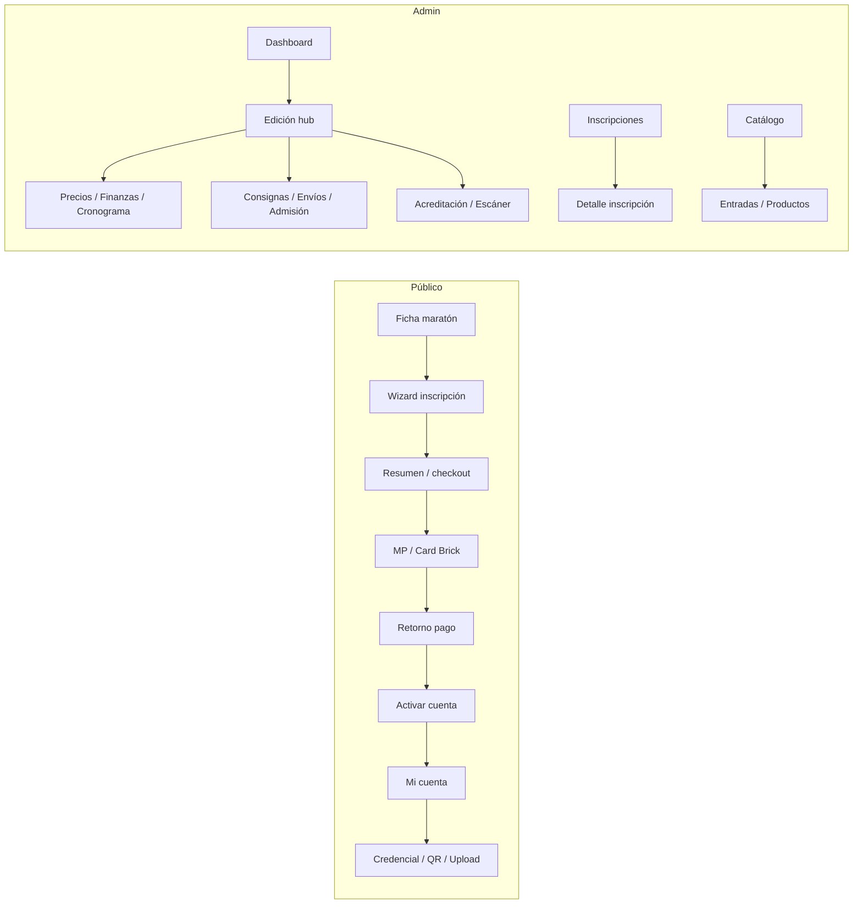

# Inventario de paneles — Clickatón

**Etapa:** 01 — Auditoría integral de UX, contenidos y experiencia móvil  
**Fecha:** 2026-08-01  
**Alcance:** `apps/clickaton` (solo lectura; sin cambios funcionales)  
**Pantallas inventariadas:** 66 páginas (`page.tsx`) — 27 públicas + 39 admin

---

## 1. Modelo de roles efectivo

| Rol efectivo | Criterio | Destino típico |
|---|---|---|
| **Público** | Sin sesión | Marketing, ficha de maratón, inscripción |
| **Participante** | Sesión DNX (`dnx_session`), sin allowlist admin | `/mi-cuenta`, credencial, upload |
| **Admin** | `SUPER_ADMIN` o email en `CLICKATON_ADMIN_EMAILS` | `/admin/**` vía `requireClickatonAdmin` |
| **Financiero (capability)** | Grants `DnxFinanceGrant` además de admin | Mutar distribución; paneles MP |
| **Organizador** | No existe como rol de pantalla | Solo label en allocations (`ORGANIZER`) |

**Fuentes:** `lib/admin/access.ts`, `lib/admin/auth.ts`, `config/admin/admins.ts`, `lib/admin/edition-finance/permissions.ts`.

**Nota:** No hay RBAC por sede ni panel “organizador” separado. Middleware admin solo propaga pathname; la auth vive en layouts/actions.

---

## 2. Shells y navegación

| Shell | Path | Componentes |
|---|---|---|
| Público | `app/(public)/layout.tsx` | `SiteHeader`, `SiteFooter` |
| Admin raíz | `app/admin/layout.tsx` | Metadata `noindex` |
| Admin panel | `app/admin/(panel)/layout.tsx` | `requireClickatonAdmin` + `AdminShell` |
| Error público | `app/(public)/error.tsx` | Boundary |
| Sin permiso | `/admin/acceso-denegado` | Card forbidden |

### Menú admin (`config/admin/navigation.ts`)

**Sección main**

| Label | Href |
|---|---|
| Dashboard | `/admin` |
| Ediciones | `/admin/ediciones` |
| Sedes | `/admin/sedes` |
| Catálogo | `/admin/catalogo` |
| Inscripciones | `/admin/inscripciones` |
| Promociones | `/admin/promociones` |
| Publicaciones sociales | `/admin/social` |
| Sponsors | `/admin/sponsors` |
| Mensajes | `/admin/mensajes` |

**Sección system**

| Label | Href |
|---|---|
| Configuración | `/admin/configuracion` |
| Mi cuenta de cobro | `/admin/finanzas/mi-cuenta` |
| Integraciones | `/admin/integraciones` |

**Fuera del menú (rutas existentes):** `/admin/finanzas/cuenta-owner`, `/admin/integraciones/diagnostico`, módulos por edición (precios, finanzas, cronograma, consignas, envíos, admisión, acreditación).

### Nav público (`config/navigation.ts`)

Maratones · Cómo funciona · Comunidad · Llevá Clickatón… · Formá parte.

---

## 3. Mapa de cobertura vs brief (1–30)

| # | Área | Estado | Rutas / componentes principales |
|---|---|---|---|
| 1 | Panel participante / fotógrafo | Parcial | `/mi-cuenta`, `/mi-cuenta/inscripciones/[id]`, `PromptPhotoUpload`, `WelcomeCardShareCard` |
| 2 | Panel administrativo general | Cubierto | `/admin`, `AdminShell` |
| 3 | Panel organizadores | Gap | No hay rol/pantalla dedicada |
| 4 | Ediciones / maratones | Cubierto | `/admin/ediciones/**`, `/maratones/**` |
| 5 | Inscripciones | Cubierto | Funnel público + `/admin/inscripciones/**` |
| 6 | Participantes | Parcial | Vía inscripciones; sin directorio “participantes” |
| 7 | Acreditaciones / QR | Cubierto | Admin acreditación + QR en mi-cuenta |
| 8 | Gestión de pagos | Parcial | Checkout / postpago / finanzas; sin UI completa de órdenes/reembolsos |
| 9 | Promociones | Cubierto | `/admin/promociones` |
| 10 | Productos / kits / talles | Cubierto | `/admin/catalogo/**` |
| 11 | Consignas y cronograma | Cubierto | `…/consignas`, `…/cronograma` |
| 12 | Integración FotoRank | Parcial | Sync en edición/inscripción; jurado en FotoRank |
| 13 | Subida / entrega de fotos | Parcial | Upload participante + envíos admin |
| 14 | Admisión técnica | Cubierto | `…/admision` |
| 15 | Jurado / clasificación / resultados | Gap (Clickatón) | Frontera FotoRank |
| 16 | Publicaciones en redes | Cubierto | `/admin/social` |
| 17 | Configuración financiera | Cubierto | `…/finanzas`, cuentas MP |
| 18 | Integraciones externas | Cubierto | `/admin/integraciones` (+ diagnóstico) |
| 19 | Config general de edición | Cubierto | Detalle / editar + módulos |
| 20 | Estados vacíos | Parcial | `AdminEmptyState` (sponsors vacío intencional) |
| 21 | Mensajes de confirmación | Parcial | `AdminFlashMessage`, returns de pago |
| 22 | Mensajes de error | Parcial | Alerts en forms; `error.tsx` solo público |
| 23 | Modales | Gap fuerte | Sin librería modal admin; 1 modal talles en inscripción |
| 24 | Tooltips | Gap | Sin sistema dedicado |
| 25 | Menús laterales / superiores | Cubierto | Sidebar admin + header público |
| 26 | Breadcrumbs | Cubierto | `AdminBreadcrumbs`, `SimpleBreadcrumb` |
| 27 | Pantallas de carga | Gap | Sin `loading.tsx` |
| 28 | Sin permisos | Cubierto | `/admin/acceso-denegado` |
| 29 | Pantallas de error | Parcial | Public error + `notFound()`; sin error admin |
| 30 | Smartphones | A auditar (ver `mobile-audit.md`) | Shell móvil existe; tablas densas |

---

## 4. Inventario de rutas públicas

Layout: `app/(public)/layout.tsx`

| Ruta | Rol | Componentes clave | Función |
|---|---|---|---|
| `/` | Público | `Hero`, `UpcomingEventsSection` | Home |
| `/maratones` | Público | `MarathonCard`, `EmptyMarathonsState` | Listado |
| `/maratones/[slug]` | Público | `MarathonDetailView`, `MarathonShirtOffer` | Ficha |
| `/maratones/[slug]/inscripcion` | Público | `PublicRegistrationWizard` | Wizard inscripción |
| `…/inscripcion/resumen/[registrationId]` | Público (+ token) | `CheckoutPayButton` | Resumen / pago |
| `…/pago/exito` | Público | `PaymentReturnView` | Postpago éxito |
| `…/pago/pendiente` | Público | `PaymentReturnView` | Postpago pendiente |
| `…/pago/error` | Público | `PaymentReturnView` | Postpago error |
| `…/inscripcion/activar/[registrationId]` | Público + token | `ActivateAccountClient` | Activar cuenta |
| `/mi-cuenta` | Participante | Cards de inscripciones | Panel cuenta |
| `/mi-cuenta/inscripciones/[id]` | Participante (dueño) | QR, placa, upload, kit | Hub inscripción |
| `/login` | Público | `LoginForm` | Login unificado |
| `/crear-cuenta` | Público | `RegisterForm` | Registro |
| `/recuperar` | Público | Forgot form | Recuperar |
| `/recuperar/[token]` | Público | Reset form | Reset password |
| `/verificar-email` | Público | `VerifyEmailClient` | Verificación |
| `/como-funciona` | Público | `ProcessTimeline` | Educativo |
| `/comunidad` | Público | `AudienceGrid` | Marketing |
| `/organizar` | Público | content organizar | Marketing sedes |
| `/formar-parte` | Público | content formar-parte | Aliados |
| `/aliados-fundadores` | Redirect | → `/formar-parte` | Legacy |
| `/sobre` | Público | content sobre | Institucional |
| `/contacto` | Público | `ContactForm` | Contacto |
| `/manualdemarca` | Público | Brand manual | Marca |
| `/legal/terminos` | Público | `legal-funnel` | Bases — **LEGAL_REVIEW** |
| `/legal/privacidad` | Público | `legal-funnel` | Privacidad — **LEGAL_REVIEW** |
| `/design-system` | Interno | Showcase | DS |

---

## 5. Inventario de rutas admin

Layout: `app/admin/(panel)/layout.tsx` + `AdminShell` (excepto login / acceso-denegado).

| Ruta | Rol | Componentes clave | Función |
|---|---|---|---|
| `/admin` | Admin | `AdminPageHeader`, métricas | Dashboard |
| `/admin/ediciones` | Admin | Tabla + badges | Listado ediciones |
| `/admin/ediciones/nueva` | Admin | `EditionForm` | Alta |
| `/admin/ediciones/[editionId]` | Admin | `EditionDetailActions`, sync FotoRank | Hub edición |
| `…/editar` | Admin | `EditionForm` | Edición datos |
| `…/sedes/nueva` | Admin | `VenueForm` | Vincular sede |
| `…/precios` | Admin | `PricePhaseForm`, `PricePhaseItemsPanel` | Fases / precios |
| `…/finanzas` | Admin (+ grants) | `EditionDistributionEditor` | Distribución |
| `…/cronograma` | Admin | Timeline versions | Cronograma |
| `…/consignas` | Admin | Prompts CRUD | Consignas |
| `…/envios` | Admin | Submissions list | Envíos fotos |
| `…/admision` | Admin | Lotes admisión | Admisión técnica |
| `…/acreditacion` | Admin | KPIs + dispositivo | Acreditación |
| `…/acreditacion/escanear` | Admin | `AccreditationScanner` | Escáner QR |
| `/admin/sedes` (+ nueva, detalle, editar) | Admin | `VenueForm` | Sedes |
| `/admin/catalogo` | Admin | Hub | Catálogo |
| `/admin/catalogo/entradas` (+ nueva, `[id]`) | Admin | `TicketTypeForm`, `TicketCompositionPanel` | Entradas / kits |
| `/admin/catalogo/productos` (+ nuevo, `[id]`) | Admin | `ProductForm`, `ProductVariantsPanel` | Productos / talles |
| `/admin/inscripciones` | Admin | Filtros + `AdminDataTable` | Listado |
| `/admin/inscripciones/[registrationId]` | Admin | Transitions, fulfillment, resend, FR | Detalle |
| `/admin/promociones` | Admin | Forms promo | Códigos |
| `/admin/social` | Admin | Publisher | Redes |
| `/admin/sponsors` | Admin | `AdminEmptyState` | Placeholder |
| `/admin/mensajes` (+ `[id]`) | Admin | Inbox | Contacto |
| `/admin/configuracion` | Admin | Allowlist + MP status | Config |
| `/admin/finanzas/mi-cuenta` | Admin (+ partner) | `PartnerMpConnectActions` | Cobro partner |
| `/admin/finanzas/cuenta-owner` | Admin (+ owner) | `OwnerMpConnectActions` | Collector owner |
| `/admin/integraciones` | Admin | `AdminIntegrationCard` | Hub |
| `/admin/integraciones/diagnostico` | Admin | OAuth/email diag | Diagnóstico |
| `/admin/login` | Redirect | → `/login` | Compat |
| `/admin/acceso-denegado` | Autenticado no-admin | Forbidden | Sin permiso |

### Módulos por edición (`EditionDetailActions`)

Precios · Finanzas · Cronograma · Consignas · Envíos · Admisión · Acreditación.

---

## 6. Componentes compartidos (alto impacto UX)

### Admin UI

| Componente | Path |
|---|---|
| `AdminShell` / `AdminSidebar` / `AdminTopbar` / `AdminMobileNavigation` | `components/admin/` |
| `AdminPageHeader` | `components/admin/AdminPageHeader.tsx` |
| `AdminBreadcrumbs` | `components/admin/AdminBreadcrumbs.tsx` |
| `AdminStatusBadge` | `components/admin/AdminStatusBadge.tsx` |
| `AdminEmptyState` | `components/admin/AdminEmptyState.tsx` |
| `AdminDataTable` | `components/admin/AdminDataTable.tsx` |
| `AdminFlashMessage` | `components/admin/AdminFlashMessage.tsx` |
| `AdminForm` | `components/admin/AdminForm.tsx` |
| `EditionDistributionEditor` | `components/admin/EditionDistributionEditor.tsx` |
| Escáner / catálogo / registros / pricing / MP | `components/admin/**` |

### Cuenta / inscripción / pago

| Componente | Path |
|---|---|
| `PromptPhotoUpload` | `components/account/PromptPhotoUpload.tsx` |
| `WelcomeCardShareCard` / `WelcomeCardShareActions` | `components/account/` |
| `CredentialPrintActions` | `components/account/CredentialPrintActions.tsx` |
| `PublicRegistrationWizard` | `components/public-registration/` |
| `CheckoutPayButton` | idem |
| `CardPaymentBrickCheckout` | `components/payments/` |
| `PaymentReturnView` | `app/(public)/maratones/.../pago/PaymentReturnView.tsx` |

### Labels / copy compartido

| Pieza | Path |
|---|---|
| Status labels inscripción/pago | `lib/admin-registration/ui/status-labels.ts` |
| Labels estado edición | `lib/admin/editions/types.ts` (`EDITION_STATUS_LABELS`) |
| Copy postpago | `lib/registration/ui/post-payment-public-copy.ts` |
| Legal funnel | `content/legal-funnel.ts` |

---

## 7. Flujos clave (mapa)

---

## 8. Gaps estructurales relevantes para UX (sin implementar)

1. Sin panel organizador ni jurado local (competencia en FotoRank).
2. Sin `loading.tsx` ni error boundary admin.
3. Sin sistema de modales/tooltips admin.
4. Sponsors vacío; varias áreas “future” del marketing sin pantalla.
5. Labels ES de inscripción existen en admin pero **no se reutilizan** en mi-cuenta / postpago.
6. Módulos de edición no están en el sidebar (descubrimiento móvil frágil).

---

## 9. Archivos de referencia para la próxima etapa

- `config/admin/navigation.ts`
- `components/admin/AdminShell.tsx` (+ sidebar / topbar / mobile nav)
- `components/admin/AdminPageHeader.tsx`
- `components/admin/AdminStatusBadge.tsx`
- `lib/admin-registration/ui/status-labels.ts`
- `app/(public)/mi-cuenta/**`
- `components/public-registration/**`
- `components/payments/CardPaymentBrickCheckout.tsx`
- `content/legal-funnel.ts` (**LEGAL_REVIEW**)
