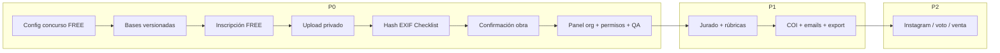

# Santa Fe en Foco — Plan de implementación (lanzamiento 1 ago 2026)

**Basado en:** [`santa-fe-en-foco-launch-gap-analysis.md`](./santa-fe-en-foco-launch-gap-analysis.md)  
**Producto:** FotoRank  
**Objetivo P0:** abrir **inscripciones gratuitas** el **1 de agosto de 2026** (1 categoría, 1 fotografía por participante).  
**Fuera de alcance inmediato:** Instagram, votación pública, publicación automática, venta de obras, checkout PAID productivo (solo dejar gancho correcto).

---

## Principios de diseño

1. **FREE no crea orden DNX** — confirmar inscripción con estado tipo `NOT_REQUIRED` (patrón Clickatón).
2. **PAID futuro** solo vía `@repo/payments` — sin checkout paralelo.
3. **Porcentajes en basis points** (10000 = 100%).
4. **Inscripciones pagas** conservan snapshot financiero; FREE guarda snapshot nulo/`NOT_APPLICABLE`, no ficticio.
5. **EXIF ausente ≠ FAIL** — `NOT_AVAILABLE` o `WARNING`; nunca rechazo automático solo por eso.
6. **Originales privados** — signed URLs; jurado ve derivados anonimizados.
7. **No reescribir shared** sin justificación; adaptar patrones CLF/Clickatón detrás de frontera FR.
8. **No tocar cambios ajenos** en Clickatón/InfoSpot/CLF salvo APIs compartidas mínimas en `packages/*` si hace falta helper neutro.

---

## Vista general de fases

| Fase | Ventana | Meta |
|------|---------|------|
| **P0** | Antes del 1 ago 2026 | Inscripción FREE + 1 obra segura + panel básico + QA |
| **P1** | Durante agosto 2026 | Jurado operativo completo, rúbricas, COI, comunicaciones, exportaciones |
| **P2** | Posterior | Instagram, voto público, publicación automática, venta |



---

# P0 — Obligatorio antes de abrir

> **Estado P0-01 (2026-07-28):** núcleo en código — ver [`fotorank-p0-01-registration-implementation-report.md`](./fotorank-p0-01-registration-implementation-report.md).  
> **Estado P0-06…10 (2026-07-28):** carga privada + hash + EXIF + checklist + confirm/replace + panel org mínimo — ver [`fotorank-p0-06-entry-upload-exif-checklist-report.md`](./fotorank-p0-06-entry-upload-exif-checklist-report.md) y [`fotorank-local-test-database-runbook.md`](./fotorank-local-test-database-runbook.md).  
> **Estado P0-07 panel jurado / bases / R2 (2026-07-28):** ver [`fotorank-p0-07-jury-anonymization-storage-report.md`](./fotorank-p0-07-jury-anonymization-storage-report.md) y [`fotorank-r2-private-storage-runbook.md`](./fotorank-r2-private-storage-runbook.md).  
> **Estado P0-08 release readiness (2026-07-28):** migraciones from-zero + incremental **PASS** en Postgres local aislado; guard anti-prod; seed SF + concurrencia; checklist/runbook. **Go/No-Go = NO-GO** (R2 staging real + bases oficiales + E2E browser pendientes). Ver [`fotorank-p0-08-release-readiness-report.md`](./fotorank-p0-08-release-readiness-report.md).  
> **Estado P0-08b ops Go/No-Go (2026-07-28):** RC `FOTORANK-SFEF-2026-RC1`. typecheck/build **PASS**; `contest:validate-launch-config` **FAIL** (bases placeholder + R2 + email); R2 MCP Cloudflare **auth error**; Playwright FREE **FAIL**; lint 42 warnings preexistentes. **Resultado formal: NO-GO**. Ver [`fotorank-p0-08b-ops-go-no-go-report.md`](./fotorank-p0-08b-ops-go-no-go-report.md), checklist/runbook/pending-decisions actualizados.  
> **Estado P0-09A motor de reglas (2026-07-28):** `ContestRulesConfiguration` + versionado + Wizard `/configuracion` + preset Santa Fe en Foco 2026 + validación + políticas derivadas + prompt ChatGPT (copiar) + import bases + compare texto/config + plantilla provincial. Migración `fotorank_p0_09a_contest_rules_configuration_engine` aplicada en DB local. Selfcheck + integration **PASS**. Ver [`fotorank-p0-09a-rules-configuration-engine-report.md`](./fotorank-p0-09a-rules-configuration-engine-report.md).  
> **Estado P0-09B generación/revisión/publicación de bases (2026-07-28):** ciclo `DRAFT→GENERATED→UNDER_REVIEW→APPROVED→PUBLISHED`; prompt mejorado; import documento/JSON; normalización+hash; compare ampliado; panel revisión; legal PENDING para licencia SF; aceptación con hashes + licencia; autorización menores 16–17; borrador SF; migración `fotorank_p0_09b_rules_generation_review_publish`. Tests lifecycle **PASS**. Publicación productiva bloqueada por revisión jurídica. Ver [`fotorank-p0-09b-rules-generation-review-publish-report.md`](./fotorank-p0-09b-rules-generation-review-publish-report.md) y [`fotorank-rules-authoring-guide.md`](./fotorank-rules-authoring-guide.md).  
> Pendiente: legal REVIEWED + bases PUBLISHED; R2/email staging; E2E browser verdes; rúbricas/votos (fuera de alcance).

## P0-01 — Modelo de inscripción + ventanas de carga ✅ (núcleo)

**Objetivo:** entidad de inscripción con 1 user/concurso, categoría elegida, modalidad FREE, ventanas inscripción/carga.

| Ítem | Detalle |
|------|---------|
| **Archivos** | `packages/db/prisma/schema.prisma`; domain nuevo `apps/fotorank/app/lib/fotorank/registration/*`; `actions/contests.ts` (validación fechas); serializers Public API |
| **Migraciones** | `FotorankContestRegistration` (o nombre equivalente): `contestId`, `userId`, `categoryId`, `status`, `pricingMode`, `acceptedRulesVersionId`, timestamps, unique `(contestId,userId)`. Campos opcionales en contest: `submissionOpensAt` (si se separa de registration) / timezone IANA. Extender enum con `INVITATION_ONLY` (puede quedar sin UI). |
| **API** | Server actions: `startFreeRegistration`, `getMyRegistration`. Public API: `confirmedCount` real; `canRegister` alineado. |
| **UI** | Wizard/modal publicación: mostrar ventanas inscripción vs carga; landing usa `resolvePublicRegistrationState`. |
| **Tests** | Selfcheck + unit: unique 1 inscripción; FREE no crea payment order; ventana cerrada rechaza. |
| **Criterio de aceptación** | Concurso FREE con ventana abierta permite exactamente una inscripción confirmada por `User`; cupo decrementa. |
| **Dependencias** | Auth `User` existente. |

## P0-02 — Configuración del concurso “Santa Fe en Foco” ✅ (seed local/staging)

**Objetivo:** concurso listo para operar (no necesariamente seed en prod aún).

| Ítem | Detalle |
|------|---------|
| **Archivos** | Seed script opcional `packages/db/prisma/scripts/seed-santa-fe-en-foco.ts` o runbook en docs; UI existente wizard |
| **Migraciones** | Ninguna nueva si P0-01 ya cubre campos |
| **API** | Reutilizar `createContest` / `updateContest` / publish |
| **UI** | 1 categoría, `maxFiles=1`, `registrationPricingMode=FREE`, `registrationEnabled=true`, `registrationOpensAt=2026-08-01T00:00:00-03:00` (timezone a definir) |
| **Tests** | Selfcheck de fixture de concurso; e2e smoke de landing |
| **Criterio de aceptación** | Organizador puede publicar concurso FREE con 1 categoría / 1 foto y ver estado `open` el 1/8. |
| **Dependencias** | P0-01 (ventanas), org + AppAccess |

## P0-03 — Categorías: enforcement maxFiles + una categoría por inscripción 🟡 (parcial)

> Una categoría por inscripción + validación ACTIVE/pertenencia. `maxFiles` en upload → etapas siguientes.

| Ítem | Detalle |
|------|---------|
| **Archivos** | `contest-categories.ts`; domain registration; entry create/replace |
| **Migraciones** | Constraints de aplicación (y opcional unique parcial entry confirmada por user+contest) |
| **API** | Validar al inscribir: categoría ACTIVE del concurso; al subir: count ≤ `maxFiles` |
| **UI** | En SF: ocultar selector si hay 1 sola categoría |
| **Tests** | Intentar 2da obra → rechazo; 2da categoría → rechazo |
| **Criterio de aceptación** | Imposible superar 1 foto / 1 categoría en Santa Fe en Foco. |
| **Dependencias** | P0-01, P0-05 |

## P0-04 — Bases versionadas + aceptación auditable ✅ (núcleo)

> Aceptación embebida en inscripción (`rulesVersionId` + IP/UA). UI admin de publicación de bases aún mínima (servicio `publishRulesVersion` + seed).

| Ítem | Detalle |
|------|---------|
| **Archivos** | Schema nuevos modelos `FotorankContestRulesVersion`, `FotorankContestRulesAcceptance`; UI bases en dashboard; paso inscripción |
| **Migraciones** | Version: `contestId`, `version`, `contentMd/text`, `contentHash` (SHA-256), `publishedAt`, `isActive`. Acceptance: `registrationId`, `rulesVersionId`, `userId`, `acceptedAt`, `ip`, `userAgent`, `documentHash` |
| **API** | `publishRulesVersion`, `acceptRulesForRegistration` (transacción con inscripción) |
| **UI** | Organizador publica versión; participante checkbox + link a bases inmutables |
| **Tests** | Cambiar `rulesText` no altera versión aceptada; aceptación sin versión activa falla |
| **Criterio de aceptación** | Cada inscripción FREE tiene aceptación con hash verificable. |
| **Dependencias** | P0-01 |

## P0-05 — Inscripción gratuita (funnel público) ✅ (mínimo)

| Ítem | Detalle |
|------|---------|
| **Archivos** | `app/concursos/[slug]/inscripcion/*`; `ContestPublicLanding.tsx` (CTA); `app/lib/fotorank/registration/*`; actions |
| **Migraciones** | Cubiertas en P0-01/04 |
| **API** | `POST` inscripción FREE: auth → check ventanas → accept rules → create registration `CONFIRMED` / `REGISTERED` con `paymentStatus=NOT_REQUIRED` **sin** llamar a payments |
| **UI** | Funnel: login/registro User → aceptar bases → elegir categoría (si >1) → ir a carga |
| **Tests** | E2E Playwright: landing → login → inscripción FREE → redirect carga. Selfcheck: no mock order. |
| **Criterio de aceptación** | Participante no-organizador completa inscripción FREE end-to-end; CTA landing no apunta a login de organizador como destino final. |
| **Dependencias** | P0-01, P0-04, auth suite |

## P0-06 — Storage privado + upload seguro ✅ (código + DB local)

| Ítem | Detalle |
|------|---------|
| **Archivos** | `storage/private-local-storage.ts` + `entries/*`; UI `EntryUploadPanel`; APIs upload-intent/upload |
| **Migraciones** | `20260728140000_fotorank_p0_06_entry_upload_exif_checklist` |
| **API** | Upload server-side con límites + signed read; nunca URL pública del original |
| **UI** | Panel participante con progreso, preview, checklist simplificado |
| **Tests** | Unit + integration local PASS; E2E spec añadido |
| **Criterio de aceptación** | Original solo con URL firmada corta para owner/org. |
| **Dependencias** | P0-01; R2 prod pendiente (adapter local listo) |

## P0-07 — SHA-256 + duplicados exactos ✅ (incluido en P0-06)

| Ítem | Detalle |
|------|---------|
| **Archivos** | `entries/hash.ts` + índice `(contestId, sha256)` |
| **API** | Hash al recibir bytes; duplicado concurso → `REQUIRES_REVIEW` |
| **Tests** | Integration: duplicado detectado |
| **Criterio de aceptación** | Duplicado exacto marcado para revisión (no auto-CONFIRMED silencioso). |
| **Dependencias** | P0-06 |

## P0-08 — EXIF (no bloqueante) ✅ (incluido en P0-06)

| Ítem | Detalle |
|------|---------|
| **Archivos** | `entries/exif.ts` + `FotorankContestEntryMetadata` |
| **API** | Extracción post-upload; derivados sin EXIF sensible |
| **UI** | Mensajes claros: falta EXIF ≠ rechazo |
| **Tests** | Unit + integration sin EXIF |
| **Criterio de aceptación** | Ninguna foto se rechaza **solo** por ausencia de EXIF. |
| **Dependencias** | P0-06 |

## P0-09 — Derivados + checklist automático ✅ (incluido en P0-06)

| Ítem | Detalle |
|------|---------|
| **Archivos** | `derivatives.ts`, `checklist.ts`, tabla `FotorankContestEntryCheck` |
| **API** | Pipeline: mime/size/dims → hash → EXIF → duplicate → derivatives → summary |
| **UI** | Checklist participante + org detalle |
| **Tests** | Matriz PASS/WARNING/FAIL/REQUIRES_REVIEW en selfcheck |
| **Criterio de aceptación** | Checklist persistido; FAIL bloquea confirm; EXIF missing ≠ FAIL. |
| **Dependencias** | P0-06–08 |

## P0-09A — Motor estructurado de reglas ✅ (núcleo)

**Objetivo:** `ContestRulesConfiguration` como fuente de verdad; bases textuales derivadas; Santa Fe en Foco 2026 configurado.

| Ítem | Detalle |
|------|---------|
| **Archivos** | `app/lib/fotorank/rules-config/*`; Wizard `.../configuracion`; migración `20260728200000_fotorank_p0_09a_*` |
| **Migraciones** | `FotorankContestConfigurationVersion`, `FotorankContestRulesTemplate`, FKs en rules/registrations |
| **API** | saveDraft / publish / import bases / compare / prompt ChatGPT (sin OpenAI) |
| **UI** | Asistente 10 pasos + revisión + copiar prompt |
| **Tests** | `test:rules-config:selfcheck` + `test:rules-config:integration` |
| **Criterio de aceptación** | Config SF publicada técnicamente; validación; políticas derivadas; sin límites reglamentarios inventados |
| **Dependencias** | P0-01–07 |
| **Docs** | [`fotorank-p0-09a-rules-configuration-engine-report.md`](./fotorank-p0-09a-rules-configuration-engine-report.md) |

## P0-09B — Generación / revisión / publicación de Bases ✅ (núcleo)

| Ítem | Detalle |
|------|---------|
| **Archivos** | `app/lib/fotorank/rules-lifecycle/*`; UI `.../bases`; inscripción con menores/licencia |
| **Migraciones** | `20260728210000_fotorank_p0_09b_*` — estados, legal, auditoría, minor auth, hashes en registration |
| **API** | prompt, import, review, approve, legal mark, `publishContestRulesVersion` |
| **UI** | Panel 3 columnas + acciones; inscripción con checkboxes separados |
| **Tests** | `test:rules-lifecycle:selfcheck` + `integration` |
| **Docs** | [`fotorank-p0-09b-rules-generation-review-publish-report.md`](./fotorank-p0-09b-rules-generation-review-publish-report.md), [`fotorank-rules-authoring-guide.md`](./fotorank-rules-authoring-guide.md) |

## P0-10 — Reemplazo antes del cierre + confirmación final ✅ (incluido en P0-06)

| Ítem | Detalle |
|------|---------|
| **Archivos** | Estados `FotorankContestEntryStatus`; confirm/replace/withdraw |
| **Migraciones** | `status`, `confirmedAt`, `replacedAt`, `withdrawnAt`, versionado assets |
| **API** | `replaceEntryPhoto` (solo antes de `submissionDeadline`/`submissionClosesAt`); `confirmEntry` |
| **UI** | Botones reemplazar/confirmar en “Mi participación” |
| **Tests** | Replace regenera hash/checklist; post-cierre 403; confirmación idempotente |
| **Criterio de aceptación** | Participante puede corregir foto hasta cierre; jurado solo ve CONFIRMADAS (cuando P1 active). |
| **Dependencias** | P0-05–09 |

## P0-11 — Panel operativo básico del organizador ✅ (mínimo P0-06)

> Listado + detalle + revisión manual en `/dashboard/concursos/[id]/inscripciones`. Filtros avanzados / export quedan P1.

| Ítem | Detalle |
|------|---------|
| **Archivos** | `inscripciones/page.tsx`, `inscripciones/[entryId]/page.tsx`, API admin + review |
| **Migraciones** | Ninguna adicional (consume entry/check/review) |
| **API** | `listContestEntriesForOrganizer`, checklist/preview/review |
| **UI** | KPIs + tabla + detalle técnico |
| **Tests** | Integration: org ve filas; stranger 403 |
| **Criterio de aceptación** | Organizador opera el día 1 sin SQL. |
| **Dependencias** | P0-05–10 |

## P0-12 — Permisos (mínimo viable)

| Ítem | Detalle |
|------|---------|
| **Archivos** | `contest-permissions.ts`; guards en actions de registration/entry; membership role checks |
| **Migraciones** | Ninguna |
| **API** | Solo OWNER/ADMIN/EDITOR gestionan participaciones; VIEWER read-only; participantes solo su registro |
| **UI** | Ocultar mutaciones a roles sin permiso |
| **Tests** | VIEWER no puede confirmar/forzar estados; cross-org 403 |
| **Criterio de aceptación** | No hay mutaciones cross-org; roles org respetados en actions críticas. |
| **Dependencias** | P0-11 |

## P0-13 — Fee BPS + snapshot (gancho FREE-safe) ✅

**Nota:** no bloquea cobro el 1/8, pero evita deuda técnica peligrosa.

| Ítem | Detalle |
|------|---------|
| **Archivos** | Schema org/contest fee fields; dejar de hardcodear 15% en UI o marcarlo explícitamente “estimativo no vinculante” hasta cablear BPS |
| **Migraciones** | `ContestOrganization.platformFeeBps Int?`; `FotorankContest.platformFeeBpsOverride Int?`; en registration: `financialSnapshotJson` nullable + `paymentStatus` |
| **API** | FREE: `paymentStatus=NOT_REQUIRED`, snapshot `null` o `{ mode: "FREE" }` sin orderId. PAID: stub que **falla cerrado** hasta 09B2 con `@repo/payments`. |
| **UI** | Config fee en settings org (BPS); concurso puede override |
| **Tests** | FREE path nunca llama createOrder; PAID sin payments → error claro |
| **Criterio de aceptación** | Cero órdenes DNX en inscripciones FREE; fee almacenado en BPS. |
| **Dependencias** | P0-01; payments solo lectura de tipos si hace falta |

## P0-14 — QA / hardening pre-apertura

| Ítem | Detalle |
|------|---------|
| **Archivos** | `apps/fotorank/e2e/public-free-registration.spec.ts`; `e2e/entry-upload-checklist.spec.ts`; selfchecks domain |
| **Migraciones** | — |
| **API** | Smoke scripts documentados en `docs/fotorank/` |
| **UI** | Checklist manual de staging |
| **Tests** | Matriz P0 (abajo) en verde en staging |
| **Criterio de aceptación** | Runbook de apertura firmado; feature flag / `registrationEnabled` listo para flip el 1/8. |
| **Dependencias** | Todo P0 |

### Matriz QA P0 (mínima)

1. Landing muestra abierto solo con `registrationEnabled` + ventana + PUBLISHED/ACTIVE.  
2. Inscripción FREE ×1 OK; segunda falla.  
3. Upload 1 foto OK; segunda falla.  
4. Sin EXIF → WARNING/NOT_AVAILABLE, confirma OK.  
5. Duplicado exacto detectado.  
6. Original no listado en URL pública.  
7. Reemplazo pre-cierre OK; post-cierre falla.  
8. Confirmación final requerida.  
9. Panel org lista inscripción.  
10. FREE no crea filas en `DnxPaymentOrder` / Intent.  

---

# P1 — Durante agosto

## P1-01 — Jurado: consumo solo de obras CONFIRMADAS + anonimato endurecido

| Ítem | Detalle |
|------|---------|
| **Archivos** | `judges.ts`, panel evaluación, derivatives signed |
| **Migraciones** | Opcional `anonymousCode` en entry |
| **API** | Filtrar `status=CONFIRMED`; nunca `authorUserId`/nombre/email/GPS |
| **UI** | Código anónimo `Obra #A17` |
| **Tests** | E2E existente + assert payload sin PII |
| **Criterio** | Jurado no puede obtener identidad por API de evaluación. |
| **Deps** | P0-10, R17 |

## P1-02 — Rúbricas y puntuación

| Ítem | Detalle |
|------|---------|
| **Archivos** | Extender `methodConfigJson` / UI criterios; `FotorankJudgeVote.criteriaScoresJson` |
| **Migraciones** | Si se formaliza rúbrica tipada: `FotorankRubric` |
| **API** | Validar scores vs rúbrica |
| **UI** | Formulario criterios |
| **Tests** | Vote hardening e2e ampliado |
| **Criterio** | Voto con rúbrica persistido + historial. |
| **Deps** | P1-01 |

## P1-03 — Conflictos de interés

| Ítem | Detalle |
|------|---------|
| **Archivos** | Nuevo modelo `FotorankJudgeConflict`; UI declaración |
| **Migraciones** | `judgeAccountId`, `contestId`, `entryId?`, `reason`, `status` |
| **API** | Bloquear voto si COI ACTIVE |
| **UI** | Declarar/recusar |
| **Tests** | Intento de voto con COI → 403 |
| **Criterio** | COI impide puntuar esa obra/categoría. |
| **Deps** | P1-01 |

## P1-04 — Comunicaciones automáticas

| Ítem | Detalle |
|------|---------|
| **Archivos** | Integrar canal notificaciones suite (si existe) o email provider; templates inscripción/confirmación/cierre |
| **Migraciones** | Log `FotorankNotificationLog` opcional |
| **API** | Hooks post-registro / post-confirm / cierre ventana |
| **UI** | Preferencias mínimas org |
| **Tests** | Selfcheck de payload email (sin enviar en CI) |
| **Criterio** | Participante recibe confirmación de inscripción FREE. |
| **Deps** | P0-05 |

## P1-05 — Exportaciones

| Ítem | Detalle |
|------|---------|
| **Archivos** | `/participaciones/export` CSV/XLSX |
| **Migraciones** | — |
| **API** | Export stream con permisos |
| **UI** | Botón export |
| **Tests** | Snapshot de columnas |
| **Criterio** | Org descarga listado con estados checklist (sin URLs de original). |
| **Deps** | P0-11 |

---

# P2 — Posterior

| ID | Tarea | Notas |
|----|-------|-------|
| P2-01 | Instagram | No implementar hasta brief; perfiles ya tienen handle informativo |
| P2-02 | Votación pública | Nuevo dominio; separar de jurado |
| P2-03 | Publicación automática de resultados | Usar `resultsAt` + job |
| P2-04 | Venta de obras | Probable puente CLF/payments; diseño separado |
| P2-05 | Checkout PAID productivo | Cablear `@repo/payments` + snapshot BPS obligatorio |

Cada P2 requerirá su propio gap/plan; **no** diluir P0.

---

## Orden de implementación recomendado (primer bloque)

**Semana 1 (fundación):**

1. **P0-01** modelo inscripción + ventanas  
2. **P0-04** bases versionadas  
3. **P0-13** fee BPS fields + FREE-safe paymentStatus (sin checkout)  
4. **P0-06** storage adapter + schema asset  

**Semana 2 (funnel):**

5. **P0-05** funnel inscripción FREE + CTA landing  
6. **P0-03** enforcement categoría/maxFiles  
7. **P0-07 + P0-08 + P0-09** hash/EXIF/checklist/derivados  
8. **P0-10** replace + confirm  

**Semana 3 (ops + QA):**

9. **P0-11** panel participaciones  
10. **P0-12** permisos  
11. **P0-02** configurar Santa Fe en Foco en staging  
12. **P0-14** QA staging + runbook flip `registrationEnabled` el 1/8  

---

## Migraciones necesarias (consolidado P0)

| # | Migración (propuesta) | Contenido |
|---|----------------------|-----------|
| M1 | `fotorank_registration_core` | `FotorankContestRegistration` + enums status/paymentStatus; unique user+contest; FKs |
| M2 | `fotorank_rules_versions` | RulesVersion + RulesAcceptance |
| M3 | `fotorank_entry_assets_checklist` | Asset keys, sha256, exif, derivatives keys, entry status, checklist |
| M4 | `fotorank_fee_bps` | `platformFeeBps` org + override contest; snapshot fields en registration |
| M5 | `fotorank_contest_submission_window` (opc.) | `submissionOpensAt` + `timezone` si se separa carga de inscripción |
| M6 | `fotorank_invitation_only_enum` (opc. P0/P1) | Ampliar `FotorankRegistrationPricingMode` |

> Nombres finales sujetos a convención del monorepo. Aplicar solo con review; **no** en esta etapa de docs.

---

## Tests faltantes (prioridad)

| Prioridad | Test | Tipo |
|-----------|------|------|
| P0 | Inscripción FREE E2E | Playwright |
| P0 | Unique inscripción | Unit/selfcheck |
| P0 | Upload + mime/size | Unit + E2E |
| P0 | EXIF ausente no bloquea | Unit |
| P0 | SHA-256 duplicado | Unit |
| P0 | Checklist aggregation | Unit |
| P0 | Replace/confirm ventanas | Unit |
| P0 | Original no público | Integration |
| P0 | FREE sin DnxPaymentOrder | Integration |
| P0 | Panel lista registration | E2E |
| P0 | Permisos cross-org | Unit |
| P1 | Jurado sin PII | E2E |
| P1 | COI bloquea voto | Unit |
| P1 | Export columnas | Unit |

---

## Criterio de “listo para abrir” (go/no-go 31 jul)

- [ ] Staging: camino feliz FREE completo  
- [ ] Producción: bucket privado + secrets  
- [ ] Concurso Santa Fe en Foco creado (`registrationEnabled=false` hasta flip)  
- [ ] Bases v1 publicadas y hasheadas  
- [ ] Runbook de flip 1 ago 00:00 ART (o hora acordada)  
- [ ] Rollback: `registrationEnabled=false` en <5 min  
- [ ] Sin dependencia de checkout PAID  
- [ ] Monitoreo básico errores upload/inscripción  

---

## Archivos previstos a tocar (P0)

```
packages/db/prisma/schema.prisma
packages/db/prisma/migrations/<nuevas>/
apps/fotorank/app/lib/fotorank/registration/**
apps/fotorank/app/lib/fotorank/media/**
apps/fotorank/app/lib/fotorank/storage/**
apps/fotorank/app/actions/registrations.ts          (nuevo)
apps/fotorank/app/actions/fotorank-contest-entries.ts
apps/fotorank/app/actions/contests.ts
apps/fotorank/app/concursos/[slug]/ContestPublicLanding.tsx
apps/fotorank/app/concursos/[slug]/inscripcion/**   (nuevo)
apps/fotorank/app/(dashboard)/participaciones/**
apps/fotorank/app/lib/public-api/v1/registration.ts
apps/fotorank/app/lib/public-api/v1/loaders.ts
apps/fotorank/app/lib/contest-permissions.ts
apps/fotorank/app/lib/fotorank/prizesRewards.ts     (desacoplar 15% hardcode)
apps/fotorank/e2e/public-free-registration.spec.ts  (nuevo)
apps/fotorank/.env.example
docs/fotorank/*                                     (runbooks)
```

Paquetes compartidos solo si se extrae helper neutro (p. ej. EXIF/hash) a `packages/*` **sin** romper CLF.

---

## Confirmación de alcance de esta entrega documental

- Plan y gap analysis solamente.  
- Sin implementación funcional en esta ejecución.  
- Sin commit, push ni deploy.
