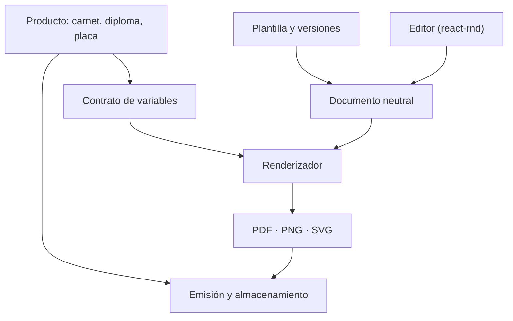

# Módulo de diseño de DNX Suite

**Fecha:** 2026-08-26
**Estado:** aprobado con condiciones — revisión incorporada
**Paquete:** `@repo/design-studio`
**Primer consumidor:** carnet de socio (FotoOffice)

---

## 1. Objetivo

Un paquete compartido donde se diseñe **cualquier pieza gráfica con datos variables** de la
plataforma —carnets, diplomas, credenciales, placas, fotolibros— y del que salga el
**archivo final**: PDF para imprimir, PNG para pantalla.

Y una exigencia que ordena todo el diseño: **lo emitido ayer debe poder reproducirse hoy,
idéntico**, aunque la plantilla haya cambiado en el medio.

## 2. Por qué existe

Hoy hay **tres motores de diseño** resolviendo el mismo problema, sin compartir una línea:

| Motor | Dónde | Tamaño | Fuerte en |
|---|---|---|---|
| Diplomas | fotorank | ~12.400 líneas | Variables, verificación por token, catálogo |
| Fotolibros | compramelafoto | ~2.300 líneas | Impresión: 300 DPI, sangrado, área segura |
| `media-composition` | paquete compartido | 918 líneas | Interpolar variables, renderizar SVG |

Cada producto nuevo suma otro. El carnet sería el cuarto.

## 3. Estrategia: estrangulamiento progresivo

El módulo **nace en el paquete compartido**, no en una aplicación. Copiar con promesa de
extraer después es una promesa que no se cumple.

### Orden de migración

1. **Carnet de socio** — consumidor nuevo, sin riesgo
2. **Una segunda pieza real de FotoOffice** — placas o credenciales
3. **Una tercera pieza de otro producto** — la que exista y se necesite
4. **Diplomas de fotorank** — cuando el módulo ya fue probado por dos o tres consumidores
5. **Fotolibros de compramelafoto** — último: su formato de pliegos es el más exigente y
   condicionaría la arquitectura demasiado temprano

Fotorank está en producción emitiendo diplomas: migra tarde, no segundo. *(La versión previa
de esta spec decía "carnet → diplomas → placas → fotolibros" y a la vez "fotorank migra
último" — una contradicción, corregida acá.)*

**Los pasos 2 y 3 tienen que ser necesidades reales.** Si no existe una segunda pieza que el
negocio pida, no se inventa para validar la abstracción: se espera. Un consumidor fabricado
valida mal, porque no tiene exigencias verdaderas.

### La disciplina que evita el pantano

> **Abstraer solo donde hay dos casos reales hoy. Para los futuros, dejar lugar — no implementación.**

Hoy hay dos formatos reales: **tarjeta de dos caras** (85,6 × 54 mm, impresa) y **hoja A4**
(diploma). Escribir hoy lo que se imagina que necesita una historia de Instagram produce una
abstracción equivocada que además estorba.

### Criterios para borrar un motor viejo

"Si no se borra, no se terminó" es un lema sin puerta de salida. Un motor anterior se elimina
**solo cuando todo esto es verificable**:

- [ ] Todas sus plantillas activas están migradas
- [ ] El render nuevo es visualmente equivalente al viejo, comparado sobre casos reales
- [ ] Las URLs públicas de verificación siguen respondiendo igual
- [ ] La verificación de piezas históricas no cambió de resultado
- [ ] Las piezas emitidas antes siguen consultables y reproducibles
- [ ] No hay emisiones nuevas desde el motor viejo
- [ ] Existe vuelta atrás a la versión publicada anterior

## 4. Arquitectura



Módulos internos de `@repo/design-studio`:

| Módulo | Responsabilidad |
|---|---|
| `document-schema` | El documento neutral, su versión y sus migraciones |
| `variable-contract` | Tipos, validación y formateo de variables |
| `renderer` | Documento + datos → SVG → PDF/PNG |
| `validation` | Reglas duras: QR legible, recursos presentes, variables requeridas |
| `export` | Contrato de salida: formatos, sangrado, marcas, lotes |
| `editor-react` | La interfaz. **Encapsulada**: nada de esto llega al documento |

**El renderizado funciona sin editor.** La Secretaría aprueba cuarenta socios y los carnets
se emiten en un proceso automático, sin que nadie abra una pantalla.

### Por qué SVG

Independiente de la resolución: el mismo diseño sale a 300 DPI para imprenta o a 1080 px
para pantalla. Maneja texto, imágenes, formas y QR. Convierte a PDF y a PNG desde la misma
fuente. **No se elige entre pantalla e impresión al diseñar, sino al exportar.**

## 5. Plantillas, versiones y emisiones

Es el corazón del módulo y lo que garantiza la reproducibilidad.

| Entidad | Qué es | Mutable |
|---|---|---|
| `DesignTemplate` | La identidad: "Carnet SFPR" | Nombre y metadatos |
| `DesignTemplateVersion` | El documento congelado de una versión | **Nunca** |
| `Draft` | La versión en edición | Sí |
| `PublishedVersion` | La versión habilitada para emitir | Puntero, cambia |
| `RenderedArtifact` | Un archivo emitido desde una versión concreta | **Nunca** |

**Modificar un diseño mañana no puede alterar ni reinterpretar lo emitido ayer.** Por eso una
versión publicada es inmutable: editar produce un borrador nuevo, y publicar mueve el
puntero — nunca reescribe.

### Qué registra cada emisión

```
versión de plantilla        cuál exactamente
datos utilizados            los valores reales de las variables
versión del renderizador    para reproducir bit a bit
fecha
formato de salida
checksum del archivo
resultado                   OK | FALLÓ, con motivo
```

Con eso, reproducir una pieza de hace dos años es volver a correr el mismo renderizador
sobre la misma versión con los mismos datos.

## 6. El documento neutral

Se siembra del esquema de diplomas —cinco tipos de bloque (`text`, `qrcode`, `image`,
`line`, `rect`), posición, rotación, capas con bloqueo y visibilidad— y se le agrega lo que
falta.

```
{
  schemaVersion: 1,
  format: { … },
  sides: [ … ],
  metadata: { … }
}
```

### El esquema se versiona en serio

Guardar un JSON de bloques no alcanza: ese formato va a evolucionar. Desde el primer día:

- **Validación estructural** al leer, no al usar
- **Migraciones** entre versiones del esquema
- **Rechazo explícito** de un documento incompatible — nunca interpretación a medias
- **Pruebas con documentos históricos**, para que una actualización del editor no vuelva
  ilegible una plantilla anterior

### El formato es de primera clase

```
format:
  ancho, alto            mm (PRINT) o px (SCREEN)
  medio                  PRINT | SCREEN
  dpi                    solo PRINT
  sangrado, área segura  solo PRINT
sides: [ cara1, cara2… ]   arreglo, no campos por cara
```

El **medio** decide unidades y guías. Un carnet impreso necesita sangrado y área segura; una
placa de pantalla, ninguno. Las caras son un arreglo para que el fotolibro entre después sin
rediseñar.

### Coordenadas neutrales

El documento guarda **medidas y transformaciones propias**, nunca estructuras de `react-rnd`
ni de ninguna librería de edición. Así el editor se reemplaza sin migrar las plantillas.

## 7. Contrato de variables

No una lista de nombres: una declaración tipada que el consumidor provee.

```ts
{
  key: "fullName",
  type: "text",
  label: "Nombre completo",
  required: true,
  sampleValue: "Daniel Cuart",
  maxLength: 80
}
```

Tipos iniciales: `text`, `number`, `date`, `image`, `url`, `qrPayload`.

### Reglas duras

**Una variable requerida ausente hace fallar la emisión.** No se emite con el campo vacío.

Esto corrige un problema que **ya existe en producción**: el motor de diplomas resuelve
`vars[key] ?? ""`, así que una variable faltante hoy se convierte en silencio en una cadena
vacía. Un diploma con el nombre en blanco se emite igual, y nadie se entera hasta que alguien
lo mira.

Lo demás que el contrato define:

| Situación | Decisión |
|---|---|
| Variable requerida ausente | **Falla la emisión**, con el nombre de la variable |
| Variable opcional ausente | Vacío, y queda registrado |
| Fecha | Formato declarado en el contrato, no improvisado por el bloque |
| Texto más largo que `maxLength` | Falla la validación al publicar, no al emitir |
| Imagen inexistente | Falla la emisión |
| Valores de ejemplo | Obligatorios: son lo que el editor muestra al diseñar |

## 8. Legibilidad del QR

Un mínimo fijo en milímetros sería falso. La legibilidad depende de la información
codificada, la versión del QR, el nivel de corrección de errores, el tamaño de módulo, la
calidad de impresión, el contraste y la zona de silencio.

**El sistema calcula la legibilidad con el contenido real**, y el editor responde en tres
niveles:

| Situación | Respuesta |
|---|---|
| QR técnicamente inválido | **Error** — no se puede guardar |
| Sirve en pantalla, riesgoso impreso | **Advertencia** visible |
| No cumple el mínimo del formato | **Bloquea la publicación** |

Y una decisión de contenido: el QR codifica **una URL corta o un token breve**, nunca los
datos del socio. Menos información es menos módulos, y menos módulos es más legible — además
de no imprimir datos personales en un código que cualquiera puede leer.

## 9. Fuentes y recursos

Reproducir un diseño exige controlar de qué depende. Una imagen alojada en una URL que
mañana muere rompe la reproducción de todo lo emitido con ella.

**Al publicar una versión, sus recursos se congelan.** Una imagen usada por una versión
publicada deja de ser una URL externa y pasa a ser un **recurso administrado y estable**,
guardado por la plataforma.

**Fuentes: catálogo controlado.** Para la primera versión, un conjunto cerrado de fuentes con
sus pesos disponibles y su alternativa declarada. Permitir fuentes arbitrarias por workspace
agrega problemas de licencia, de seguridad y de reproducción que hoy no hace falta tener.

## 10. Propiedad y alcance

DNX Suite es multi-workspace desde el primer día, y el módulo también tiene que serlo. Sin
esto, después es muy difícil separar una plantilla de la SFPR de una plantilla global.

```
ownerType: SYSTEM | APP | WORKSPACE
ownerId
visibility: PRIVATE | SHARED
sourceTemplateId     de qué plantilla se duplicó
```

Permisos separados, porque son decisiones distintas:

| Permiso | Quién, típicamente |
|---|---|
| **Ver** | Cualquiera del workspace |
| **Duplicar** | Quien puede crear plantillas |
| **Editar borradores** | Diseñador |
| **Publicar versiones** | Responsable — habilita emisiones reales |
| **Emitir** | El producto, no una persona |

No hace falta un mercado de plantillas hoy. Sí hace falta que propiedad y alcance estén en el
modelo desde el principio.

## 11. Contrato de exportación

"PDF o PNG" es demasiado vago. El contrato tiene que contemplar, aunque no se implemente
todo de entrada:

PDF por cara o documento completo · marcas de corte · sangrado incluido o recortado ·
perfil de color · fondo transparente o sólido · resolución del PNG · nombre de archivo ·
exportación individual y masiva · empaquetado ZIP · orden frente/dorso.

**Para el carnet inicial alcanza con:**

- PDF listo para impresión
- PNG del frente
- PNG del dorso
- Vista digital combinada

La emisión masiva —ZIP o plancha imprimible— es fase posterior, pero el contrato la admite
desde ahora.

## 12. Lo que el módulo no hace

| Fuera | Por qué |
|---|---|
| Emitir | Quién recibe qué y cuándo es del producto |
| Verificar | La página del QR sabe qué significa "habilitado" |
| Guardar los archivos | Ya está resuelto en R2 |
| Formatos de fotolibro y redes | Se agregan cuando esos productos migren |

El módulo diseña, valida y renderiza. **Qué se emite y qué significa es del producto.**

## 13. Riesgos

| Riesgo | Mitigación |
|---|---|
| Un diseño modificado altera lo ya emitido | Versiones inmutables; cada emisión guarda su versión, sus datos y la versión del renderizador |
| Una actualización del editor vuelve ilegibles plantillas viejas | `schemaVersion` con migraciones y pruebas sobre documentos históricos |
| El editor contamina el documento | Coordenadas neutrales; `react-rnd` encapsulado en la capa de interfaz |
| Un recurso externo desaparece y rompe la reproducción | Recursos congelados al publicar |
| Emisión silenciosa con campos vacíos | Variable requerida ausente hace fallar la emisión |
| Abstracción prematura | Solo los dos formatos reales de hoy |
| Migrar fotorank rompe diplomas en producción | Fotorank migra cuarto, con el módulo ya probado |
| Quedan cuatro motores en vez de tres | Criterios verificables de borrado (§3) |

## 14. Decisiones cerradas

| Decisión | Definición |
|---|---|
| Editor inicial | **`react-rnd`**, encapsulado y sin contaminar el documento |
| Nombre del paquete | **`@repo/design-studio`** |
| Catálogo de plantillas de diplomas | **No migrarlo ahora**; se comparte cuando diplomas migre de verdad |

## 15. Dos proyectos, dos specs

Este documento es **el módulo**. El **carnet de socio** —variables del socio, emisión,
vigencia de dos años, verificación pública y estado en vivo— es su primer consumidor y
necesita la suya.

Se construyen juntos, pero se documentan aparte. Si se mezclan, en tres meses nadie sabe qué
era del módulo y qué del carnet — y eso complica la migración de fotorank.

## 16. Alcance, con honestidad

Las condiciones de esta revisión —versiones inmutables, esquema versionado, propiedad
multi-workspace, contratos de variables, política de recursos— **agrandan el proyecto de
manera significativa**. No es un editor reutilizable: es infraestructura de diseño con
garantías de reproducción.

Es lo correcto para algo que emite documentos con valor institucional. Pero conviene decirlo
antes de empezar y no a mitad de camino: **el carnet va a tardar más** de lo que tardaría
sobre un motor copiado sin estas garantías.
