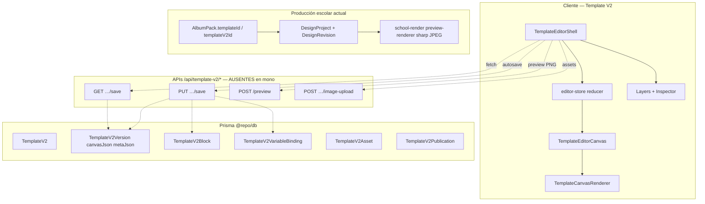
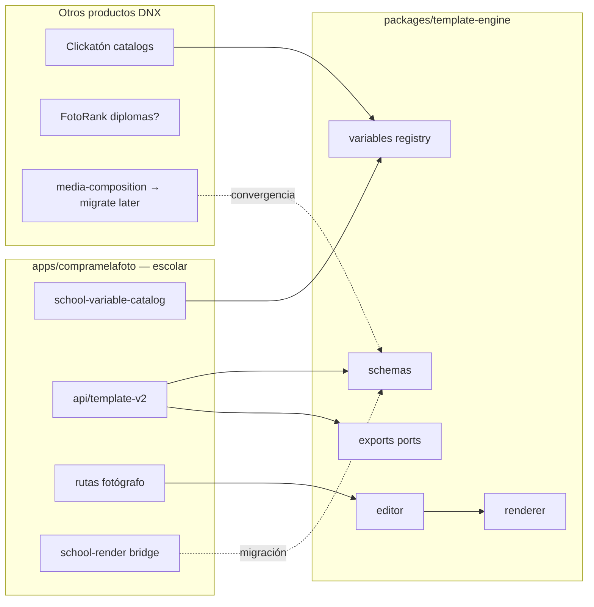

# Template Engine Audit — P0-01

**Etapa:** 01 — Template Engine Audit  
**Fecha:** 2026-08-01  
**Alcance:** Diseñador de plantillas del módulo escolar de ComprameLaFoto y su potencial como motor central de DNX Suite  
**Modo:** Solo auditoría y documentación. Sin cambios de implementación, commits, push ni deploy.

---

## Resumen ejecutivo

En el monorepo conviven **tres superficies de diseño gráfico** relevantes, más un package paralelo de composición para Clickatón:

| Sistema | Ubicación | Motor UI | Persistencia | Rol actual |
|---|---|---|---|---|
| **Template V2** | `apps/compramelafoto` (`components/template-v2`, `lib/template-v2`) | **DOM + CSS** (no Konva) | Prisma `TemplateV2*` | Diseñador de plantillas escolares “producto” (fotógrafo/admin) |
| **Legacy Template + DesignProject** | `lib/school-render`, design-projects | Slots sobre imagen + **sharp** | `Template`, `TemplateSlot`, `DesignProject*` | Pipeline de pedido escolar en producción (preview/export JPEG) |
| **Fotolibros / admin diseñador** | `components/fotolibros`, `/admin/plantillas/disenador` | **react-konva** | Documento local / layouts | Lienzo multipágina tipo álbum |
| **`@repo/media-composition`** | `packages/media-composition` | Sharp/SVG server-side | Templates TS hardcodeados | Composiciones Clickatón (welcome/credential); **otro dominio** |

**Veredicto:** Template V2 es el candidato más sólido a motor central de plantillas (modelo de bloques tipados, versiones, bindings, multipágina, DPI/bleed/safe-area). **No está listo hoy** como package compartido ni como pipeline de producción escolar:

1. Las **APIs fotógrafo `/api/template-v2/*` están ausentes** en el árbol actual (gap P1 documentado en `docs/clf-migration`).
2. El **render de producción escolar** sigue en legacy (imagen + slots → sharp JPEG).
3. El catálogo de variables está **acoplado al dominio escolar** (`student.*`, `school.*`, `course.*`, `PreCompraOrder`).
4. No existe un package `@repo/template-engine`; toda la lógica vive dentro de `apps/compramelafoto`.

**Compatibilidad futura con package compartido sin cambios funcionales:** **SI CON CAMBIOS** (extracción + adapters + restauración de APIs). Ver §12.

---

## 1. Ubicación completa del editor

### 1.1 App principal

`apps/compramelafoto`

### 1.2 Rutas de página (UI)

| Ruta | Archivo | Rol |
|---|---|---|
| `/fotografo/diseno/plantillas` | `app/fotografo/diseno/plantillas/page.tsx` | Redirect / entrada |
| `/fotografo/diseno/plantillas/v2` | `.../v2/page.tsx` | Listado V2 |
| `/fotografo/diseno/plantillas/v2/[templateId]/[versionId]` | `.../v2/[templateId]/[versionId]/page.tsx` | **Editor** → `TemplateEditorShell` |
| `/fotografo/diseno/plantillas/publicas` | `.../publicas/page.tsx` | Catálogo público (clone) |
| `/fotografo/diseno/plantillas/nueva` | `.../nueva/` | Create legacy (slots) |
| `/admin/template-v2/revision` | `app/admin/template-v2/revision/page.tsx` | Cola de revisión |
| `/dashboard/designs` | `app/dashboard/designs/page.tsx` | Listado/clone designs V2 |
| `/fotografo/escuelas/[id]` | `app/fotografo/escuelas/[id]/page.tsx` | Gestión escuela + entrada a plantillas |
| `/admin/plantillas` | Admin plantillas legacy | |
| `/admin/plantillas/disenador` | CanvasEditor Konva (fotolibros) | |
| `/dashboard/design-projects` / `[id]` | Editor/revisión diseño por pedido | Legacy pipeline |

### 1.3 APIs

**Presentes (admin V2):**

- `app/api/admin/template-v2/review-queue/route.ts`
- `app/api/admin/template-v2/templates/[templateId]/approve/route.ts`
- `app/api/admin/template-v2/templates/[templateId]/reject/route.ts`

**Ausentes (cliente las llama; gap P1-01):**

```
/api/template-v2/preview
/api/template-v2/public
/api/template-v2/templates/create
/api/template-v2/templates/[templateId]
/api/template-v2/templates/[templateId]/clone
/api/template-v2/templates/[templateId]/versions
/api/template-v2/templates/[templateId]/versions/[versionId]/save
/api/template-v2/templates/[templateId]/versions/[versionId]/image-upload
/api/template-v2/templates/[templateId]/submit-for-review
/api/template-v2/templates/[templateId]/save-as-new-version
```

**Legacy / pedidos:**

- `app/api/dashboard/design-projects/**`
- `app/api/cron/process-design-previews`
- `app/api/cron/process-design-exports`
- `app/api/fotografo/school-order-items/[id]/generate-design`

### 1.4 Componentes UI (Template V2)

```
apps/compramelafoto/components/template-v2/
├── TemplateEditorShell.tsx          # Shell: toolbar, load/save, preview modal
├── TemplateEditorCanvas.tsx         # Canvas interactivo (drag, resize, snap)
├── TemplateCanvasRenderer.tsx       # Renderer DOM read-only / preview en lienzo
├── TemplateEditorInspector.tsx      # Inspector de bloque
├── TemplateEditorLayers.tsx         # Sidebar capas
├── TemplateBlockContextToolbar.tsx  # Toolbar contextual por bloque
├── TemplateTextFormatToolbar.tsx    # Formato tipográfico
├── TemplateVariableBraceInsertPanel.tsx
├── TemplateDiagnosticsPanel.tsx
├── TemplateVersionList.tsx
├── CreateTemplateV2Button.tsx
├── CanvasSizeModal.tsx
├── TemplateEditorExitModal.tsx
├── GoogleFontsLoader.tsx
├── useTemplateEditorAutosave.ts
├── useTemplateEditorHotkeys.ts
└── inspector/                       # ColorField, NumberSlider, ImageBlockUpload, etc.
```

### 1.5 Lib de dominio editor (Template V2)

```
apps/compramelafoto/lib/template-v2/
├── editor-store.ts                  # Reducer + selectSerializableSavePayload
├── render-core.ts                   # Tipos canvas/bloque + normalize + resolve text
├── variable-catalog.ts              # Catálogo canónico de variables (escolar)
├── resolve-text-brace-variables.ts  # {token} → valor
├── validate-save-payload.ts         # Schema/validación save
├── create-version-from-editor-payload.ts
├── create-default-blocks.ts
├── editor-mock-variables.ts
├── editor-font-catalog.ts
├── upload-template-version-image.ts
├── load-template-v2-blocks-from-db.ts
├── duplicate-template-v2-in-transaction.ts
├── resolve-template-v2-for-album-pack.ts
├── template-diagnostics.ts
├── snap/align/safe-area helpers
└── …
```

### 1.6 School render (pipeline pedido)

```
apps/compramelafoto/lib/school-render/
├── template-contract.ts
├── template-preflight.ts
├── preview-renderer.ts              # sharp → JPEG
├── design-editor.ts
├── design-review.ts
└── ensure-school-design-for-preventa-order-item.ts
```

### 1.7 Packages relacionados (no es el editor escolar)

| Package | Relación |
|---|---|
| `@repo/db` | Modelos Prisma `TemplateV2*`, `Template`, `DesignProject*`, `School*` |
| `@repo/design-system` | Shell UI CLF |
| `@repo/editor` | TipTap/markdown — **no** canvas de plantillas |
| `@repo/media-composition` | Composición server Clickatón — paralelo, no integrado |
| **No existe** `@repo/template-engine` | — |

### 1.8 Archive (referencia)

`apps/_archive/compramelafoto-monorepo-stale-2026-07/lib/school-design/` + `SchoolDesignVisualEditor.tsx` — pipeline legacy completo (Konva + workers).

---

## 2. Arquitectura

### 2.1 Componentes principales (Template V2)

| Pieza | Componente / módulo | Responsabilidad |
|---|---|---|
| **Editor shell** | `TemplateEditorShell` | Orquesta estado, APIs, toolbar global, preview, exit |
| **Canvas** | `TemplateEditorCanvas` | Interacción: selección, drag, resize handles, snap, safe-area guide, multipágina |
| **Renderer** | `TemplateCanvasRenderer` | Pinta bloques en DOM absoluto (BG, PHOTO, TEXT, VARIABLE_TEXT, IMAGE, SHAPE) |
| **Toolbar** | Shell + `TemplateBlockContextToolbar` + `TemplateTextFormatToolbar` | Undo/redo, add blocks, preview, tipografía, acciones por bloque |
| **Sidebar** | `TemplateEditorLayers` + `TemplateEditorInspector` | Capas / propiedades |
| **Store** | `editor-store.ts` (`templateV2EditorReducer`) | Estado local + undo stack + serialización |
| **Storage** | Prisma `TemplateV2Version` + blocks/bindings/assets; R2 via image-upload | Persistencia (APIs faltantes) |
| **Preview** | Modal en shell → `POST /api/template-v2/preview` → `imageBase64` PNG | **API ausente** |
| **Diagnostics** | `template-diagnostics` + panel | Validaciones de diseño (safe area, variables, etc.) |

### 2.2 Flujo de datos (alto nivel)



### 2.3 Diagrama de capas propuestas vs actual

```
ACTUAL
┌─────────────────────────────────────────────────────────────┐
│ apps/compramelafoto                                          │
│  UI editor V2  │  lib/template-v2  │  lib/school-render     │
│  (DOM)         │  (core + escolar) │  (legacy sharp)        │
│                │                   │                        │
│  fotolibros Konva (paralelo)       │  APIs template-v2 ❌   │
└─────────────────────────────────────────────────────────────┘
                         │
                    @repo/db (Prisma)
```

---

## 3. Motor gráfico

### 3.1 Qué utiliza cada superficie

| Superficie | Motor | Evidencia |
|---|---|---|
| **Template V2 (diseñador escolar)** | **HTML/CSS DOM** (`position: absolute`, `contentEditable`, transforms CSS) | `TemplateCanvasRenderer.tsx`, `TemplateEditorCanvas.tsx` |
| **Fotolibros / admin diseñador** | **Konva + react-konva** | `components/fotolibros/CanvasEditor.tsx`; deps `konva`, `react-konva` |
| **Preview/export pedido escolar** | **sharp** (composite server-side → JPEG) | `lib/school-render/preview-renderer.ts` |
| **PDF (ops / labels / print)** | **pdf-lib** | Rutas labels/export-print; **no** es el motor del diseñador V2 |
| **Clickatón compositions** | `@repo/media-composition` (server) | Package aparte |

**No se usa:** Fabric.js, React Flow, PixiJS, HTML Canvas 2D directo en V2, html-to-image/html2canvas en el árbol actual del editor.

### 3.2 Ventajas y limitaciones del motor V2 (DOM)

**Ventajas**

- Tipografía y edición inline naturales (`contentEditable`).
- Integración sencilla con React e inspector.
- Google Fonts vía CSS (`GoogleFontsLoader` + `EDITOR_FONT_CATALOG`).
- Multipágina y capas con modelo de bloques claro.
- Menor curva para UI de producto (toolbars, hotkeys, diagnostics).

**Limitaciones**

- **Fidelidad print:** el preview en pantalla (DOM) no garantiza pixel-perfect vs export print (DPI/bleed).
- **Export PNG previsto por API** (`/api/template-v2/preview`) no implementado → no hay camino server-side oficial en mono.
- SSR: shell es `"use client"`; el renderer DOM no sirve para workers Node sin headless browser o reimplementación.
- Performance en canvas grandes (3000×2000 px del seed) depende del browser (zoom/transforms).
- Mobile: editor pensado desktop (handles, hotkeys, sidebars); sin evidencia de UX táctil completa.
- Duplicación de motores: Konva (fotolibros) vs DOM (V2) vs sharp (legacy) → tres caminos de verdad visual.

### 3.3 Motor legacy (sharp)

- Compone fotos en slots sobre `templateImageUrl`.
- Output: **JPEG** quality 82 (preview) / 92 (export).
- No renderiza tipografía dinámica V2; el contrato legacy usa `textElementsJson` + placeholders `{{key | "fallback"}}`.

---

## 4. Modelo de datos

### 4.1 Prisma (fuente de verdad)

Definido en `packages/db/prisma/schema.prisma`:

| Modelo | Campos clave |
|---|---|
| `TemplateV2` | `id`, `ownerUserId`, `name`, `status` (DRAFT/ACTIVE/ARCHIVED), `currentVersionId` |
| `TemplateV2Version` | `canvasJson`, `metaJson`, `revision`, `isLocked`, `versionNumber` |
| `TemplateV2Block` | `type`, `pageIndex`, layout (`x,y,width,height,rotation,zIndex,opacity,locked,visible`), `configJson` |
| `TemplateV2Asset` | `kind` IMAGE\|LOGO\|FONT, `storageKey` |
| `TemplateV2VariableBinding` | `blockId`, `targetPath`, `variableKey`, `formatter`, `fallbackOverride` |
| `TemplateV2Publication` | `visibility`, `reviewStatus` |

**Tipos de bloque:** `BACKGROUND | PHOTO | TEXT | VARIABLE_TEXT | IMAGE | SHAPE`

**Legacy paralelo:** `Template` (imageUrl, slots, textElementsJson, pagesJson, version `"v1"`), `TemplateSlot` + roles, `DesignProject` / `DesignRevision` / jobs preview-export.

### 4.2 Types TypeScript

- `TemplateV2Canvas`, `TemplateV2Block`, `TemplateV2BlockType` — `lib/template-v2/render-core.ts`
- `TemplateV2SavePayloadCore` — `lib/template-v2/validate-save-payload.ts`
- Catálogo variables — `lib/template-v2/variable-catalog.ts`
- Legacy contract — `lib/school-render/template-contract.ts`

### 4.3 ¿Cómo se guarda una plantilla?

| Capa | Mecanismo |
|---|---|
| **JSON** | `canvasJson`, `metaJson`, `configJson` por bloque; payload de save serializado |
| **DB** | Filas Prisma normalizadas (version + blocks + bindings + assets) |
| **Archivos** | Imágenes/logos en object storage (R2) vía `image-upload` → URL / `storageKey` |
| **Otro** | Optimistic concurrency con `revision` (conflicto 409 previsto) |

Flujo previsto (UI lista; API faltante):

1. Load: `…/versions/{versionId}/save` → canvas, blocks, bindings, revision, meta.
2. Estado en reducer → `selectSerializableSavePayload`.
3. Autosave/Guardar: PUT con `{ revision, canvas, blocks, variableBindings, meta }`.
4. Nueva versión: `save-as-new-version` → `createTemplateV2VersionFromEditorPayload` (remap IDs, copy assets).
5. Publicadas/aprobadas: bloqueo de edición.

### 4.4 Ejemplo completo de payload / documento

```json
{
  "revision": 3,
  "canvas": {
    "width": 3000,
    "height": 2000,
    "background": "#fafbfc",
    "dpi": 254,
    "bleedMm": 0,
    "safeAreaMm": 5
  },
  "blocks": [
    {
      "id": "blk-bg-01",
      "type": "BACKGROUND",
      "pageIndex": 0,
      "name": "Fondo exterior",
      "layout": {
        "x": 0,
        "y": 0,
        "width": 3000,
        "height": 2000,
        "rotation": 0,
        "zIndex": 0,
        "opacity": 1,
        "locked": true,
        "visible": true
      },
      "configJson": {
        "backgroundColor": "#fafbfc",
        "src": "",
        "fit": "cover"
      }
    },
    {
      "id": "blk-photo-01",
      "type": "IMAGE",
      "pageIndex": 0,
      "name": "Foto principal",
      "layout": {
        "x": 120,
        "y": 200,
        "width": 900,
        "height": 1200,
        "rotation": 0,
        "zIndex": 10,
        "opacity": 1,
        "visible": true
      },
      "configJson": {
        "src": "",
        "fit": "cover",
        "photoMode": "single",
        "maskShape": "rect",
        "borderRadius": 0,
        "source": { "variableKey": null }
      }
    },
    {
      "id": "blk-var-01",
      "type": "VARIABLE_TEXT",
      "pageIndex": 0,
      "name": "Nombre alumno",
      "layout": {
        "x": 1100,
        "y": 240,
        "width": 1600,
        "height": 80,
        "rotation": 0,
        "zIndex": 20,
        "opacity": 1,
        "visible": true
      },
      "configJson": {
        "variableKey": "student.fullName",
        "fallback": "—",
        "fontFamily": "Inter",
        "fontSize": 48,
        "fontWeight": 600,
        "lineHeight": 1.2,
        "letterSpacing": 0,
        "textAlign": "LEFT",
        "color": "#111111",
        "fontItalic": false,
        "underline": false
      }
    },
    {
      "id": "blk-text-01",
      "type": "TEXT",
      "pageIndex": 0,
      "name": "Línea con braces",
      "layout": {
        "x": 1100,
        "y": 340,
        "width": 1600,
        "height": 60,
        "rotation": 0,
        "zIndex": 21,
        "opacity": 1,
        "visible": true
      },
      "configJson": {
        "content": "{curso} · {escuela}",
        "fontFamily": "Inter",
        "fontSize": 28,
        "fontWeight": 400,
        "textAlign": "LEFT",
        "color": "#475569"
      }
    },
    {
      "id": "blk-logo-01",
      "type": "IMAGE",
      "pageIndex": 0,
      "name": "Logo escuela",
      "layout": {
        "x": 2600,
        "y": 80,
        "width": 280,
        "height": 160,
        "rotation": 0,
        "zIndex": 30,
        "opacity": 1,
        "visible": true
      },
      "configJson": {
        "src": "",
        "fit": "contain",
        "photoMode": "free",
        "maskShape": "rect",
        "source": { "variableKey": "branding.schoolLogoUrl" }
      }
    }
  ],
  "variableBindings": [
    {
      "id": "bind-01",
      "blockId": "blk-var-01",
      "targetPath": "variableKey",
      "variableKey": "student.fullName",
      "formatter": "titleCase",
      "fallbackOverride": "—"
    },
    {
      "id": "bind-02",
      "blockId": "blk-logo-01",
      "targetPath": "source.variableKey",
      "variableKey": "branding.schoolLogoUrl",
      "formatter": "none",
      "fallbackOverride": null
    }
  ],
  "meta": {
    "templatePageCount": 2,
    "seedId": "template-v2-school-folder-minimal-v1",
    "productIntent": "school_folder"
  }
}
```

Referencia de seed real: `apps/compramelafoto/scripts/seed-template-v2-school-folder-minimal.ts` (canvas 3000×2000 @ 254 dpi, carpeta escolar 3 fotos).

---

## 5. Variables dinámicas

### 5.1 Catálogo V2 (canónico)

Fuente: `lib/template-v2/variable-catalog.ts` (`TEMPLATE_V2_VARIABLE_CATALOG` v1).

| Key | Grupo | Tipo | usableIn | sourcePath |
|---|---|---|---|---|
| `student.fullName` | Alumno | string | TEXT | `PreCompraOrder.studentFirstName + studentLastName` |
| `buyer.fullName` | Cliente | string | TEXT | `PreCompraOrder.buyerName` |
| `school.name` | Escuela | string | TEXT | `Album.school.name` |
| `course.displayName` | Curso | string | TEXT | `SchoolCourse.name + division` |
| `order.referenceShort` | Pedido | string | TEXT | token fulfillment transformado |
| `order.fulfillmentQrUrl` | Pedido | qrUrl | TEXT | `baseUrl + /escolar/entrega/:token` |
| `photographer.displayName` | Fotógrafo | string | TEXT | `User.name / profile.displayName` |
| `event.dateFormatted` | Evento | date | TEXT | `Album.eventDate / Event.date` |
| `branding.schoolLogoUrl` | Marca | imageUrl | IMAGE | `School.logoUrl` |
| `branding.photographerLogoUrl` | Marca | imageUrl | IMAGE | `PhotographerBrand.logoUrl` |

**Formatters v1:** `none`, `uppercase`, `titleCase`, `truncate`, `date.short`.

### 5.2 Sintaxis en texto

| Sistema | Sintaxis | Resolver |
|---|---|---|
| V2 braces en TEXT | `{student.fullName}` o alias `{alumno}`, `{curso}`, `{escuela}`, `{pedido}`, `{qr}`, … | `resolveBracePlaceholdersInText` |
| V2 VARIABLE_TEXT | `configJson.variableKey` + fallback | `getResolvedVariableText` |
| Legacy school-render | `{{student.fullName \| "—"}}` | `template-preflight.extractPlaceholders` |

Alias braces (slug normalizado): ver `BRACE_ALIAS_TO_KEY` en `resolve-text-brace-variables.ts`.

### 5.3 Cuándo y dónde se reemplazan

| Momento | Dónde | Datos |
|---|---|---|
| **Diseño (editor)** | Cliente, al renderizar lienzo | Mocks `TEMPLATE_V2_EDITOR_RESOLVED_VARIABLES` (`María Gómez`, `Escuela Ejemplo`, …) |
| **Preview PNG (previsto)** | Server `POST /api/template-v2/preview` con `mode: "mock"` | Draft + mockData — **API ausente** |
| **Pedido / producción** | Contexto order (previsto V2; hoy legacy placeholders) | Datos reales de `PreCompraOrder`, `School`, `SchoolCourse`, logos |

No hay variables `parent.*`, `teacher.*` ni `grade.*` dedicadas. El adulto responsable es `buyer.fullName`. Docentes/organizadores viven en `SchoolOrganizer`, fuera del canvas.

---

## 6. Render (PNG / JPG / PDF)

| Formato | Template V2 | Legacy DesignProject | Otros |
|---|---|---|---|
| **PNG** | Previsto: `POST /api/template-v2/preview` → `imageBase64` (`output.format: "png"`). **API ausente.** | No es el path principal | — |
| **JPG/JPEG** | No hay export V2 implementado en mono | **Sí:** `renderDesignPreview` / `renderDesignExport` (sharp JPEG 82/92) | Crons `process-design-previews` / `process-design-exports` |
| **PDF** | No motor V2 | URLs `exportUrlPdf` en data de diseño; generación PDF en flujos ops (`pdf-lib` labels/print) | CuantoCobro PDF = otro dominio |

### Dónde corre

| Path | Cliente | Servidor |
|---|---|---|
| Editor visual V2 | **Sí** (DOM) | No |
| Preview PNG V2 | Solicita | **Previsto server** (ausente) |
| Preview/export pedido | — | **Sí** (sharp) |
| PDF labels/print | — | **Sí** (pdf-lib) |
| Konva diseñador | **Sí** | Export pensado a 300 DPI en página admin |

**Conclusión:** hoy el producto escolar **imprime/exporta vía servidor sharp (JPEG legacy)**. El diseñador V2 renderiza en **cliente**; el puente a PNG server está diseñado pero **no portado**.

---

## 7. Assets

| Tipo | Cómo se cargan | Cómo se almacenan |
|---|---|---|
| **Fondos** | Upload en shell/inspector → `image-upload` | URL en `BACKGROUND.configJson.src` / R2 `TemplateV2Asset` IMAGE |
| **Imágenes / decoraciones** | Upload o data URI (seed SVG wave) | `IMAGE` block `src` / assets |
| **Logos escuela/fotógrafo** | Variables `branding.*` o bloque logo por defecto | `School.logoUrl`, brand fotógrafo; kind LOGO |
| **Tipografías** | Google Fonts runtime (`GoogleFontsLoader`) | Nombre en `configJson.fontFamily`; kind FONT previsto en assets |
| **Fotos de huecos** | En pedido: selection photos → slots/photoMode | Legacy: assignments en `DesignRevision.dataJson` |
| **Íconos UI editor** | SVG inline en shell | No son assets de plantilla |
| **Stickers** | **No hay entidad sticker** | `SHAPE` + imágenes estáticas cubren el rol |

Catálogo tipográfico: `lib/template-v2/editor-font-catalog.ts` (Inter, Roboto, Playfair, Great Vibes, etc.).

Seeds:

- `scripts/seed-template-v2-school-folder-minimal.ts`
- `scripts/seed-template-v2-school-folder-minimal-production.ts`
- `scripts/bootstrap-template-v2-demo.ts`

---

## 8. Dependencias del dominio escolar

| Concepto | Dónde aparece | Acoplamiento | Desacople |
|---|---|---|---|
| Alumno (`student.*`) | variable-catalog, mocks, sourcePath PreCompraOrder | Alto en catálogo | **Fácil** (plugin de variables) |
| Curso (`course.*`) | idem + SchoolCourse | Alto | **Fácil** |
| Escuela (`school.*`, logo) | catalog + School model + UI escuelas | Alto | **Medio** (UI escuelas queda en app) |
| Buyer / padre (`buyer.*`) | catalog | Medio | **Fácil** |
| Pedido / QR entrega escolar | `order.*`, ruta `/escolar/entrega` | Alto | **Medio** |
| Fotógrafo / branding | catalog + packs | Medio (reutilizable multi-producto) | **Fácil** |
| Evento / fecha | catalog | Bajo-medio | **Fácil** |
| `AlbumPack.templateV2Id` / preventa | resolve-template-v2-for-album-pack | Alto CLF | **Difícil** (pertenece a CLF) |
| `DesignProject` + order item | school-render ensure-design | Alto legacy | **Difícil** |
| Roster / CSV / enrollments | `lib/school-roster/**` | Fuera del editor puro | **N/A al engine** (queda en módulo) |
| Slot roles SCHOOL_LOGO, GROUP_PHOTO | template-contract legacy | Alto legacy | **Medio** (mapear a PHOTO/IMAGE) |
| Docentes / padres como roles canvas | No en variables | — | — |
| Review publication admin | TemplateV2Publication | Workflow CLF | **Medio** (workflow opcional en package) |

---

## 9. Reutilización por módulo

| Módulo | Clasificación | Justificación |
|---|---|---|
| `render-core` (tipos, normalize, toRenderable) | **REUTILIZABLE** | Núcleo genérico de documento |
| `validate-save-payload` | **REUTILIZABLE** | Validación de documento |
| `editor-store` (sin strings escolares) | **PARCIALMENTE REUTILIZABLE** | Store genérico; defaults/bloques escolares aparte |
| `TemplateCanvasRenderer` / `TemplateEditorCanvas` | **PARCIALMENTE REUTILIZABLE** | UI genérica; acoplada a tokens CLF y mocks escolares |
| Toolbars / Layers / Inspector | **PARCIALMENTE REUTILIZABLE** | Extraíbles con theming; defaults de bloques escolares no |
| `variable-catalog` escolar | **NO REUTILIZABLE** como único catálogo | Debe volverse **registry pluggable** |
| `resolve-text-brace-variables` | **PARCIALMENTE REUTILIZABLE** | Motor de braces sí; alias ES escolares no |
| `editor-mock-variables` | **NO REUTILIZABLE** | Datos de demo escolar |
| `create-default-blocks` (school logo) | **PARCIALMENTE REUTILIZABLE** | Factories genéricas sí; school logo no |
| `create-version-from-editor-payload` / duplicate | **REUTILIZABLE** | Persistencia de versiones |
| `resolve-template-v2-for-album-pack` | **NO REUTILIZABLE** | Dominio AlbumPack CLF |
| `lib/school-render/**` | **NO REUTILIZABLE** como engine V2 | Pipeline legacy slots+sharp; útil como adapter de migración |
| `components/fotolibros/CanvasEditor` (Konva) | **PARCIALMENTE REUTILIZABLE** | Otro modelo de documento (spreads/frames); no compatible 1:1 con V2 |
| Admin review queue UI | **PARCIALMENTE REUTILIZABLE** | Patrón de publicación; labels CLF |
| `@repo/media-composition` | **PARCIALMENTE REUTILIZABLE** como renderer server | Modelo de bloques distinto; candidata a unificar **detrás** de un schema común a futuro |
| Rutas/páginas fotógrafo-escuelas | **NO REUTILIZABLE** | Producto CLF escolar |

---

## 10. Riesgos

### Acoplamientos

- Catálogo de variables hardcodeado a PreCompraOrder / School / entrega escolar.
- Editor + persistencia + UI de packs en la misma app sin boundary de package.
- Dos contratos de placeholders (`{x}` vs `{{x | "y"}}`).
- `AlbumPack` dual: `templateId` legacy **y** `templateV2Id`.

### Duplicación

- Tres motores visuales (DOM V2, Konva fotolibros, sharp legacy).
- Archive `school-design` vs `school-render` actual vs Template V2.
- `@repo/media-composition` redefine bloques/variables para Clickatón.

### Dependencias / gaps

- **APIs `/api/template-v2/*` ausentes** → editor no funcional end-to-end en mono.
- Preview PNG y image-upload dependen de esas APIs.
- Admin approve/reject existe; create/save/preview fotógrafo no.

### Performance

- Canvas 3000×2000+ con muchas capas DOM.
- Autosave + payloads grandes con imágenes embebidas/URLs.
- Sharp export legacy escala a ≥3000px de ancho.

### SSR

- Editor 100% client components.
- No hay renderer V2 Node-native; preview server requerirá headless, sharp-reimplementación o canvas server.

### Canvas / Mobile

- Interacciones pointer/hotkeys desktop-first.
- Konva y DOM no comparten hit-testing ni export.
- Safe-area es guía visual; riesgo de divergencia vs export real.

### Operativos

- Concurrencia por `revision` sin APIs = imposible validar en staging.
- Publicación APPROVED bloquea edición — flujo depende de APIs de review/submit.

---

## 11. Arquitectura propuesta

### 11.1 Package compartido

```
packages/template-engine/
├── schemas/          # Zod/TS: canvas, block, binding, asset, version document
├── variables/        # Registry + formatters + brace resolver (sin catálogo escolar)
├── renderer/         # DOM renderer + (futuro) server renderer adapter
├── editor/           # Store, canvas, layers, inspector, toolbars (headless-ish)
├── assets/           # Font catalog genérico, upload ports
├── storage/          # Ports: TemplateRepository, AssetStorage (implementaciones en apps)
├── exports/          # Ports: PreviewExporter (png/jpg), PdfExporter opcional
└── index.ts
```

### 11.2 Qué va al package compartido

| Capacidad | En package |
|---|---|
| Documento (canvas, blocks, bindings) | Sí |
| Validación save / versioning helpers | Sí |
| Brace resolver + formatters | Sí |
| Variable **registry interface** | Sí |
| Editor UI headless / themable | Sí (fase 2) |
| Renderer DOM | Sí |
| Contrato PreviewExporter | Sí (implementación pluggable) |
| Catálogo escolar concreto | **No** |
| AlbumPack / DesignProject / PreCompra | **No** |
| Review workflow CLF | Adapter en app (opcional module) |
| Konva fotolibros | Fuera (o adapter futuro si se unifica modelo) |

### 11.3 Qué permanece en el módulo escolar (CLF)

```
apps/compramelafoto/
├── lib/school-templates/
│   ├── school-variable-catalog.ts      # student/course/school/…
│   ├── school-mock-variables.ts
│   ├── school-default-blocks.ts
│   └── adapters/
│       ├── resolve-variables-from-order.ts
│       └── legacy-design-project-bridge.ts
├── app/api/template-v2/**               # Implementación HTTP + auth fotógrafo
├── app/fotografo/diseno/plantillas/**
└── lib/school-render/**                 # Legacy hasta cutover
```

### 11.4 Diagrama futuro



---

## 12. Compatibilidad

### ¿El módulo escolar puede seguir funcionando con el nuevo package SIN cambios funcionales?

## **SI CON CAMBIOS**

**No es SI puro** porque:

1. Hoy el editor **no está cerrado funcionalmente** en mono (faltan ~10 APIs). Extraer un package no restaura solo esa paridad.
2. Requiere **adapters** (catálogo escolar, resolve desde order, rutas API, storage R2).
3. El pipeline de pedido **sigue en legacy**; un package V2 no lo reemplaza sin bridge o cutover.
4. Imports hoy son `@/lib/template-v2/*` y `@/components/template-v2/*` — hay que rewirear (aunque sea thin re-export).

**Tampoco es NO:** el modelo de datos Prisma + `render-core` + store + UI ya forman un núcleo casi extraíble. Con:

- package + re-exports temporales desde paths actuales,
- restauración de APIs,
- catálogo escolar como plugin,

se puede mantener **paridad funcional observada** (mismo documento, mismo editor, mismos bindings) sin reescribir el producto escolar.

---

## Mapa de componentes (consolidado)

```
TemplateEditorShell
├── GoogleFontsLoader
├── Toolbar global (undo/redo, add page/block, preview, save, exit)
├── TemplateEditorLayers
├── TemplateEditorCanvas
│   ├── TemplateCanvasRenderer
│   ├── handles / snap / safe-area overlay
│   └── contentEditable (texto)
├── TemplateBlockContextToolbar
├── TemplateTextFormatToolbar
├── TemplateVariableBraceInsertPanel
├── TemplateEditorInspector → inspector/*
├── TemplateDiagnosticsPanel
├── TemplateVersionList
├── CanvasSizeModal / ExitModal
└── Preview modal (imageBase64 PNG)
```

---

## Mapa de dependencias

```
Template V2 UI
  → lib/template-v2 (store, render-core, variables, validate)
  → /api/template-v2/*          ❌ ausente
  → Prisma TemplateV2*          ✅ schema
  → R2 upload                   ❌ vía API ausente
  → Google Fonts CDN            ✅ cliente

AlbumPack
  → templateV2Id ──resolve──► TemplateV2 (fork si pública)
  → templateId   ──────────► Template legacy

Pedido escolar (hoy)
  → PreCompraOrderItem
  → DesignProject + Template legacy
  → sharp JPEG (school-render)
  → (opcional) PDF ops

Paralelos
  → fotolibros Konva
  → @repo/media-composition (Clickatón)
```

---

## Oportunidades

1. **Un solo documento de plantilla** (`canvas + blocks + bindings`) reutilizable en CLF escolar, packs, y a futuro diplomas/credenciales/stories.
2. **Variable registry pluggable** por producto (escolar / maratón / concurso) sin fork del editor.
3. **Unificar preview/export** detrás de `exports` port (sharp o headless) y deprecar dualidad DOM-only vs imagen+slots.
4. Convergencia gradual con `@repo/media-composition` vía schema común (evitar tercer dialecto).
5. Seeds V2 de carpeta escolar ya demuestran multipágina print-oriented (dpi/mm) — buen ancla de calidad.
6. Admin review/publish ya modelado (`TemplateV2Publication`) — patrón de catálogo público multi-app.

---

## Plan de migración (alto nivel, sin implementar)

| Fase | Objetivo | Criterio de salida |
|---|---|---|
| **P0-01** | Esta auditoría | Documento aprobado |
| **P0-02** | Congelar contrato schema (`TemplateDocument` v1) alineado a Prisma/V2 actual | Spec + tipos estables |
| **P1** | Restaurar APIs `/api/template-v2/*` en CLF (paridad runtime) | Editor load/save/preview/upload OK |
| **P2** | Extraer `packages/template-engine` con re-exports thin desde CLF | Misma UI, imports internos al package |
| **P3** | Plugin `school-variable-catalog` + mocks fuera del core | Core sin strings `student/school` |
| **P4** | Server preview/export real (PNG/JPEG) sobre documento V2 | Paridad visual vs DOM documentada |
| **P5** | Bridge legacy DesignProject → documento V2 o dual-read | Pedidos nuevos en V2 |
| **P6** | Cutover: packs solo `templateV2Id`; deprecar slots v1 | Legacy read-only |
| **P7** | Adoptar engine en otro producto DNX (piloto) | 1 catálogo no-escolar |

**No hacer en frío:** fusionar Konva fotolibros y V2 en la misma extracción; migrar `@repo/media-composition` antes de estabilizar schema; borrar `school-render` sin bridge.

---

## Respuestas directas al brief

| # | Pregunta | Respuesta |
|---|---|---|
| 1 | Ubicación | `apps/compramelafoto` — rutas `/fotografo/diseno/plantillas/v2/**`, `components/template-v2`, `lib/template-v2`; schema en `@repo/db` |
| 2 | Arquitectura | Shell + canvas DOM + renderer + layers/inspector + store; storage Prisma; preview API ausente |
| 3 | Motor gráfico | **DOM/CSS** (V2); Konva (fotolibros); sharp (legacy export) |
| 4 | Modelo de datos | JSON en Prisma (`canvasJson`/`configJson`) + filas blocks/bindings + R2 assets |
| 5 | Variables | Catálogo v1 escolar; braces `{key}` / VARIABLE_TEXT; mocks en editor; order en runtime |
| 6 | Render | PNG previsto server (ausente); JPG sharp legacy; PDF ops aparte; editor en cliente |
| 7 | Assets | Fondos/imágenes R2; logos variables; Google Fonts; sin stickers nativos |
| 8 | Dominio escolar | Variables + packs + DesignProject + roster; desacople fácil en catálogo, difícil en pedido |
| 9 | Reutilización | Core documento **sí**; catálogo/UI escolar **plugin**; legacy/Konva **no** como base |
| 10 | Riesgos | APIs faltantes, triple motor, SSR export, acoplamiento PreCompraOrder |
| 11 | Propuesta | `packages/template-engine` + adapters escolares en CLF |
| 12 | Compatibilidad | **SI CON CAMBIOS** |

---

## Referencias de código (auditoría)

- Editor page: `apps/compramelafoto/app/fotografo/diseno/plantillas/v2/[templateId]/[versionId]/page.tsx`
- Shell: `apps/compramelafoto/components/template-v2/TemplateEditorShell.tsx`
- Renderer: `apps/compramelafoto/components/template-v2/TemplateCanvasRenderer.tsx`
- Core: `apps/compramelafoto/lib/template-v2/render-core.ts`
- Variables: `apps/compramelafoto/lib/template-v2/variable-catalog.ts`
- Save schema: `apps/compramelafoto/lib/template-v2/validate-save-payload.ts`
- Legacy render: `apps/compramelafoto/lib/school-render/preview-renderer.ts`
- Prisma: `packages/db/prisma/schema.prisma` (`TemplateV2*` ~L4089+)
- Gap APIs: `docs/clf-migration/04-routes-parity.md`, `07-cutover-blockers.md` (P1-01)

---

*Fin del entregable P0-01 — Template Engine Audit. Sin cambios de implementación realizados.*
