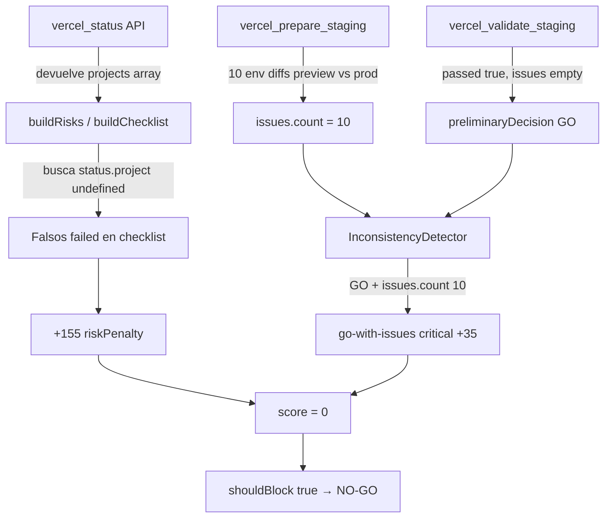

# ComprameLaFoto — Discrepancia Brain score 0 vs Vercel PASSED

**Fecha:** 2026-07-08  
**Preview deployment:** `dpl_BM3BwkoZ7NAc4dC7ShtFPmjtSVCG`  
**Operación:** `release_validate` (`dryRun: false`)  
**Restricciones respetadas:** sin producción · sin DNS · sin `release_execute` · sin nuevo deploy

---

## Resumen ejecutivo

| Capa                                  | Resultado                                             |
| ------------------------------------- | ----------------------------------------------------- |
| Vercel `vercel_validate_staging`      | **PASSED** — `issues: []`, health `healthy`           |
| Providers (Git / Prisma / PostgreSQL) | **OK** — `blockers: []`                               |
| Brain                                 | **score `0`**, `shouldBlock: true`, `verdict: reject` |
| Decisión orquestador                  | **NO-GO**, `canExecute: false`                        |

**Causa raíz (confirmada):** el Brain no refleja el estado real de Vercel. Hay **dos bugs de integración** en la capa orquestador/Brain que producen penalizaciones artificiales, combinadas con una señal semánticamente incorrecta de `issues.count`.

**Sobre el código desplegado:** el preview **no valida el código actual de la rama de trabajo**. Es un **redeploy del artefacto de producción** (`dpl_GnsG3Frihrq44dDaGTMmFtyvJZFi`), commit `39860e5` en rama `main`.

---

## 1. Causa exacta del Brain score = 0

### Fórmula de score

```
score = clamp(100 - riskPenalty - inconsistencyPenalty + bonuses, 0, 100)
```

Valores medidos en reproducción (2026-07-08):

| Componente                    | Valor   | Efecto                                                      |
| ----------------------------- | ------- | ----------------------------------------------------------- |
| `riskPenalty`                 | **155** | 5 riesgos `high` × 25 + 6 riesgos `low` × 5                 |
| `inconsistencyPenalty`        | **35**  | 1 inconsistencia `critical` (`go-with-issues`)              |
| Bonuses (`ready` + `healthy`) | **0**   | Sin señales health positivas ni checklist `*ready*` en true |
| **Score final**               | **0**   | `100 - 155 - 35 = -90` → clamp a 0                          |
| `OPERATION_MIN_SCORE`         | **60**  | Score < 60 → `scoreRejected: true`                          |

### Veredicto y bloqueo

| Campo            | Valor                                                                                                   | Motivo                                               |
| ---------------- | ------------------------------------------------------------------------------------------------------- | ---------------------------------------------------- |
| `rejected`       | `true`                                                                                                  | Score (0) < mínimo (60) **y** inconsistencia crítica |
| `verdict`        | `reject`                                                                                                | `rejected === true`                                  |
| `shouldBlock`    | `true`                                                                                                  | `rejected \|\| verdict === "reject"`                 |
| `recommendation` | `Rechazar "release.validate" en ComprameLaFoto: 1 inconsistencia(s) crítica(s), score insuficiente (0)` |                                                      |
| `nextActions`    | `halt-operation`, `fix-inconsistency-go-with-issues`, `prisma-review-drift`                             | Ver sección 2.5                                      |

### Reglas de conocimiento (`KNOWLEDGE_RULES`)

**Ninguna regla `reject` disparó.** `triggeredKnowledgeRules: []`.

El NO-GO proviene del motor de score + detector de inconsistencias, no de reglas declarativas.

---

## 2. Señales recibidas por Brain (análisis)

### 2.1 Bug primario — shape mismatch `vercel_status`

`handleVercelStatus` devuelve:

```json
{ "projects": [ { "name": "compramelafoto-dnxsuite", "health": "healthy", ... } ] }
```

Pero `buildRisks`, `buildChecklist` y `appendStatusSignals` esperan:

```json
{ "project": { "name": "...", "health": "healthy", ... } }
```

**Evidencia en vivo:**

| Campo                           | Valor                              |
| ------------------------------- | ---------------------------------- |
| `status.project`                | `undefined`                        |
| `status.projects[0].health`     | `healthy`                          |
| `status.projects[0].preview.id` | `dpl_BM3BwkoZ7NAc4dC7ShtFPmjtSVCG` |

**Efecto en cascada:**

1. `buildRisks` → riesgo `high`: _"Proyecto no encontrado en el panorama de status"_
2. `buildChecklist` → `project_exists: failed`, `health_check: failed`, `risk_assessment: failed`
3. Items `failed` del checklist se convierten en señales `risk`/`severity: high` → +100 pts de penalización
4. `appendStatusSignals` no emite señal `health:deployment.status` (requiere `data.project`)

Los tests del orquestador usan `mockStatus` con campo `project` (singular), por eso pasan en CI pero fallan con la API real.

### 2.2 Bug secundario — `issues.count` semánticamente incorrecto

`appendStagingSignals` publica:

```typescript
key: "issues.count";
value: data.environment.issues.length; // = 10
```

Los 10 issues son **diferencias esperadas** entre variables preview y production:

| Variable                                   | Tipo             |
| ------------------------------------------ | ---------------- |
| `DIRECT_URL`, `DATABASE_URL`               | `value_mismatch` |
| `GOOGLE_CLIENT_SECRET`, `GOOGLE_CLIENT_ID` | `value_mismatch` |
| `AUTH_SECRET`, `GOOGLE_REDIRECT_URI`       | `value_mismatch` |
| `COOKIE_DOMAIN`, `AUTH_URL`                | `value_mismatch` |
| `NEXT_PUBLIC_APP_URL`, `APP_URL`           | `value_mismatch` |

Estas diferencias son **normales** en staging (preview usa env de preview, production usa env de production). `vercel_validate_staging` las ignora correctamente y devuelve `passed: true`, `issues: []`.

Pero el `InconsistencyDetector` compara:

- `state:validation.decision` = `"GO"` (preliminar, porque `validation.passed === true`)
- `metric:issues.count` = `10` (de `prepare_staging`, no de validate)

→ Dispara inconsistencia **`go-with-issues`** (`severity: critical`, penalty **35**).

### 2.3 Señales de validación (correctas)

| Señal                 | Valor  | Fuente                    |
| --------------------- | ------ | ------------------------- |
| `validation.passed`   | `true` | `vercel_validate_staging` |
| `validation.decision` | `"GO"` | orquestador (preliminar)  |
| `staging.validated`   | `true` | Brain (passed + GO)       |
| `preview.available`   | `true` | `vercel_prepare_staging`  |

### 2.4 Señales de providers (correctas, no bloqueantes)

| Provider   | Señales clave                                                | Blockers |
| ---------- | ------------------------------------------------------------ | -------- |
| Git        | `dirtyTree: false`, `branch.allowed: true`, `riskLevel: low` | `[]`     |
| Prisma     | `schemaValid: true`, `hasPendingMigrations: false`           | `[]`     |
| PostgreSQL | `connected: true`, `migrationTableExists: true`              | `[]`     |

Warnings Git (rama staging, sin upstream): `severity: low`, no bloquean.

### 2.5 Checklist orquestador vs realidad

| Item                 | Status reportado | Realidad Vercel                                         |
| -------------------- | ---------------- | ------------------------------------------------------- |
| `project_exists`     | **failed**       | Proyecto existe y responde                              |
| `preview_deployment` | ready            | Preview `dpl_BM3BwkoZ7NAc4dC7ShtFPmjtSVCG`              |
| `health_check`       | **failed**       | Health real: `healthy`                                  |
| `risk_assessment`    | **failed**       | 1 falso positivo por shape mismatch                     |
| `staging_ready`      | **failed**       | Preview existe; `stagingReady=false` solo por env diffs |
| `env_alignment`      | attention        | 10 diffs preview/prod (esperado)                        |

### 2.6 Política staging (`applyStagingDryRunBrainPolicy`)

**No aplicó.** La función retorna sin cambios cuando `dryRun === false`:

```typescript
if (!input.dryRun || input.operation !== "release.validate") {
  return brain;
}
```

La política de suavizado para rama staging solo opera en dry-run.

---

## 3. Preview: código nuevo vs artefacto viejo

### Método de deploy

1. Git deploy desde `migration-legacy-clf-to-monorepo` → **falló** (`incorrect_git_source_info` — rama no en GitHub remoto).
2. **Aplicado:** `POST /v13/deployments` con `deploymentId: dpl_GnsG3Frihrq44dDaGTMmFtyvJZFi` (último production), sin `target` → preview por defecto.

### Metadatos Vercel (confirmados 2026-07-08)

| Campo                    | Preview `dpl_BM3BwkoZ7NAc4dC7ShtFPmjtSVCG`                  | Production fuente `dpl_GnsG3Frihrq44dDaGTMmFtyvJZFi` |
| ------------------------ | ----------------------------------------------------------- | ---------------------------------------------------- |
| **target**               | `null` (preview)                                            | `production`                                         |
| **readyState**           | `READY`                                                     | `READY`                                              |
| **githubCommitSha**      | `39860e5e5a2ad70b519b24e5f607ac730b8e0299`                  | `39860e5e5a2ad70b519b24e5f607ac730b8e0299`           |
| **githubCommitRef**      | `main`                                                      | `main`                                               |
| **githubCommitMessage**  | `feat: modulo evaluaciones + prisma migration + UI inicial` | (igual)                                              |
| **originalDeploymentId** | `dpl_GnsG3Frihrq44dDaGTMmFtyvJZFi`                          | —                                                    |
| **bundler**              | `turbopack`                                                 | `turbopack`                                          |
| **createdAt**            | 2026-07-08T08:45:40Z                                        | 2026-04-29T05:07:58Z                                 |
| **build.durationMs**     | 153122 (~2.5 min)                                           | —                                                    |
| **build.hasErrors**      | `false`                                                     | —                                                    |
| **health**               | `healthy`                                                   | —                                                    |

### Conclusión sobre el código

| Pregunta                                                 | Respuesta                                                        |
| -------------------------------------------------------- | ---------------------------------------------------------------- |
| ¿Usa código nuevo de `migration-legacy-clf-to-monorepo`? | **No**                                                           |
| ¿Usa artefacto de producción?                            | **Sí** — `meta.originalDeploymentId` apunta al último production |
| ¿Mismo commit que production?                            | **Sí** — SHA idéntico (`39860e5`)                                |
| ¿Rama reflejada en meta?                                 | `main` (no la rama de trabajo local)                             |
| ¿Qué valida el preview?                                  | Binario ya desplegado en producción, con **env vars de preview** |

El preview sirve para probar **configuración preview** (DB staging, URLs, OAuth preview), **no** el código del monorepo en la rama de migración.

---

## 4. Diagrama de la discrepancia



---

## 5. Recomendaciones concretas

### Prioridad 1 — Corregir integración Brain (código, sin deploy)

1. **Normalizar `vercel_status`** en `resolveStatusAndStaging` (o en el handler): cuando se pide un `project` concreto, mapear `projects[0]` → `project` para cumplir `StatusSnapshot`.
2. **Separar métricas de issues** en `appendStagingSignals`:
   - `staging.env.issues.count` para diffs de entorno (informativo)
   - `validation.issues.count` para issues de validate (bloqueante)
3. **Ajustar `InconsistencyDetector.checkGoDecisionVsIssues`**: en `release.validate`, comparar contra issues de **validate**, no de `prepare_staging`.
4. **Evaluar extender `applyStagingDryRunBrainPolicy`** (o equivalente) a `dryRun: false` cuando providers OK y `validation.passed === true`.

### Prioridad 2 — Preview con código real (operación, sin producción)

1. **Push** rama `migration-legacy-clf-to-monorepo` a GitHub (`compramelafoto/dnx-suite`).
2. **Deploy preview desde git** (no desde artefacto production) — solo cuando el fix Brain esté listo y se autorice nuevo preview.
3. Re-ejecutar `release_validate` con `deploymentId` del nuevo preview.

### Prioridad 3 — No hacer hasta GO

- No ejecutar `release_execute`
- No tocar DNS ni production
- No promover este preview (`dpl_BM3BwkoZ7NAc4dC7ShtFPmjtSVCG`) a production

### Resultado esperado post-fix

Con el shape mismatch corregido y la inconsistencia `go-with-issues` arreglada, el Brain debería:

- Ver `project.health: healthy`
- Checklist sin falsos `failed`
- Score estimado **≥ 75** (sin inconsistencia crítica, sin riesgo fantasma de status)
- `shouldBlock: false` + `decision: GO` si `validation.passed === true`

---

## 6. Referencias

- [`compramelafoto-preview-deployment-validation.md`](./compramelafoto-preview-deployment-validation.md)
- Código relevante:
  - `src/tools/vercel/vercel-status.ts` — devuelve `projects[]`
  - `src/orchestrators/release/release-types.ts` — `StatusSnapshot.project` (singular)
  - `src/orchestrators/release/release-checklist.ts` — consume `status.project`
  - `src/orchestrators/release/release-brain.ts` — `appendStagingSignals`, `applyStagingDryRunBrainPolicy`
  - `src/brain/risk-engine/inconsistency-detector.ts` — `checkGoDecisionVsIssues`
  - `src/brain/decision-engine/decision-engine.ts` — cálculo de score y `shouldBlock`

---

## Confirmaciones de alcance

| Restricción                   | Cumplida |
| ----------------------------- | -------- |
| No producción                 | ✅       |
| No DNS                        | ✅       |
| No `release_execute`          | ✅       |
| No nuevo preview deploy       | ✅       |
| Solo documentación modificada | ✅       |
