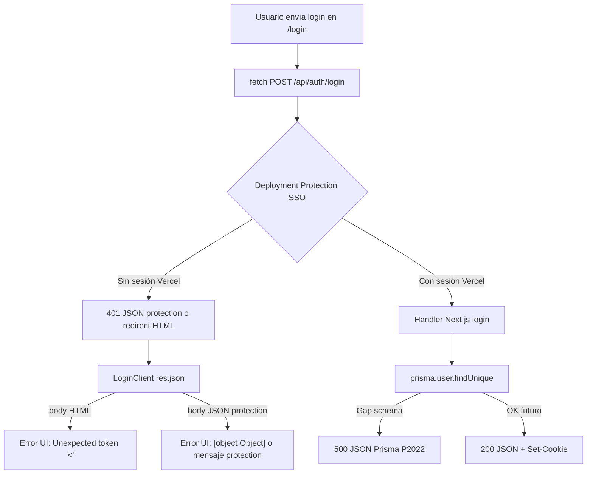

# ComprameLaFoto — Diagnóstico login preview

**Fecha:** 2026-07-09  
**Preview:** `compramelafoto-dnxsuite-5p6i55xkl-compramelafotos-projects.vercel.app`  
**Deployment:** `dpl_CGQfoZaiW7PU2Cu9ukpLh2wVqKEz` (SHA `9850748`, READY)  
**Usuario staging probado:** `fotografo.staging@clf.dnx.test`  
**Error UI reportado:** `Unexpected token '<', "<!DOCTYPE "... is not valid JSON`  
**Restricciones:** no producción, no deploy, no DNS, no cambios Vercel

---

## Resumen ejecutivo

| Hipótesis                                      | Veredicto                                                                        |
| ---------------------------------------------- | -------------------------------------------------------------------------------- |
| Deployment Protection (Vercel SSO)             | **Confirmada — causa principal del síntoma JSON/HTML**                           |
| Route `/api/auth/login` faltante               | **Descartada** — existe y responde (bloqueada por protection)                    |
| `AUTH_SECRET` / `AUTH_URL` ausentes en preview | **Descartada** — configuradas en Vercel (preview)                                |
| Middleware app bloqueando `/api/auth/*`        | **Descartada** — `middleware.ts` excluye `api`                                   |
| Usuario/password inexistente en DB             | **Descartada** — usuario seed existe con password bcrypt                         |
| Runtime error Prisma en login (post-bypass)    | **Probable bloqueador secundario** — gap schema/cliente (`User.cuantoCobroUser`) |

**Causa probable del error en UI:** el cliente de login hace `res.json()` sobre una respuesta **HTML** (página «Login – Vercel» o redirect SSO), no sobre JSON de la app.

**Fix recomendado inmediato (sin deploy):** autenticarse en Vercel Team / usar bypass de Deployment Protection para que las APIs lleguen al runtime Next.js.

**Fix estructural (sí requiere deploy y/o DB):** alinear migraciones staging + endurecer `LoginClient` para validar `Content-Type` antes de parsear JSON.

---

## 1. Logs runtime Vercel

### Deployment consultado

| Campo    | Valor                                      |
| -------- | ------------------------------------------ |
| ID       | `dpl_CGQfoZaiW7PU2Cu9ukpLh2wVqKEz`         |
| Proyecto | `compramelafoto-dnxsuite`                  |
| Estado   | READY                                      |
| Commit   | `98507484540e1a241877b21701a24ff604188e4b` |

### APIs consultadas

- `GET /v3/deployments/{id}/events` — sin eventos auth/login relevantes
- `GET /v1/projects/{id}/logs?deploymentId=…` — **0 filas**
- `POST /v1/.../request-runtime-logs` — 404

### Interpretación

No hay trazas `[auth_timing] login_start` ni `LOGIN ERROR` en logs accesibles vía API. Coherente con **requests bloqueadas en el edge de Vercel** antes de ejecutar el handler Next.js (`app/api/auth/login/route.ts`).

---

## 2. Configuración Deployment Protection

Proyecto Vercel `compramelafoto-dnxsuite`:

```json
"ssoProtection": { "deploymentType": "all_except_custom_domains" }
```

Protección SSO activa en **todos los deployments excepto custom domains** → el preview `*.vercel.app` queda protegido.

Variables preview relevantes **presentes** (nombres only, valores cifrados):

- `AUTH_SECRET`, `AUTH_URL`, `APP_URL`, `NEXT_PUBLIC_APP_URL`
- `DATABASE_URL`, `COOKIE_DOMAIN`

No hay env `VERCEL_AUTOMATION_BYPASS_SECRET` configurado en el proyecto (API env list).

---

## 3. Probes HTTP (sin credenciales)

Base: preview URL indicada. Sin cookies, sin password real en probes.

### `GET /api/auth/me`

| Campo        | `redirect: manual`                                     | `redirect: follow`         |
| ------------ | ------------------------------------------------------ | -------------------------- |
| Status       | **302**                                                | **200**                    |
| Content-Type | `text/plain`                                           | `text/html; charset=utf-8` |
| Location     | `https://vercel.com/sso-api?url=…/api/auth/me&nonce=…` | —                          |
| Cuerpo       | `Redirecting...`                                       | HTML `<!DOCTYPE html>…`    |
| Título       | —                                                      | **Login – Vercel**         |
| JSON         | No                                                     | No                         |

### `POST /api/auth/login`

Body probe: `{ "email": "fotografo.staging@clf.dnx.test", "password": "<probe-no-real>" }`

| Campo               | `redirect: manual`               | `redirect: follow`                           |
| ------------------- | -------------------------------- | -------------------------------------------- |
| Status              | **401**                          | **401**                                      |
| Content-Type        | `application/json`               | `application/json`                           |
| HTML / DOCTYPE      | No                               | No                                           |
| JSON protection     | Sí — `vercel_auth_enabled: true` | Sí — `error.message: "Protected deployment"` |
| Llega a handler CLF | **No**                           | **No**                                       |

### `GET /login` (página)

| Campo  | Valor                      |
| ------ | -------------------------- |
| manual | 302 → `vercel.com/sso-api` |
| follow | 200 HTML «Login – Vercel»  |

### Conclusión probes

- El endpoint **existe**; no es 404.
- Sin sesión Vercel, **ninguna API auth ejecuta lógica de la app**.
- Las rutas GET siguen redirect SSO y terminan en **HTML**, no JSON.

---

## 4. Revisión de código

### `app/login/LoginClient.tsx` (origen del síntoma)

```ts
const res = await fetch("/api/auth/login", { … });
const data = await res.json();  // sin validar Content-Type
```

Si `fetch` recibe HTML (p. ej. tras redirect SSO o página de protection con status 200), `res.json()` lanza exactamente:

`Unexpected token '<', "<!DOCTYPE "... is not valid JSON`

El `catch` muestra `err.message` al usuario → coincide con el reporte.

### `app/api/auth/login/route.ts`

- Runtime `nodejs`, exporta `POST`.
- Usa `prisma.user.findUnique` → en staging Neon **falla** si el cliente Prisma espera columnas no migradas (`cuantoCobroUser`, etc.) — observado al ejecutar seed con ORM (P2022).
- En error devuelve JSON 500 (`{ error, detail }`), no HTML — **solo si el request llega al lambda**.

### `lib/auth.ts`

- Bridge `@repo/auth` (`createUserSession`, cookie `DNX_SESSION_COOKIE` + legacy `auth-token`).
- `AUTH_SECRET` requerido por `@repo/auth` — configurado en preview según Vercel env.
- `COOKIE_DOMAIN` puede afectar persistencia de cookie **después** de login exitoso; no explica parse HTML en `res.json()`.

### `middleware.ts`

```ts
matcher: ["/((?!api|_next/static|…).*)"];
```

No intercepta `/api/auth/login` ni `/api/auth/me`.

### `next.config.ts`

CSP, rewrites, redirects — sin reglas que reemplacen `/api/auth/*`.

### Layout `/login`

`MainLayout` incluye `Header`, que llama `GET /api/auth/me` pero usa:

```ts
const data = await response.json().catch(() => ({ user: null }));
```

→ el Header **no** dispara el error DOCTYPE; el submit del formulario sí.

---

## 5. Estado DB staging (usuario seed)

Verificado en Neon staging (SQL directo):

| Campo    | Valor                            |
| -------- | -------------------------------- |
| email    | `fotografo.staging@clf.dnx.test` |
| id       | 1                                |
| role     | PHOTOGRAPHER                     |
| password | presente (bcrypt)                |

`prisma.user.findUnique` contra la misma DB **falla** por columnas del modelo no presentes en DB (gap migraciones). El login route usa Prisma ORM → **fallará con 500 JSON** una vez superada la protection, hasta alinear schema.

---

## 6. Causa raíz (capas)



### Capa 1 — Bloqueo actual (síntoma DOCTYPE)

**Vercel Deployment Protection (SSO)** en preview.

- GET APIs → redirect → HTML «Login – Vercel».
- `LoginClient` asume JSON siempre.
- El usuario ve error de parseo, no un mensaje de login de la app.

### Capa 2 — Bloqueo siguiente (tras bypass)

**Gap migraciones Prisma vs Neon staging.**

- `/api/auth/login` usa `prisma.user.findUnique` sin bridge SQL.
- Mismo problema que el seed antes de `staging-db-bridge.ts`.
- Resultado esperado: **500 JSON** `{ error: "Error en el login", detail: "…column…" }`, no login exitoso.

---

## 7. Prueba exacta para reproducir

### A. Protection (anónimo)

```bash
# GET auth/me — termina en HTML si sigue redirects
curl -sS -L -o /tmp/me.html -w "%{http_code} %{content_type}\n" \
  "https://compramelafoto-dnxsuite-5p6i55xkl-compramelafotos-projects.vercel.app/api/auth/me"
grep -o '<title>[^<]*' /tmp/me.html
# Esperado: Login – Vercel

# POST login — JSON protection (sin llegar a CLF)
curl -sS -X POST \
  -H "content-type: application/json" \
  -d '{"email":"fotografo.staging@clf.dnx.test","password":"probe"}' \
  "https://compramelafoto-dnxsuite-5p6i55xkl-compramelafotos-projects.vercel.app/api/auth/login"
# Esperado: {"error":...,"protection":{"vercel_auth_enabled":true,...}}
```

### B. En navegador (manual QA)

1. Abrir preview → si pide login Vercel, autenticarse con cuenta del team.
2. Ir a `/login`, enviar credenciales staging.
3. DevTools → Network → `POST /api/auth/login`:
   - Si **Content-Type: text/html** → Capa 1 (protection / redirect).
   - Si **500 application/json** con `cuantoCobroUser` → Capa 2 (schema).
   - Si **200 application/json** + `Set-Cookie` → login OK.

---

## 8. Fix recomendado

### Inmediato — sin deploy de app

| Acción                                                                                                          | Deploy app                |
| --------------------------------------------------------------------------------------------------------------- | ------------------------- |
| Autenticarse en Vercel (team) antes de probar preview                                                           | No                        |
| O configurar **Protection Bypass for Automation** (`VERCEL_AUTOMATION_BYPASS_SECRET` + header/cookie en probes) | No (solo settings Vercel) |
| O relajar SSO protection para previews del proyecto                                                             | No                        |

> Nota: el usuario pidió no modificar Vercel en esta tarea; el fix operativo queda documentado para aplicación manual.

### Corto plazo — código (requiere deploy)

1. **`LoginClient.tsx`:** comprobar `res.headers.get("content-type")` incluye `application/json` antes de `res.json()`; si HTML, mostrar mensaje claro («Preview protegido por Vercel»).
2. **Login route / auth:** bridge SQL o `select` mínimo compatible con DB staging hasta aplicar migraciones pendientes (mismo patrón que `staging-db-bridge.ts`).

### Medio plazo — DB

1. Resolver migración fallida `20260708150000_organizer_direct_mp_commission_ledger`.
2. Aplicar migraciones faltantes en Neon staging para cerrar gap `User` / `Album` / `Photo`.
3. Re-probar login tras bypass protection.

---

## 9. ¿Requiere nuevo deploy?

| Escenario                                               | ¿Deploy?                                                          |
| ------------------------------------------------------- | ----------------------------------------------------------------- |
| Solo bypass / auth Vercel en preview                    | **No**                                                            |
| Mensaje de error amigable en login (Content-Type guard) | **Sí**                                                            |
| Login route tolerante a schema gap (bridge SQL)         | **Sí**                                                            |
| Aplicar migraciones en Neon                             | **No** (DB only), pero conviene redeploy preview para validar env |

---

## Relacionado

- [`compramelafoto-staging-seed.md`](./compramelafoto-staging-seed.md)
- [`compramelafoto-preview-runtime-diagnostic.md`](./compramelafoto-preview-runtime-diagnostic.md)
- [`compramelafoto-blog-migration-staging-apply.md`](./compramelafoto-blog-migration-staging-apply.md)
