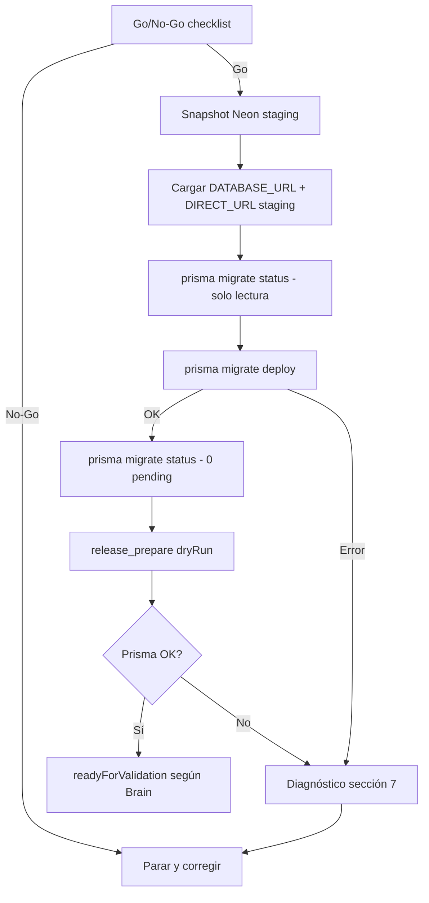

# ComprameLaFoto — Plan seguro para migraciones Prisma en staging

**Fecha:** 2026-07-07  
**Plataforma:** `compramelafoto`  
**Entorno objetivo:** **staging** (Neon + Vercel `compramelafoto-dnxsuite` preview)  
**Estado actual:** PostgreSQL OK · Prisma bloquea por 6 migraciones pendientes · `_prisma_migrations` ausente  
**Alcance de este documento:** planificación únicamente — **no ejecuta** migraciones, no modifica DB, no deploya, no toca producción.

**Relacionado:**

- [`compramelafoto-staging-database-setup.md`](./compramelafoto-staging-database-setup.md)
- [`compramelafoto-postgres-connection-diagnostic.md`](./compramelafoto-postgres-connection-diagnostic.md)
- [`compramelafoto-release-prepare-monorepo.md`](./compramelafoto-release-prepare-monorepo.md)

---

## Resumen ejecutivo

La base staging de ComprameLaFoto está **vacía de esquema Prisma** (sin `_prisma_migrations`). Para desbloquear `release_prepare` y avanzar el pipeline de release en preview, hay que aplicar **6 migraciones** en orden desde el monorepo `dnx-suite`.

Esa operación es **destructiva a nivel DDL** (crea enums, tablas, índices, constraints) y debe ejecutarse **solo contra staging**, nunca contra la base de producción legacy.

DNX-MCP **no ejecutará** `migrate deploy` (el `PrismaExecutor` lo bloquea por diseño). El apply es un paso **manual** fuera del MCP, desde el monorepo, con variables de entorno de staging explícitamente cargadas.

---

## 1. Confirmación: staging, no producción

### Qué define “staging” en este proyecto

| Señal             | Staging (objetivo)                               | Producción (NO TOCAR)                          |
| ----------------- | ------------------------------------------------ | ---------------------------------------------- |
| Proyecto Vercel   | `compramelafoto-dnxsuite`                        | Legacy `compramelafoto`                        |
| Target de release | `preview` (`allowedTargets`)                     | Dominios productivos                           |
| Dominios          | `preview.compramelafoto.com`                     | `compramelafoto.com`, `www.compramelafoto.com` |
| Rama de trabajo   | `migration-legacy-clf-to-monorepo` (preparación) | `main` (cutover final)                         |
| Base Neon         | Branch/instancia **staging** del monorepo        | Branch/instancia **producción**                |
| Estado actual DB  | `neondb`, sin `_prisma_migrations`, ~7 MB        | Datos reales de usuarios                       |

### Verificación obligatoria antes de cualquier DDL

Ejecutar **solo lectura** (sin imprimir URLs completas ni credenciales):

```bash
cd "/Users/danielcuart/Desktop/PROGRAMACIONES/dnx-suite/services/dnx-mcp"

node --import tsx/esm -e "
import './src/config/bootstrap-env.ts';

function hostOf(key) {
  try { return new URL(process.env[key] || '').hostname; } catch { return 'invalid'; }
}

const hosts = {
  DATABASE_URL: hostOf('DATABASE_URL'),
  DIRECT_URL: hostOf('DIRECT_URL'),
};

const isStagingNeon =
  hosts.DIRECT_URL.includes('neon.tech') &&
  !hosts.DIRECT_URL.includes('prod') &&
  hosts.DATABASE_URL.includes('pooler');

console.log(JSON.stringify({
  DATABASE_URL_loaded: Boolean(process.env.DATABASE_URL),
  DIRECT_URL_loaded: Boolean(process.env.DIRECT_URL),
  hosts_redacted: hosts,
  DATABASE_URL_is_pooled: hosts.DATABASE_URL.includes('pooler'),
  DIRECT_URL_is_direct: !hosts.DIRECT_URL.includes('pooler'),
  staging_neon_pattern: isStagingNeon,
}, null, 2));
"
```

**Criterio Go:** las variables cargadas corresponden al branch Neon de **staging** acordado con el equipo (mismo par usado en Vercel Preview de `compramelafoto-dnxsuite`), y **no** al connection string de producción legacy.

**Criterio No-Go inmediato:**

- Host o nombre de base que el equipo identifica como producción.
- Variables copiadas desde Vercel **Production** en lugar de **Preview**.
- Cualquier duda sin confirmación explícita del responsable de infra.

---

## 2. Migraciones pendientes (orden de aplicación)

Prisma aplicará en secuencia estricta:

| #   | Migración                                    | Nombre corto                  |
| --- | -------------------------------------------- | ----------------------------- |
| 1   | `20260422085720_init_baseline`               | `init_baseline`               |
| 2   | `20260422185334_service_leads_subtypes_meta` | `service_leads_subtypes_meta` |
| 3   | `20260424022429_add_service_lead_forms`      | `add_service_lead_forms`      |
| 4   | `20260424033104_add_service_lead_form_mode`  | `add_service_lead_form_mode`  |
| 5   | `20260424162000_add_presential_courses_mvp`  | `add_presential_courses_mvp`  |
| 6   | `20260428192455_add_evaluaciones_engine`     | `add_evaluaciones_engine`     |

**Ruta en monorepo:**  
`/Volumes/HD DNX 10/PROGRAMACIONES/dnx-suite/packages/db/prisma/migrations/`

**Schema:**  
`packages/db/prisma/schema.prisma` (datasource con `url` + `directUrl`).

> `init_baseline` es una migración **grande** (miles de líneas DDL). En Neon puede tardar varios minutos. Planificar ventana y monitoreo.

---

## 3. Riesgos de aplicar migraciones

| Riesgo                               | Severidad | Detalle                                                                                                                                                                         |
| ------------------------------------ | --------- | ------------------------------------------------------------------------------------------------------------------------------------------------------------------------------- |
| **URL incorrecta (producción)**      | Crítica   | `migrate deploy` ejecuta DDL irreversible en la DB apuntada. Un error de copy/paste puede dañar producción.                                                                     |
| **Conflicto con objetos existentes** | Alta      | Si staging ya tuviera tablas/enums creados a mano, `init_baseline` puede fallar con “already exists”. Hoy `_prisma_migrations` **no existe** — escenario favorable (DB limpia). |
| **Tiempo de ejecución / timeout**    | Media     | `init_baseline` es extensa; Neon puede cortar conexiones largas o tardar en provisionar.                                                                                        |
| **Locks durante DDL**                | Media     | Creación masiva de tablas puede bloquear brevemente; en staging vacía el impacto es bajo.                                                                                       |
| **Migración a medias**               | Media     | Si falla la migración #3, Prisma deja historial parcial en `_prisma_migrations`; requiere diagnóstico antes de reintentar.                                                      |
| **Desalineación código ↔ schema**    | Media     | Aplicar migraciones de una rama distinta a la desplegada en preview puede romper la app hasta alinear deploy.                                                                   |
| **Permisos insuficientes**           | Baja      | El usuario debe poder `CREATE` schema objects. Usuario readonly **no** sirve para deploy.                                                                                       |
| **Falsa sensación de “prod lista”**  | Baja      | Staging con schema no implica cutover; producción legacy sigue intacta y fuera de alcance.                                                                                      |

---

## 4. Backup / snapshot recomendado (antes de ejecutar)

Aunque staging esté vacía de esquema Prisma, **siempre** tomar punto de restauración antes del primer `migrate deploy`.

### Neon (recomendado)

1. **Branch snapshot:** en Neon Console → proyecto staging → crear branch desde el estado actual (o usar “Restore” / branch hijo con timestamp).
2. **Anotar** nombre del branch snapshot y hora UTC (sin credenciales).
3. **PITR:** si el plan Neon lo incluye, confirmar ventana de point-in-time recovery disponible.

### Alternativa mínima

```bash
# Solo si pg_dump está disponible y las credenciales de staging lo permiten.
# NO redirigir a logs compartidos; archivo local cifrado o descartable.
pg_dump "<DIRECT_URL_staging>" --schema-only -f "./backup-staging-schema-$(date +%Y%m%d-%H%M).sql"
```

> Usar siempre la URL **directa** (equivalente a `DIRECT_URL`) para `pg_dump`, no el pooler.

### Qué conservar como evidencia

- ID/nombre del branch snapshot Neon.
- Rama Git del monorepo: `migration-legacy-clf-to-monorepo` (commit SHA).
- Resultado de `prisma migrate status` **antes** del deploy (captura sin URLs).

---

## 5. Comando exacto: `migrate deploy` en staging

### Precondiciones

- [ ] Go/No-Go completado (sección 8).
- [ ] Backup/snapshot creado.
- [ ] Rama monorepo con las 6 migraciones presentes en `packages/db/prisma/migrations/`.
- [ ] `DATABASE_URL` (pooled) y `DIRECT_URL` (directa) de **staging** cargadas en la shell.
- [ ] **No** ejecutar desde DNX-MCP ni vía herramientas MCP (`PrismaExecutor` bloquea `migrate deploy`).

### Paso A — Cargar entorno staging (sin commitear secretos)

Opción recomendada: reutilizar el mismo `.env.local` de DNX-MCP (ya validado con PostgreSQL OK), exportando solo las variables Prisma en la sesión actual:

```bash
cd "/Users/danielcuart/Desktop/PROGRAMACIONES/dnx-suite/services/dnx-mcp"

eval "$(node --import tsx/esm -e "
import './src/config/bootstrap-env.ts';
if (!process.env.DATABASE_URL || !process.env.DIRECT_URL) {
  console.error('Faltan DATABASE_URL o DIRECT_URL');
  process.exit(1);
}
console.log('export DATABASE_URL=' + JSON.stringify(process.env.DATABASE_URL));
console.log('export DIRECT_URL=' + JSON.stringify(process.env.DIRECT_URL));
")"
```

Verificar que la shell tiene las variables **sin imprimirlas**:

```bash
node -e "console.log({ DATABASE_URL: Boolean(process.env.DATABASE_URL), DIRECT_URL: Boolean(process.env.DIRECT_URL) })"
```

### Paso B — Estado previo (solo lectura)

```bash
cd "/Volumes/HD DNX 10/PROGRAMACIONES/dnx-suite"

packages/db/node_modules/.bin/prisma validate \
  --schema packages/db/prisma/schema.prisma

packages/db/node_modules/.bin/prisma migrate status \
  --schema packages/db/prisma/schema.prisma
```

**Esperado hoy:** “6 migrations pending”, sin tabla `_prisma_migrations` o con historial vacío.

### Paso C — Aplicar migraciones (comando principal)

```bash
cd "/Volumes/HD DNX 10/PROGRAMACIONES/dnx-suite"

packages/db/node_modules/.bin/prisma migrate deploy \
  --schema packages/db/prisma/schema.prisma
```

Prisma usará `DATABASE_URL` y, por el `directUrl` del schema, la conexión directa para operaciones que lo requieran.

### Paso D — Verificación inmediata post-deploy

```bash
packages/db/node_modules/.bin/prisma migrate status \
  --schema packages/db/prisma/schema.prisma
```

**Esperado:** “Database schema is up to date” / 0 migraciones pendientes.

Comprobación SQL read-only (opcional, con cliente `pg` o `psql` contra URL directa):

```sql
SELECT COUNT(*) AS applied FROM "_prisma_migrations";
SELECT migration_name, finished_at
FROM "_prisma_migrations"
ORDER BY finished_at;
```

**Esperado:** 6 filas aplicadas, última `20260428192455_add_evaluaciones_engine`.

---

## 6. Verificación con `release_prepare` (DNX-MCP)

Tras `migrate deploy` exitoso, **sin** ejecutar `release_validate` ni deploy:

```bash
cd "/Users/danielcuart/Desktop/PROGRAMACIONES/dnx-suite/services/dnx-mcp"

node --import tsx/esm -e "
import './src/config/bootstrap-env.ts';
import { handleReleasePrepare } from './src/tools/release/release-prepare.ts';

const r = await handleReleasePrepare({ platformId: 'compramelafoto', dryRun: true });

console.log(JSON.stringify({
  postgres: r.postgres?.connected ? 'OK' : 'Error',
  prisma: (r.prisma?.blockers?.length ?? 0) === 0 ? 'OK' : 'Error',
  brainScore: r.brain?.score,
  blockers: [
    ...(r.git?.blockers ?? []),
    ...(r.prisma?.blockers ?? []),
    ...(r.postgres?.blockers ?? []),
    ...(r.vercel?.blockers ?? []),
    ...(r.brain?.blockers ?? []),
  ],
  readyForValidation: r.readyForValidation,
}, null, 2));
"
```

### Resultado objetivo

| Campo                              | Antes                | Después (objetivo)                      |
| ---------------------------------- | -------------------- | --------------------------------------- |
| PostgreSQL                         | OK                   | OK                                      |
| Prisma                             | Error (6 pendientes) | **OK**                                  |
| `migrationTableExists` (assess PG) | `false`              | **`true`**                              |
| Brain score                        | `0`                  | **> 0** (según otros checks)            |
| `readyForValidation`               | `false`              | **`true`** (si Git/Vercel sin bloqueos) |

Input MCP equivalente:

```json
{
  "platformId": "compramelafoto",
  "dryRun": true
}
```

---

## 7. Qué hacer si falla

### Durante `migrate deploy`

| Síntoma                        | Causa probable                                     | Acción                                                                                       |
| ------------------------------ | -------------------------------------------------- | -------------------------------------------------------------------------------------------- |
| `P1001` / timeout              | Red, Neon suspendido, pooler usado incorrectamente | Reintentar con `DIRECT_URL` válida; despertar branch en Neon Console.                        |
| `P1000` / auth failed          | Credenciales rotadas o URL expirada                | Rotar password en Neon; actualizar `.env.local`; **no** reintentar hasta corregir.           |
| `relation/type already exists` | Objetos previos en staging sin historial Prisma    | **Parar.** Evaluar `prisma migrate resolve` o limpiar staging desde snapshot (solo staging). |
| Falla en migración #N          | SQL inválido o dependencia                         | Leer log completo; no forzar re-deploy; consultar `SELECT * FROM "_prisma_migrations"`.      |
| `permission denied`            | Usuario sin DDL                                    | Usar rol owner de staging (mismo que `DIRECT_URL` actual).                                   |

### Migración parcial aplicada

1. **No** ejecutar `migrate reset` en staging sin aprobación (borra datos).
2. Revisar `_prisma_migrations` para ver cuántas se aplicaron.
3. Si la migración falló pero quedó registrada como fallida, seguir [guía Prisma migrate resolve](https://www.prisma.io/docs/guides/migrate/troubleshooting-development).
4. Restaurar desde **branch snapshot Neon** si el estado quedó inconsistente.

### Después de un fallo

1. Documentar error (código Prisma, migración, timestamp) — sin URLs.
2. Re-ejecutar `prisma migrate status` y `release_prepare` dry-run para ver bloqueos actuales.
3. No avanzar a `release_validate` ni deploy hasta Prisma OK.

### Rollback

| Escenario                            | Acción                                                                                                                               |
| ------------------------------------ | ------------------------------------------------------------------------------------------------------------------------------------ |
| Staging vacía, deploy falló a mitad  | Restaurar branch Neon desde snapshot; opcionalmente `DROP SCHEMA public CASCADE` + recreate solo si el equipo lo aprueba en staging. |
| Deploy completo pero app rota        | Revertir deploy preview en Vercel (fuera de este doc); DB puede quedarse — evaluar con equipo.                                       |
| Producción afectada por error humano | **Escalación inmediata** — fuera de alcance; este plan no autoriza tocar prod.                                                       |

---

## 8. Go / No-Go (checklist antes de ejecutar)

Marcar **todas** las casillas Go antes de `migrate deploy`.

### Go (todas requeridas)

- [ ] Confirmé con el equipo que el target es **Neon staging** de `compramelafoto-dnxsuite`, no producción.
- [ ] `DATABASE_URL` apunta al **pooler** staging; `DIRECT_URL` apunta al host **directo** staging (mismo branch).
- [ ] `POSTGRES_READONLY_DATABASE_URL` usa URL directa (PostgreSQL assess ya OK).
- [ ] Snapshot/branch Neon creado y anotado.
- [ ] Monorepo en rama `migration-legacy-clf-to-monorepo` (o la rama acordada) con las 6 migraciones presentes.
- [ ] `prisma validate` exit 0 en monorepo.
- [ ] `prisma migrate status` muestra exactamente las 6 migraciones pendientes listadas arriba.
- [ ] `_prisma_migrations` no existe o está vacía (estado actual confirmado).
- [ ] Ventana de mantenimiento acordada (init_baseline puede tardar).
- [ ] Responsable operativo disponible durante el deploy.
- [ ] Entiendo que DNX-MCP **no** ejecutará el deploy por mí — es manual.

### No-Go (cualquiera detiene la operación)

- [ ] URLs sin verificar o copiadas de entorno Production.
- [ ] Host/nombre de base que coincide con producción legacy.
- [ ] Sin snapshot y sin aprobación explícita para proceder sin backup.
- [ ] Working tree sucio con cambios no relacionados en `packages/db/prisma/migrations/`.
- [ ] Migraciones locales que no están en el remoto acordado.
- [ ] Credenciales expiradas o `prisma migrate status` ya falla por conexión.

**Decisión:**

| Resultado | Acción                                             |
| --------- | -------------------------------------------------- |
| **Go**    | Ejecutar sección 5 (Paso C) en ventana acordada.   |
| **No-Go** | Resolver ítems bloqueantes; re-ejecutar checklist. |

---

## 9. Qué NO hacer (límites explícitos)

| Acción                                                        | Motivo                                                     |
| ------------------------------------------------------------- | ---------------------------------------------------------- |
| `prisma migrate deploy` desde DNX-MCP                         | Bloqueado por diseño (`PrismaExecutor`)                    |
| `prisma migrate dev` / `db push` / `migrate reset` en staging | Fuera de procedimiento; riesgo de drift o pérdida de datos |
| Aplicar contra producción                                     | Política: `allowedTargets: ["preview"]`                    |
| Deploy preview automático post-migrate                        | Fuera de alcance; requiere paso separado                   |
| `release_validate` / `release_execute`                        | No ejecutar en esta fase sin plan de validación aparte     |
| Commitear `.env.local` o logs con connection strings          | Seguridad                                                  |

---

## 10. Flujo resumido



---

## 11. Estado de referencia (al redactar este plan)

| Componente                      | Estado                               |
| ------------------------------- | ------------------------------------ |
| PostgreSQL (DNX-MCP assess)     | OK                                   |
| Prisma                          | Bloqueado — 6 migraciones pendientes |
| `_prisma_migrations` en staging | No existe                            |
| Brain score                     | `0`                                  |
| `readyForValidation`            | `false`                              |

Este documento **no cambia** ese estado hasta que un operador ejecute manualmente `migrate deploy` siguiendo las secciones 4–6.

---

## Referencias

- Monorepo migrations: `dnx-suite/packages/db/prisma/migrations/`
- Platform catalog: `src/platforms/platforms/compramelafoto.ts`
- Prisma troubleshooting: https://www.prisma.io/docs/guides/migrate/troubleshooting-development
- Neon connection errors: https://neon.tech/docs/connect/connection-errors
